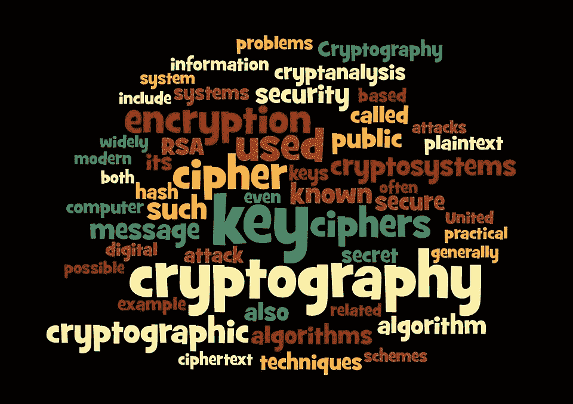
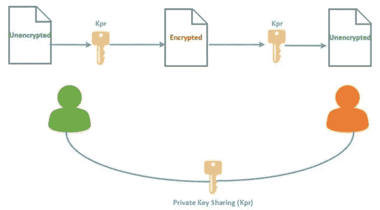
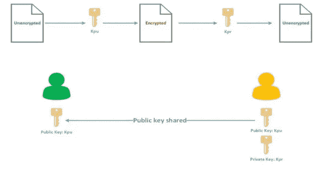
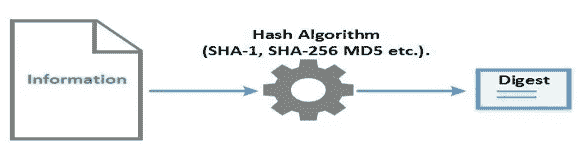
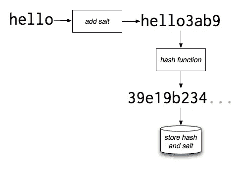
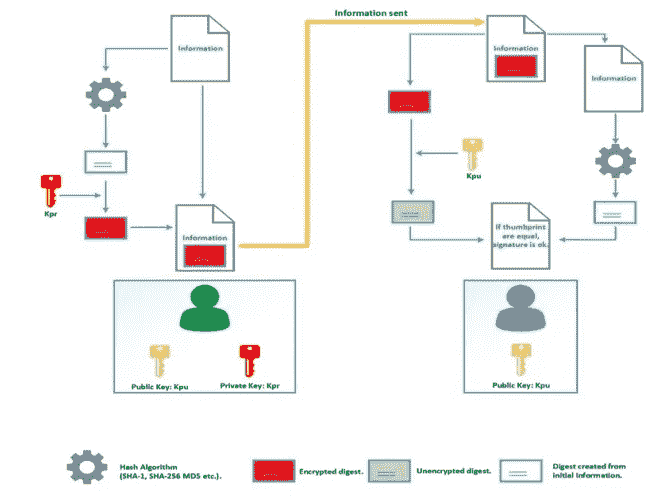
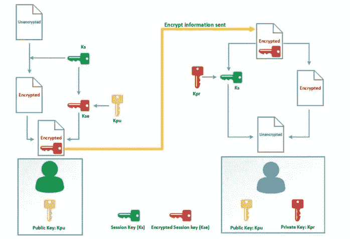
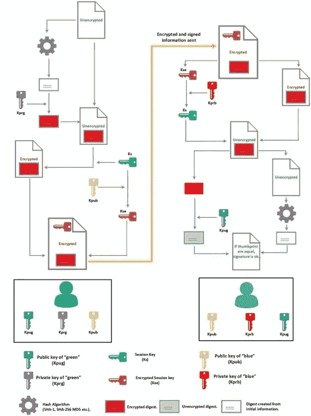

# 密码术、加密、散列函数和数字签名

> 原文：<https://medium.datadriveninvestor.com/cryptography-encryption-hash-functions-and-digital-signature-101-298a03eb9462?source=collection_archive---------0----------------------->

密码学是区块链技术的核心。在这篇文章中，我将尝试解释一些密码学、编码、加密和数字签名的基础知识。

**编码**是将特定代码(如字母、符号和数字)应用于数据以转换成等效密码的过程。

编码和加密的区别在于**加密需要一个密钥来加密/解密。**

**密码术**

密码学是在第三方存在的情况下对安全通信的实践和研究。[1]过去，密码学主要指加密。加密是将纯文本信息转换为密文的过程。反过来就是解密。加密是一种使信息对除了想要的接收者之外的任何人保密的机制。密码是产生加密和解密的一对算法。密码运算取决于算法和密钥。密钥是通信者知道的秘密。此外，使用的密钥有两种加密类型:

**对称密钥算法**
对称密钥算法(私钥密码术):用于加密和解密的相同密钥。(AES、DES 等。)(AWS KMS 使用对称密钥加密来执行数字数据的加密和解密)

根据输入数据的类型，对称密钥密码被实现为块密码或流密码。分组密码以明文块的形式对输入进行加密，而不是以单个字符的形式，这是流密码使用的输入形式。

**分组密码**:加密固定大小的数据块。(DES、AES 等。)
**流密码**:加密连续的数据流。(RC4 等。)

**熵**衡量数据在加密中的随机程度。

**非对称密钥算法**
非对称密钥算法(公钥加密):用于加密和解密的两种不同的密钥(私钥和公钥)。(RSA、椭圆曲线等。)(AWS EC2 密钥对使用非对称加密。)

对称系统中的数据操作比非对称系统快，因为它们通常使用较短的密钥长度。非对称系统使用公钥加密消息，使用私钥解密消息。然而，不对称系统的使用增强了通信的安全性；它会大量消耗 CPU 资源。

**加密哈希函数**

加密散列函数是第三种类型的加密算法。任何长度的消息作为输入，并输出到一个短的、固定长度的散列。(MD5、SHA 等。)它是一种数学算法，将任意大小的数据映射到固定大小的位串(哈希)，并设计为单向函数，不可反转。完整性检查是验证信息是否没有改变的机制。为了验证完整性，需要创建信息的指纹(也称为**散列或摘要**)。由从信息中创建较短位串的算法创建的指纹。

**盐**

随机字符串或 salt 被添加到密码中(以使密码更安全)，然后被散列。这可以防止彩虹表攻击。Salting 应该与加密安全的伪随机数生成器(又名 CSPRNG)一起使用。盐需要有高熵。[然而，RSA 对 CSPRNG 使用 Dual_EC_DRBG 标准，该标准已被证明在加密方面不安全，并被认为有窃取 NSA 后门。](https://www.wikizero.pro/index.php?q=aHR0cHM6Ly9lbi53aWtpcGVkaWEub3JnL3dpa2kvQ3J5cHRvZ3JhcGhpY2FsbHlfc2VjdXJlX3BzZXVkb3JhbmRvbV9udW1iZXJfZ2VuZXJhdG9y)后门在 2013 年被证实，RSA Security 为此从美国国家安全局获得了 1000 万美元的报酬。

**按键拉伸**

密码散列函数或分组密码可以在循环中重复应用。[现代基于密码的密钥导出函数，如 PBKDF2，使用加密哈希，如 SHA-2、更长的 salt(如 64 位)和高迭代计数(几万或几十万)。](https://www.wikizero.pro/index.php?q=aHR0cHM6Ly9lbi53aWtpcGVkaWEub3JnL3dpa2kvS2V5X3N0cmV0Y2hpbmc)

# [**认证加密**](https://www.wikizero.pro/index.php?q=aHR0cHM6Ly9lbi53aWtpcGVkaWEub3JnL3dpa2kvQXV0aGVudGljYXRlZF9lbmNyeXB0aW9u)

[***认证加密对加密数据提供机密性、数据完整性和真实性保证***](https://aws.amazon.com/blogs/security/how-to-protect-the-integrity-of-your-encrypted-data-by-using-aws-key-management-service-and-encryptioncontext/) ***。*** 认证加密一般可以通过组合加密方案和[消息认证码(MAC)](https://www.wikizero.pro/index.php?q=aHR0cHM6Ly9lbi53aWtpcGVkaWEub3JnL3dpa2kvTWVzc2FnZV9hdXRoZW50aWNhdGlvbl9jb2Rl) 来构建。例如，AWS KMS 加密 API 接受明文、客户主密钥(CMK)标识符和加密上下文(*)加密上下文*是一组非秘密的密钥-值对，当您调用`[Encrypt](https://docs.aws.amazon.com/kms/latest/APIReference/API_Encrypt.html)`、`[Decrypt](https://docs.aws.amazon.com/kms/latest/APIReference/API_Decrypt.html)`、`[ReEncrypt](https://docs.aws.amazon.com/kms/latest/APIReference/API_ReEncrypt.html)`、`[GenerateDataKey](https://docs.aws.amazon.com/kms/latest/APIReference/API_GenerateDataKey.html)`或`[GenerateDataKeyWithoutPlaintext](https://docs.aws.amazon.com/kms/latest/APIReference/API_GenerateDataKeyWithoutPlaintext.html)`API 时，可以将它们传递给 AWS KMS。)并返回密文。加密上下文表示附加认证数据(AAD)。加密过程仅使用 AAD 来生成认证标签。标签包含在输出密文中，并用作解密过程的输入。这意味着您提供给 Decrypt API 的加密上下文必须与您提供给 Encrypt API 的加密上下文相同。否则，加密和解密标记将不匹配，解密过程将无法生成明文。此外，如果任何一个参数被篡改——特别是如果密文被更改——身份验证标签将不会计算出与加密时相同的值。解密过程将会失败，并且密文将不会被解密。

# 数字签名

数字签名是一种数学方案，用于证明数字消息或文档的真实性。有效的数字签名能够实现信息完整性(使用哈希算法)以确保消息不被更改，由发送方创建的消息(身份验证)和发送方不能否认已发送消息(不可否认)。数字签名必须是真实的、不可伪造的、不可重复使用的、不可更改的和不可撤销的。当所有这些属性被收集时，信息的真实性和完整性可以被验证。

签名操作基于非对称加密。首先创建初始信息的摘要，最后用私钥加密。这种操作称为签名。

为了验证签名，接收者从消息中提取加密的摘要，并使用他的公钥解密。接下来，接收方从接收到的信息中创建一个摘要，并将其与先前未加密的摘要进行比较。这是签名检查过程。

记住何时使用私钥的一个好方法是知道在每个操作中什么信息是重要的。在签名过程中，关键信息是摘要，所以使用私钥进行签名。在加密过程中，关键信息被加密:所以私钥被用来解密。

# 现代加密[2]

每种加密算法都有优点和方便，因此现代加密技术结合了对称和非对称技术。现代算法使用会话密钥(临时密钥)通过对称加密来加密信息。接下来，用接收方的公钥加密会话密钥。要解密信息，首先接收者用他的私钥解密会话密钥，用会话密钥解密信息[2]。

在发送方，执行以下操作:

1.生成称为会话密钥(Ks)的临时密钥；

2.用会话密钥(Ks)加密的信息；

3.(Ks)用收件人的公钥(Kpu)加密。这个键叫 Kse

4.Kse 添加到加密信息文件中。此文件发送给收件人。

在接收方，执行了以下操作:

1.  加密信息和 Kse 是分离的；
2.  Kse 密钥用接收方的私钥(Kpr)解密，成为 Ks；
3.  这份文件没有用 Ks 加密。

# 加密和数字签名操作

现在，我们已经了解了加密、哈希算法和签名，让我们看看这些元素是如何相互作用以使信息保密、可信和诚实的。

当签名和加密一起使用时，先完成签名过程。执行以下步骤:

1.从初始信息中创建一个摘要；

2.此指纹用私钥(Kprg)加密；

3.将指纹添加到初始信息中(在同一文件中)；

4.生成临时会话密钥(Ks ),它将用于加密初始信息；

5.会话密钥用接收方的公钥(Kpub)加密(Kse)；

6.Kse 添加到加密信息文件。所以这个文件包含加密信息，Kse 和签名。

当接收方从发布方接收到文件时，首先是未加密文件，然后是验证签名:

1.接收者从接收的文件中提取 Kse。该密钥用私钥(Kprb)解密以获得会话密钥(Ks)；

2.Ks 用于解密信息；

3.下一个收件人提取加密的指纹；

4.公钥(Kpug)用于解密指纹；

5.同时，接收方从先前未加密的信息中创建一个摘要；

6.最后，接收方将未加密的指纹与从未加密信息中生成的摘要进行比较。如果它们匹配，签名被验证。

**代理再加密**

当一方(比如 Bob)想要向第三方(Chris)公开发送给他并用他的公钥加密的消息的内容，而不向 Chris 公开他的私钥时，通常使用代理再加密。Bob 不希望代理能够读取他的消息内容。Bob 可以指定一个代理来重新加密他要发送给 Chris 的一条消息。这将生成一个新密钥，Chris 可以用它来解密邮件。现在，如果 Bob 发送给 Chris 一条用 Bob 的密钥加密的消息，代理将改变该消息，允许 Chris 解密它。这种方法支持许多应用，如电子邮件转发、执法监控和内容分发。

单向多用户代理再加密(UM-PRE)方案允许半可信代理将在 A 方密钥下加密的消息转换成包含初始明文的另一密文，使得另一方 B 可以用其密钥解密该密文。代理既不能访问明文，也不能访问解密密钥。代理只能在一个方向上变换，一个密文可以变换多次。

代理重新加密是一种公钥加密形式，它允许用户 Alice 将其解密权限“委托”给另一个用户 Bob。

在代理重加密方案中，Alice 委托一个半可信代理将在她密钥下加密的密文翻译成在 Bob 密钥下加密的密文。一旦被委托，代理独立于 Alice 操作。代理被认为是“半可信的”,因为它看不到正在翻译的消息的内容，也不能将 Alice 的消息重新加密给 Alice 没有授予解密权限的用户。

为了将她的解密权限委托给 Bob，Alice 生成一个“委托密钥”(或“重新加密密钥”)，并将该密钥发送给代理服务器。代理服务器使用这个密钥将消息从 Alice 的密钥转换为 Bob 的密钥。代理服务器实现的方案是单向的。在单向方案中，委托是“单向的”，即，代理可以将 Alice 的消息重新加密给 Bob，但是不能将 Bob 的消息重新加密给任何人。此外，Alice 可以仅使用 Bob 的公钥(和她的私钥)来生成(给 Bob 的)委托密钥。Bob 不必在线，甚至不必知道委托已经发生。

[**代理重加密功能**](https://www.wikizero.pro/index.php?q=aHR0cHM6Ly9lbi53aWtpcGVkaWEub3JnL3dpa2kvUHJveHlfcmUtZW5jcnlwdGlvbg)

代理重新加密方案类似于传统的对称或非对称加密方案，增加了两个功能:

**委托** —允许消息接收者(密钥持有者)根据他的秘密密钥和委托用户的密钥生成一个重新加密密钥。该重新加密密钥被代理用作重新加密函数的输入，该函数由代理执行以将密文翻译成委托用户的密钥。非对称代理再加密方案有双向和单向两种。

在**双向方案**中，重新加密方案是可逆的——也就是说，重新加密密钥可用于将消息从 Bob 翻译成 Charlie，以及从 Charlie 翻译成 Bob。这可能会产生各种安全后果，具体取决于应用程序。双向方案的一个显著特征是委托方和被委托方(例如，Charlie 和 Bob)必须组合他们的秘密密钥来产生重新加密密钥。

**单向方案**实际上是单向的；从 Bob 到 Charlie 的消息可以被重新加密，但反过来不行。可以构造单向方案，使得被委托方不需要透露其秘密密钥。例如，Bob 可以通过将他的秘密密钥与 Charlie 的公开密钥相结合来委托给 Charlie。

**传递性** —传递性代理重新加密方案允许密文被重新加密无限次。例如，从 Bob 到 Charlie，然后从 Charlie 到 David，等等，密文可能被重新加密。不可传递方案只允许对给定密文进行一次(或有限次)重新加密。目前，唯一已知的单向传递代理再加密是通过使用允许对加密数据进行计算的同态加密来完成的。

**代理再加密(PRE)是一种有用的密码原语，其中半可信的委托代理被授权将 Alice 的密文转换为 Bob 的密文，而无需查看底层明文。基于属性的加密(ABE)是一种很有前途的加密算法，它提供了数据的机密性以及所有者强制的细粒度访问控制。利用基于属性的加密，数据所有者可以使用一组属性值(即访问策略)来加密消息，使得只有拥有所需属性值组的授权实体才能解密密文。一种利用密文策略匿名属性加密优点的代理重加密方案。该方案被称为预 AABE，显著降低了更新密文对半可信代理(例如云服务器)的访问策略的计算负担。前 AABE 方案将访问策略隐藏在密文中，因此除了预期接收者之外的其他各方都无法猜出密文的目的。同时，委托代理能够成功地执行重新加密，而无需了解任何关于明文内容或访问策略的信息。**

**IBCPRE 方案是代理重加密在两个方面的自然扩展。第一个方面是将代理重新加密概念扩展到基于身份的公钥密码设置。第二个方面是扩展代理重加密的特性集，以支持条件代理重加密。通过有条件的代理重新加密，代理可以使用 IBCPRE 方案来重新加密密文，但是只有当应用于密文和重新加密密钥的条件得到满足时，密文才是用于解密的良构的。这允许细粒度的代理重新加密，对于加密云数据存储上的安全共享等应用程序非常有用。**

**在基于身份的加密设置下，用户的公钥可以是任意比特串，只要该串能够在系统中唯一地标识用户。例如，唯一字符串可以是电子邮件地址、电话号码和员工 ID(如果仅在组织内部使用)。但是，相应的私钥不再由用户生成。从公钥(唯一的二进制字符串)开始，有一个密钥生成中心(KGC)，它生成私钥并将其颁发给用户。KGC 有一个公共密钥，该密钥被认为是公开已知的，然后，相对于 KGC 的公共密钥，加密和解密分别在唯一的二进制串定义的公共密钥和相应的私有密钥下工作。**

**代理再加密允许原本只能由用户解密的密文被称为代理的公共实体转换成另一个密文，以便另一个用户也可以解密。假设这两个用户是爱丽丝和鲍勃。爱丽丝有一些信息:M1，M2，… Mn。她打算用她的公钥对它们进行加密，然后将加密的消息上传到某个服务器。**

**现在，当 Alice 想要与 Bob 共享这 n 个加密的消息时，Alice 可以使用代理重新加密方案来允许服务器重新加密这 n 个加密的消息，以便 Bob 可以使用他自己的私钥直接解密这些重新加密的消息。**

**为了在代理重新加密方案中做到这一点，Alice 使用她的私钥和 Bob 的公钥来生成重新加密密钥。然后，Alice 将重新加密密钥发送到服务器。在接收到该重新加密密钥时，服务器使用该密钥将所有 n 个加密的消息 C1，C2，…，Cn 转换成表示为 D1，D2，…，Dn 的新形式。鲍勃然后可以下载 D1，D2，…，Dn，解密它们，并恢复消息 M1，M2，… Mn 使用他的私人密钥。**

**在基于身份的条件代理重加密(IBCPRE)系统中，用户将其公钥设置为用户的唯一身份。使用基于身份的加密算法的主要优势之一是消除了公钥证书，这有助于增强目标安全应用程序的可用性。IBCPRE 中的术语“Conditional”指的是一个附加特性，它允许每个加密的消息都有一个与。除了标签之外，每个重新加密密钥还附有一个“标签”。IBCPRE 的设计使得只有当加密消息的标签与重新加密密钥的标签匹配时，加密消息才能被重新加密。**

**IBCPRE 的一个关键特性是，当 Alice 作为数据所有者加密消息时，加密是为她自己完成的，只有 Alice 自己可以使用她的秘密密钥解密加密的消息。爱丽丝不需要预先知道她想与谁共享加密的消息。换句话说，Alice 可以在加密消息并上传到服务器后选择要分享的朋友。**

**IBCPRE 的另一个特性是它支持端到端加密。存储加密消息的服务器在重新加密之前和之后都不能解密消息。**

**IBCPRE 支持一对多加密。数据所有者 Alice 可以选择多个朋友来共享她的数据。对于要与多个朋友共享加密消息的情况，Alice 只需为她的每个朋友生成一个重新加密密钥，并将所有重新加密密钥发送到服务器以执行重新加密。Alice 需要生成的重新加密密钥的数量取决于 Alice 想要与之共享加密消息的朋友的数量。它不依赖于加密消息的数量。如果加密消息的标签和重新加密密钥的标签匹配，一个重新加密密钥将允许服务器转换所有加密消息。**

**IBCPRE 的条件“标记”有助于加密消息的细粒度访问。通过在不同的加密消息上设置不同的标记值，数据所有者 Alice 可以非常灵活地控制她想要与她的任何特定朋友共享的加密消息的确切集合。**

**考虑一个用户 Alice，她用标签‘Private’加密一些消息 M1、M2、…、Mt，用标签‘toShareWithFamily’加密 Mt+1、Mt+2、…、Mm，用标签‘toShareWithFriend’加密 Mm+1、Mm+2、…、Mn，在她的唯一身份下使用 IBCPRE，这被认为是 Alice 的公钥。然后，爱丽丝将相应的加密消息 C1，C2，…，Ct，Ct+1，…，Cm，Cm+1，…，Cn 上传到服务器。**

**当 Alice 将要与另一个用户 Bob 共享 Mm+1，Mm+2，…，Mn 时，Alice 使用 IBCPRE 生成一个重新加密密钥，该密钥带有一个相关联的标签‘to sharewithfriend’。这种生成是通过将 Alice 的私钥和 Bob 的身份作为输入来完成的。然后，Alice 将重新加密密钥发送到服务器。通过使用重新加密密钥，服务器在 Cm+1，Cm+2，…，Cn 上运行 IBCPRE 重新加密函数，用于将它们转换成另一种形式 Dm+1，Dm+2，…，Dn，以便 Bob 可以使用他的私钥直接解密它们。当与加密消息相关联的标签，即“toShareWithFriend”与和重新加密密钥相关联的标签相匹配时，可以完成这种转换。**

**请注意，服务器无法将 C1、C2、…、Ct、Ct+1、…、Cm 转换为另一种形式，以便鲍勃使用重新加密密钥进行解密，因为这 m 条加密消息的标签，即“Private”或“toShareWithFamily”，与重新加密密钥的标签不匹配。**

***原载于 2018 年 2 月 17 日*https://www.linkedin.com*[*。*](https://www.linkedin.com/pulse/cryptography-encryption-hash-functions-digital-signature-eray-altili)***

***参考资料:***

***[1]“密码学”。在 j .范莱文。理论计算机科学手册***

***[2] Romain Serre 加密和签名简介***