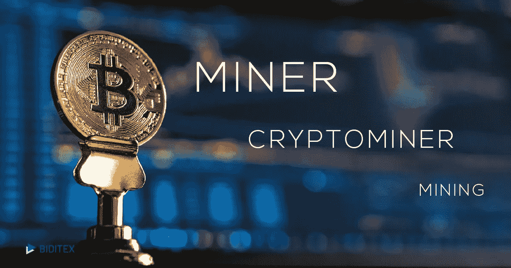

# 加密采矿:采矿初学者指南

> 原文：<https://medium.datadriveninvestor.com/cryptomining-explained-3ff3716c8f35?source=collection_archive---------2----------------------->

## 推动区块链发展的过程

Biditex Education

> Cryptomining 验证交易并将其更新到区块链分类账中。

采矿就像挖掘一样，但你挖掘的不是地面，而是网络内部。你需要大量的精力来使用硬件，并且需要更多的注意力、耐心和自我定位来成为挖掘过程的一部分。如今，由于最近对加密货币的需求和使用，矿商之间的竞争变得更加激烈。为了战胜竞争，矿工们必须解决复杂的数学问题，包括加密哈希函数。

# 采矿是如何进行的？

因此，让我们更深入地挖掘加密创建的实际网络。

 [## 总部位于瑞士的 ETP 进入加密交易市场|数据驱动的投资者

### 虽然金融市场几乎没有沉闷的时刻，特别是在引入…

www.datadriveninvestor.com](https://www.datadriveninvestor.com/2019/03/10/swiss-based-etp-enters-the-crypto-trading-market/) 

**节点做什么？**

节点是任何一种连接到互联网并有 IP 地址的电子设备。节点的任务是维护区块链副本并处理事务。每种加密货币都有自己的节点。节点由矿工控制，他们通过使用节点来验证交易并收取交易费，从中赚取报酬。

# 成为一名矿工需要什么？

首先，你需要特殊的硬件来为交易授权提供足够的能力。硬件应该有专门的图形处理单元(GPU)芯片或 ASIC(专用集成电路)，硬件的冷却系统和不间断的互联网连接。此外，每个矿工都应该能够访问合法的加密采矿软件包，并成为加密货币交易所和在线采矿池的成员。

# **什么是矿池？**

矿工可以决定分组工作，并创建一个采矿池，根据他们在采矿散列功率中的贡献分享奖励。这对于一个普通的矿工来说是有效率的，但事实上，所有的权力都集中在矿坑的所有者手中。最大的挖掘池在中国，控制着整个网络散列率的 81%。这是由于中国的电力非常便宜，而且据说一些电力公司支持比特币矿工。所有矿池中最大的是 BTC.com，占整个池系统的 18.5%，而 AntPool 是最大的比特币生成矿池。

一个非常重要的注意事项是，矿工可以在任何时候将他们的贡献导向另一个池。那些不进入矿坑并在矿坑内采矿的矿工被称为单独采矿者，采矿本身被称为单独采矿，这被认为不如在矿坑内有利可图。

**矿工对于加密货币和区块链的安全性至关重要，因为他们使系统不那么容易受到攻击。**

*参考文献:*

*加密货币挖掘*[*https://www.webopedia.com/TERM/C/cryptocurrency-mining.html*](https://www.webopedia.com/TERM/C/cryptocurrency-mining.html)*，2019 年 8 月 16 日访问*

*采水池*[*https://www.buybitcoinworldwide.com/mining/pools/*](https://www.buybitcoinworldwide.com/mining/pools/)*，2019 年 8 月 18 日访问*

*节点:区块链如何工作*[*https://lisk . io/academy/区块链-基础知识/How-does-区块链-工作原理/节点*](https://lisk.io/academy/blockchain-basics/how-does-blockchain-work/nodes) *，2019 年 8 月 19 日访问*

***如果你想了解更多，请访问 BIDITEX 页面并提出你的问题，关注我们的*** [***推特***](https://twitter.com/biditex_com) ***，*** [***脸书***](https://www.facebook.com/biditex/) ***，*** [***中型***](https://medium.com/@biditex) **【T55 投标变更用**[***bidi tex***](https://medium.com/@biditex/biditex.com)***。***