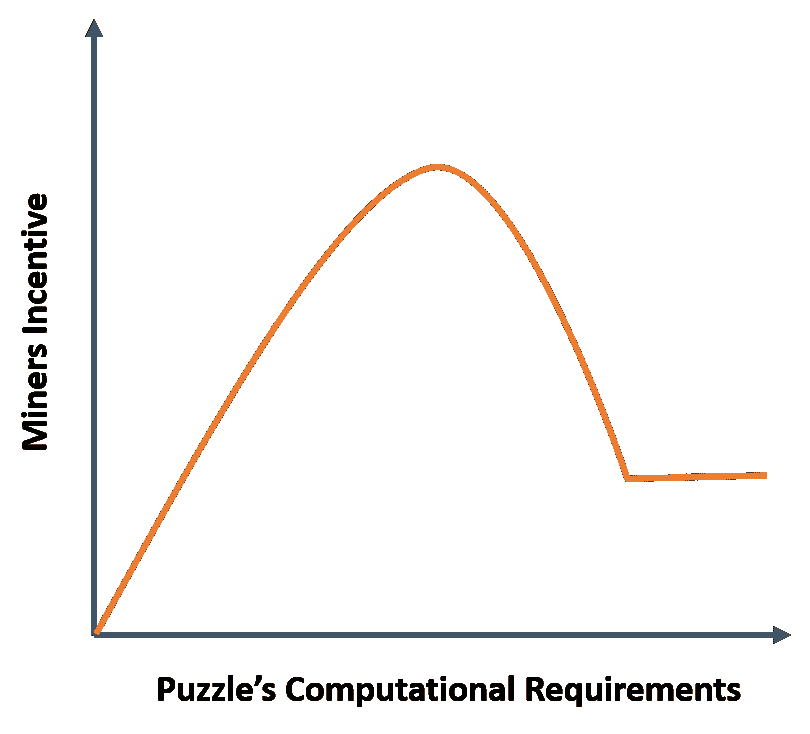

# 密码经济学:理解加密资产中的广告人困境

> 原文：<https://medium.datadriveninvestor.com/cryptonomics-understanding-the-vertifiers-dilemma-in-crypto-assets-30c65259865b?source=collection_archive---------0----------------------->

工作证明(PoW)共识算法是比特币和以太坊等市场上最受欢迎的加密货币的核心。从经济学角度来看，PoW 可以被视为推动加密资产价格的基本要素之一。还记得杰米·戴蒙(Jamie Dimon)的不幸言论吗？他声称比特币是一个骗局，因为它没有任何驱动价格的潜在机制。嗯，权力可以被看作是潜在机制。简单明了，制造一枚比特币是要花钱的。如果你将比特币视为一种商品，PoW 可以被视为生产成本的一种衡量标准。商品定价中的一些经典理论甚至指出，资产的价格应该与其生产成本相对接近，这是一个指标，表明 PoW 与加密资产的经济性有多相关。

像任何其他资产生产机制一样，PoW 在加密资产市场中引入了一系列经济动态/规则。PoW 模型中最有趣但不太为人所知的一个是所谓的验证者困境，它在基于 PoW 的网络(如比特币或以太坊)中的经济和安全行为挖掘器中发挥了重要作用。

# 验证者的困境

验证者困境的概念是在新加坡大学研究人员发表的一篇名为[揭开共识计算机](https://eprint.iacr.org/2015/702.pdf)中激励机制的神秘面纱的论文中首次提出的。本文概述了经济激励或矿工与 PoW 模型要求之间的简单冲突，这可能导致加密网络中的安全漏洞。

为了理解验证者的困境，让我们来看看矿工在比特币或以太坊等 PoW 网络中的角色。随着新的区块进入 PoW 网络，矿工需要运行计算过程来回答 PoW 难题，以验证交易并保持网络的完整性。矿工的工作得到了新的加密资产的奖励。通常，第一个成功广播当前 PoW 难题的解决方案的矿工证明她已经花费了必要的计算能力，值得将她的新交易集附加到区块链，并且该步骤奖励矿工一套新铸造的硬币。这个过程对于简单的过程来说工作得很好，但是对于计算密集型的难题来说会产生一定的摩擦。

尽管 PoW 模型在数学上很复杂，但它未能解释共识过程中的理性人类因素。PoW 协议规定，矿工应该自由地参与共识过程，以保持网络的完整性，这反过来有利于所有参与者。然而，在非琐碎的计算难题中，矿工可以花费大量资源，却得不到任何回报。因此，许多矿工决定背离该协议，并将他们有限的计算资源保留给下一个更合适的块。问题是，通过跳过验证过程，矿工为战俘网络中的严重安全漏洞打开了大门。

由验证者困境引起的典型攻击是一个不良行为者将一系列计算密集型事务发布到 PoW 网络中，以耗尽挖掘者的计算资源。当理性的采矿者竞相解决资源密集型难题时，坏的参与者可以获得优势，开始开采网络中的下一个区块。验证者困境的其他副作用包括矿工接受无效交易而不运行适当的验证过程，这损害了网络的完整性。

验证者的困境基本上是 PoW 共识网络中谜题的计算复杂性、解决这些谜题的经济激励和矿工的理性行为之间的摩擦。

加密货币行业已经产生了各种解决方案来解决验证者的困境。在我最喜欢的游戏中， [TrueBit](https://truebit.io/) 提供了一种游戏化的方法，为了解决一个难题，它打乱了网络参与者之间的激励机制。以太坊网络中的其他解决方案集中于将挖掘计算移出链外。