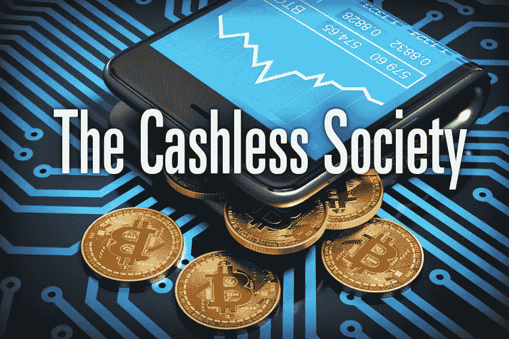

# 密码让我们更快地走向无现金社会…

> 原文：<https://medium.datadriveninvestor.com/cryptos-moving-us-to-a-cashless-society-faster-32e57ad6748d?source=collection_archive---------8----------------------->

我们已经在走向一个无现金的社会，所有的借记卡和信用卡都在世界各地流通，一些公司作为发行机构，银行处理交易，政府监控这些交易的货币供应。所以你我只是我们周围更大的监管网中的一枚棋子。

进入 Cryptos &底层区块链技术，它以一种革命性的方式改变了全球金融科技的格局……在这里，**无现金、匿名&分散**交易正迅速成为新的规范。因此，真正困扰这三驾马车(T4、政府、中央银行、企业)的不是数字硬币让许多人变得富有，它们的波动性或投机性，而是他们无法控制它们的事实。

到目前为止，FUD 只是成功地让 Cryptos 的价格保持在压力之下，并没有扼杀转型！因此，许多国家的当局已经开始考虑发行他们自己的与法定货币挂钩的数字硬币，以解决波动性、投机和控制问题。最近的一些头条新闻如下:

> 由高盛支持的加密货币初创公司 Circle 在由中国虚拟货币开采巨头比特大陆科技公司牵头的一轮投资中筹集了 1.1 亿美元
> 
> 日本银行业巨头将推出自己的加密货币。世界第五大银行三菱 UFJ 金融集团将于明年开始这一过程，将涉及 10 万个银行账户——Crypto Globe
> 
> 瑞典**将推出基于 IOTA 的“E-Krona”加密货币**——以太坊世界新闻

你可以看到三驾马车的所有三个成员都参与了上述项目，还有无数的其他例子表明这些步骤正在考虑之中或正在实施之中。如果有什么不同的话，加密硬币的引入加速了当前金融系统的数字化进程。重要的问题是，这些电子货币的引入是否会取代加密硬币(区块链技术)更广泛的功能，或者只是让一切都在三驾马车的眼皮底下的另一个噱头……你怎么看？

对加密货币、金融科技行业、突破性技术感兴趣或正在寻找加密货币、外汇或股票交易思路的人—关注我[**Twitter**](https://twitter.com/trade_nut)&[**StockTwits**](https://stocktwits.com/trade_nut)**。**