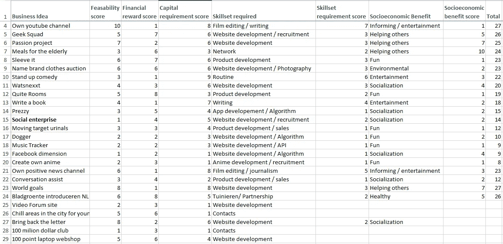
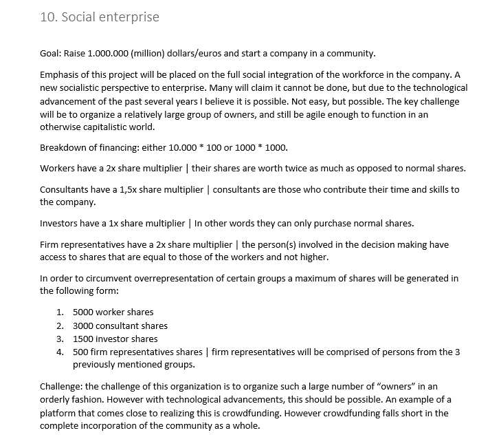

# CryptoVentures 第一部分——他真的放弃了一个价值百万美元的想法吗？

> 原文：<https://medium.datadriveninvestor.com/cryptoventures-part-i-did-he-really-just-give-away-a-million-dollar-idea-f4029de2fb6?source=collection_archive---------1----------------------->

**CryptoVentures 是我的一个创意，我在其中与全世界分享潜在的商业想法，供所有人阅读、评论，是的，甚至窃取(我所要求的是，如果/当你与:D #cryptocode 一拍即合时，获得 10%的股份)**

在这个人们害怕有人窃取他们想法的世界里，我喜欢反其道而行之，公开分享我的想法。我宁愿看到我的一个想法变成现实，而不是把它留在架子上积灰。诚然，我想成为实现这一目标的掌舵人，但同时，我又不是一个能够推动这一目标的实干家。然后再次写这个博客，并把它放在那里可能就是这样做的，所以加油哈哈。

简单介绍一下我自己。不到一年前，我进入了加密领域。主要交易硬币，赚了不少钱，但也失去了大部分。最近，我越来越对区块链技术在未来几年能够并将会产生的社会影响感兴趣。创业一直是我的魅力所在，提出(梦想)想法是我的强项。这些年来，我已经有了很多这样的想法，我已经把它们培养成了我称之为商业想法矩阵的东西。这是一份基于我个人标准的商业想法列表。您可以在下面找到最新版本。

Business Idea Matrix (same 10% hit it off fee applies;)

现在，我敢肯定这份清单吸引了大量的问题，如:

*   道格是什么？或者
*   你知道极客小队已经存在了吧？或者
*   [对于敏锐的观察者]你的两大想法是什么？

然而，我已经强调了我想在这篇文章中放大的商业风险，即:

## -社会企业

社会企业是在我观看了 HARDtalk 对亿万富翁风险投资家尼克·哈瑙尔的采访后产生的，他基本上在等待干草叉被举起，一场针对这个世界上富人的革命开始。由于贫富差距日益扩大，这是一个值得期待的事件。尼克·哈诺尔也有一个有趣的 ted 演讲，在这里。

除了那次采访，我还看了一部关于企业的荷兰纪录片，其中的问题是“一个连续多年日复一日投入 8 小时艰苦工作的一线工人，是否没有平等地或甚至可能更多地享有他或她所工作的公司的利润？”如果没有金融知识的课程，这个人可能会继续靠薪水过活，永远不会真正收获他们所有辛勤工作的回报。

看完这两个节目后，我问自己，难道没有更好的方法吗？答案是社会企业。令我高兴的是，我发现了我笔记的摘录(我发现了完整的计划，但说摘录我的笔记听起来更酷)。

注:以下要带着**半信半疑**来读。

Social enterprise alpha version

那么什么是社会企业呢？基本上是一个企业，众所周知的馅饼(利润)的分配在所有参与方之间更加平均。将其视为一家众包公司，在这里，员工可以根据一套预定义的角色/标准获得固定金额的利润。我笔记中的分解可以被认为是需要一些(相当多的)改进的 alpha 版本，但是我相信总体思路是清楚的。有趣的是，在区块链技术和智能合同之前，我所说的技术进步将“神奇地”使这成为可能。一两年后，它应该很容易得到。太神奇了！

在搜索 medium 上的成功帖子时，我偶然发现了丹尼尔·杰弗里斯的文章[。一位**高度**推荐阅读货币的历史，以及他认为区块链技术最有前途的方面(还没有加密货币可以利用)，即创造财富时的分配。从拥有银器的古代国王和王后，到拥有法令的当今民族国家，财富的分配一直是自上而下的。他认为这是一个几乎不可能改变的系统。](https://hackernoon.com/why-everyone-missed-the-most-mind-blowing-feature-of-cryptocurrency-860c3f25f1fb)

> ***“在钱已经分发出去之后再重新分配几乎是不可能的”——丹尼尔·杰弗里斯***

让一个新的企业成为一个绝佳的机会，来利用这种全新的，我敢说是革命性的财富分配方式来兜一圈。

所以…我终于可以开始真正的商业冒险了。将之前的社会企业概念与可行的业务相结合，我向您展示[请击鼓]:

# *加密货币支持网站*

一个基于社区的中央支持平台，面向所有加密内容，目标是:

## 帮助人们解决与加密相关的问题。

崩溃

*   利用其代币的另一个平台/加密货币的潜在衍生产品

它需要成为一个平台，让《社会企业》中概述的原则成为现实。人们因他们的服务而获得报酬(概述如下)。CoinSupport 通过收取费用来赚钱。这笔收入将用于支付所有费用，利润可以每周/每月/每季度重新分配给“代币持有者”。

> 旁注:我不明白为什么每个人和他们的祖母都在制作他们自己的硬币/代币。为什么不支持现有的硬币，增加它的价值，并增加它和你自己的生存机会？

*   服务包括:

设置帐户

设置主节点

建立/建议正确的保护措施

解释加密/交易的课程

交易者挑战(竞赛)

绘制特定硬币的图表

更多(**随意分享你的想法**

**服务附录**

1.服务可能会分为两类

社区:向所有人开放

经过审查的专业人员:经过验证的共同支持代理

2.想想通过 skype 进行一对一通话的服务或一些桌面共享服务。

**这是正在解决的问题**:我相信有一大群人愿意进入加密领域，但没有知识或时间深入这个领域的所有角落。帮助这些人并让大众更容易获得加密将在增加全球采用率并最终使加密货币成为我们日常生活的一部分方面发挥关键作用(这里是真正的大商业梦想家行话)。

Gary Vaynerchuck(如果你还没有看过，我强烈建议你看看他的一些博客)经常说“消除摩擦将是成功的关键”，这与这个世界上的 Googles、Alexas 和 Siris(语音激活辅助)有关。我认为这同样适用于所有加密的东西。人们天生懒惰，因此降低准入门槛，尽可能做到天衣无缝、简单易行，将是一个制胜的秘诀。

不仅如此，加密空间也非常复杂和广阔，即使对于精通技术的人来说，有时也会让人不知所措。因此，CoinSupport 也将作为一个更好地组织和汇集知识的地方，并在需要的地方提供帮助。更不用说有这么多的人试图将他们的时间和知识货币化，却没有一个易于访问、结构良好的平台来这样做。

这个想法的 A4 大小的草图。现在，需要什么或谁来启动这个项目呢？我最近有幸阅读了 2018 年 5 月版的 21cryptos，这是一本关于所有加密事物的杂志。其中说了以下的话:

> *“开发商可能是市场上最好的，但是如果没有来自市场和法律环境的重要数据，他们的产品不可能成为主流。在我看来，每一个成功的项目，他们的团队里一定有这些关键岗位。他们需要有人来涵盖他们的营销、品牌开发、合规、公共关系、法律咨询、社区关系、国家关系专家和合作伙伴顾问职位的工作”“* @Cryptobulld0g

旁注:我们生活在一个什么样的世界里，这些是未来 xD 的引语

基于以上所述，我想出了一个最低限度的人员名单，需要得到这样的东西了。在大学期间，我熟悉了有效创业和 MVP(最小可行产品)的概念。这个想法有助于立即投入运行，并利用社区验证和反馈来改进产品。然而，如果有任何天使投资者喜欢这个想法或分享它的人，请随时联系。

*   区块链开发者(智能合约知识)4x
*   营销/品牌开发/社区关系 2x
*   网站开发人员/ UX 设计师 2x
*   法律顾问/公共关系 1x
*   财务总监 1x

所以你有它。我希望你们喜欢读这篇文章，这是我第一次与广大公众分享。这篇文章让你的神经突触超速运转了吗？你喜欢这个主意吗？欢迎在下面分享你的想法和评论，或者直接联系我。

> 脚注:对于 CryptoVentures 的这一部分和未来部分，我需要补充一个关键的警告，即我几乎没有研究过这是否已经在做了。这些帖子基本上只是我大声思考，想知道，并确定各种机会。如果你确实在其他地方看到过这种实现，或者如果你有任何其他有趣的想法要分享，请在下面的评论中随意发表一些知识。

___________________________________________________________________

# 讨论主题:

*   什么平台/加密货币可以用来实现上述目标？
*   为什么每个人都有自己的区块链/令牌？
*   更多的服务添加到加密支持？
*   看到类似的东西已经在工作了吗？
*   关于这个想法还有其他想法吗？