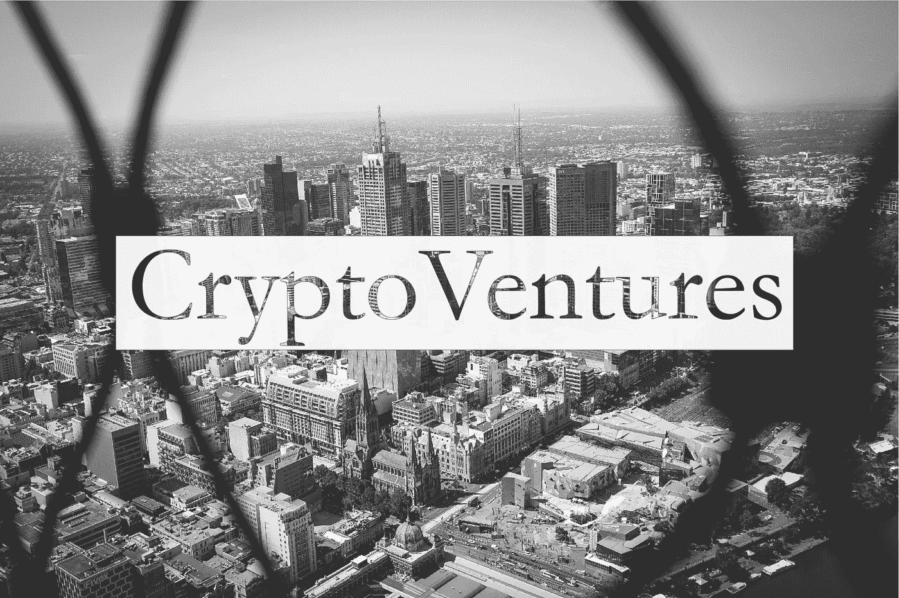

# CryptoVentures 第二部分——供应链 5.0？

> 原文：<https://medium.datadriveninvestor.com/cryptoventures-part-ii-supply-chain-5-0-6cd2a1ef704d?source=collection_archive---------4----------------------->

**CryptoVentures 是我的一个创意，我在其中与全世界分享潜在的商业想法，供所有人阅读、评论，是的，甚至窃取(我所要求的是，如果/当你与:D #cryptocode 一拍即合时，获得 10%的股份)**

CryptoVentures 的第二部分与其说是一个商业想法，不如说是一个面向未来的思路和投资机会。有趣的是，我开始意识到，在某种程度上，人们并没有意识到我们是多么地坚持古老的格言“活在当下”。一个很好的例子是我不久前发现的以下智慧:

你有多少次发现自己在回想:“我希望我想到了那个”或者“我希望我做了那个”？对我来说，一个完美的例子是“当我第一次听说比特币时，我希望我买了 200 美元左右的比特币”。所以这篇文章是我打破流行的被动思维过程，转变成主动思维过程，希望在这个过程中激发你自己的商业想法/机会。

那么我的这个面向未来的投资是什么呢？

## **数字价格指标**

如果你是加密货币和区块链技术的忠实信徒，那么想象一下:现在是 2021 年。加密货币已经成为主流。大多数体面的商店现在接受一些可用的密码，它确实已经成为你日常购物的首选支付方式。没有一个硬币主要用于你所有的交易。取而代之的是，许多货币已经取得突破，正在争夺各自的市场份额。因此，价格需要以这些货币显示。你走进你经常去的杂货店，看到一条面包的价格显示在这些不同的加密货币中。

今天暗淡的模拟价格指标将很快成为过去。数字价格指标不仅方便，而且对于解释这些货币每天的价格波动也是必要的。有竞争力的购物者可以通过选择最有利可图的时间和货币来获利。

> 附注:正如在本系列[第一部分](https://medium.com/datadriveninvestor/cryptoventures-part-i-did-he-really-just-give-away-a-million-dollar-idea-f4029de2fb6)中提到的，我有目的地选择写这些文章，因为这些想法突然出现在我的脑海中。以下是我在上面分享的最初想法后想到的。

## **供应链 5.0**

作为一名 SAP IT 顾问，我意识到了供应链前沿发生的一些重大变化。所谓的供应链 4.0 指的是由于技术进步而成为可能的新可能性，如大数据、机器学习以及过去几年我们一直在轰炸的任何其他热门词汇。你可以在这里了解更多信息。然而，我提出的可能必须归类为供应链 5.0。不过，让我们一步一步来。

牢记**数字价格指标**，我们可以提出充分利用动态定价能力所需的新技术/软件。想象一下数字价格标签背后的系统，一个与供应链相连甚至完全集成的系统，以及加密货币的实时市场价格。这可以使我们走得更远。消费者可能不喜欢我将要写的东西，但我肯定生产商和供应商会喜欢的。想象一下一个全新的供应链，它跟踪产品从生产者到消费者的整个过程，在产品沿着供应链移动的过程中，将成本归属于产品。价格可以调整，以准确反映这些成本+双方设定的利润。已经有了自动区块链，其目的是跟踪产品，确保真实性，并利用自动化来提高整个过程的效率。这些区块链可能会使整个商业领域发生革命性的转变。完全取消企业对企业空间中的购买和销售，转而引入合作伙伴关系，根据实际销售价格减去供应链中该产品的所有成本，相关方获得报酬。

也许这是遥远未来的梦想，或者激励机制不会像我在这里描述的那样，但是想想还是很有趣的。

所以你有它。基本上一篇文章有三个机会:

1.  **对于散户投资者:**投资制作数字价格指标的公司。
2.  **对于精通技术的企业家来说:**创建商店展示实时加密价格所需的软件包。
3.  **对于革命者:**供应链 5.0 →将最新技术(物联网、大数据、区块链)充分嵌入和利用到供应链中，彻底改变商业世界。

希望这激发了你对未来世界的想象，我很想听听这个故事！

这就引出了我的最后一点。这是我之前提到过的，也就是说，我认为比特币是我一生中迄今为止错过的最大的一艘船(换句话说，我从一开始就错过了成为一个伟大机会的一部分的机会)。当然，有些人会说，今天的任何参与都还为时过早，我们还有很长的路要走。是的，我很大程度上同意这一点。然而，看到所有的成分都在那里；作为一个精通技术、有点古怪的人，我从 2004 年就拥有了一台游戏电脑，我个人无法摆脱这种感觉。因此，为了确保这种情况不会再次发生，我想知道是否有任何其他新兴技术或机会是我们/我应该注意的？

我知道 Gary Vaynerchuck 是所有语音助手的倡导者，然而谷歌、亚马逊和苹果对我来说并不感兴趣。一旦与大量资本打交道，这些大型老牌公司就更令人感兴趣了。寻找下一个 1000 倍机会的小散户呢？想到的一些东西是人工智能或者可能是量子计算？随意分享“黄金提示”,一如既往地期待 10%的削减，如果它起飞:D

感谢阅读！

___________________________________________________________________

## 讨论要点

*   这个想法是否激发了你的未来导向/前瞻性思维？随意分享。
*   你能想象我所描述的伙伴关系模式吗？还是太牵强了？
*   你还知道哪些将会彻底改变世界的新兴技术和不太高的准入门槛？