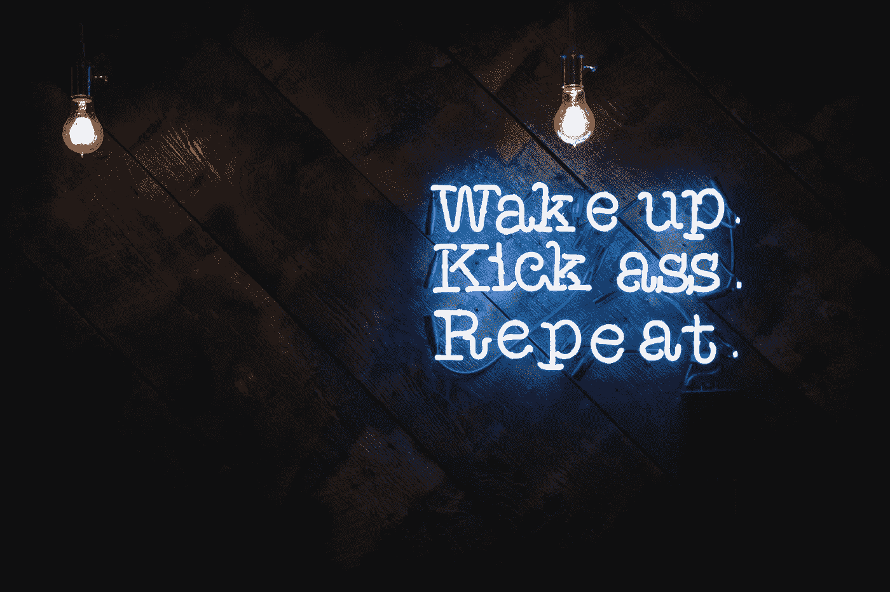

# 培养维护自己的勇气

> 原文：<https://medium.datadriveninvestor.com/cultivate-the-courage-to-stand-up-for-yourself-3afb2b8a1e74?source=collection_archive---------3----------------------->

踢屁股与女王伊丽莎白二世(二手灵感项目)

Photo by [Justin Veenema](https://unsplash.com/@justinveenema?utm_source=unsplash&utm_medium=referral&utm_content=creditCopyText) on [Unsplash](https://unsplash.com/s/photos/kick-ass?utm_source=unsplash&utm_medium=referral&utm_content=creditCopyText)

二手灵感项目从一句激励性的引语开始，在创造性道路蜿蜒的任何地方冒险。

> “这个世界并不是最令人愉快的地方。最终，你的父母会离开你，没有人会无条件地保护你。你需要学会捍卫自己和自己的信仰，有时，原谅我的语言，踢别人的屁股。”——伊丽莎白二世女王

那个在中学时在我们的储物柜旁威胁地等着的呆子。那些在员工会议上让我们难堪的刻薄的中层管理人员。那个在公共场合侮辱我们的重要的人。那些不理睬我们礼貌地请求安静一点的讨厌的邻居。

 [## 摔倒不是失败。数据驱动的投资者

### 你只有在放弃的时候才会失败。每个英雄都会倒下，我们活着就是为了失败者出现的时刻；上升到…

www.datadriveninvestor.com](https://www.datadriveninvestor.com/2019/01/17/falling-isnt-failing/) 

生活中充斥着令人讨厌的恶霸、贱人、卑鄙小人、混蛋和混蛋。从我们上幼儿园的第一天起，我们就遇到了这些问题，一旦我们被送进老年护理中心，我们很可能会处理这些问题。

一路走来，我们知道我们必须捍卫自己和我们的利益，我们不会忍受这个被玷污的社会，除非我们停止接受人们抛出的废话。

但是我们如何为自己辩护呢？没有保护我们免受言语攻击的手册。没有小册子教我们如何避免受人摆布。如果我们模仿失败者电影中的英雄，他们总是完美地回到他们生活中的混蛋身边，我们会被误导——现实生活不是照本宣科的。朋友和父母经常给我们提供有缺陷的蓝图，告诉我们在保护自己时，T2 应该做什么，不应该做什么。

我们都在一起做人类生存的事情。不友善的话语和有害的行为从情感上污染了我们的环境。为了清理它，我们必须根除它的毒性，并在需要后退的时候后退。

无论是在工作场所还是社交场合，我们都需要为自己说话。我们都需要周围的人理解我们的声音、想法和感受。以下是一些我们可以有效捍卫自己的方法:

**不要道歉(除非真的有必要)。当我们为自己辩护时，我们经常会有找借口或道歉的冲动。别说了——让我们自信一点，不要道歉。我们有权说是或不是，而不需要解释。有时候需要的只是一个简单的答案。我们有权决定人们是否应该得到更多关于我们动机或感受的信息。除非我们愿意，否则我们不应该放弃这种控制。**

**理解对立的观点。我们经常审视自己来反驳他人。自信时展现自信的一个方法是意识到对方想要什么。考虑他们的观点、动机和需求。原谅我的陈词滥调，但是每个故事都有两面性。如果我们了解对手来自哪里，我们就能更有效地争取我们的位置。**

明智地选择我们的话语。当回应骚扰者时，我们应该小心地发展任何口头回应。我们的声音和话语是有影响力的。因此，如果我们精确地计划我们的话语，我们可以有效地保护自己免受攻击。我们还想监测交付和声调。重要的是要在遭遇中意识到这些因素，并在事后反思。我们对单词选择是积极的还是消极的？我们的信息是被动表达的还是主动表达的？我们是否清楚直接地表达了我们的观点，让每个人都理解了我们的观点？

**控制我们的身体反应。**这并不(一定)意味着举起我们的拳头打一架；它可能更多的是关于审视和改变我们的身体存在和外表。肢体语言和语言交流一样强大。我们是否弯腰驼背，避免目光接触？当我们为自己辩护时，互动的物理元素是需要考虑的关键因素。

**蔻驰尊重他人对待我们。我们最终控制着别人如何对待我们。我们需要清楚地表明我们希望被如何对待——让别人知道我们不会接受他们的废话。这并不总是意味着明确地说出来。这是关于意识到我们的行为、言语和决定在别人看来是怎样的。我们的行为会促使人们尊敬我们吗？如果我们被利用了一次，它可以成为其他人的线索，表明我们在未来可以被操纵。我们需要对自己的行为保持高度警惕，并在以后反思，以确保我们不会招致不敬。**

**考虑我们的设定。**当开始自作主张时，考虑时间和地点。如果我们不是早起的人，工作日的开始可能不是面对同事和监控上述事情的最佳时间。如果事情是私人的，在大型会议上，在公司一半的人面前为自己辩护可能不是正确的做法。时间和地点对获得我们想要的结果至关重要。

很多因素会影响我们维护自己时的成功程度。但共同点是信心。我们必须相信自己的立场，不允许别人强迫我们做我们不想做的事情。

我们时不时都会被踢屁股。我们都可能被恐吓，被逼迫，被推来推去。对于这些不可预见的对抗时刻，我们并不总是有恰当的俏皮话或身体反应。

这没关系。重要的是，我们进化并扩展我们的自信工具箱，这样我们就可以减少未来必须应对的垃圾数量。我们应该只在需要的时候吃点苦头。只要我们有机会，我们就应该在别人有机会踢我们的屁股之前把我们的靴子踢到别人的屁股上。