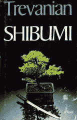

# 培养这种古老的哲学来成功创业

> 原文：<https://medium.datadriveninvestor.com/cultivate-this-ancient-philosophy-to-succeed-in-entrepreneurship-b0e74bea9c2?source=collection_archive---------2----------------------->

韦斯·安东内尔

*失败后又成功的企业家。退伍军人，美国陆军和美国空军。专业主题演讲人。*

如果你是一个不相信像 Shibumi 这样抽象的古代亚洲哲学的人，那么你并不孤单。一开始我也不知道。

Shibumi 是一个非常抽象的概念。没有它你能成功吗？绝对的。

但是，如果我不分享我认为对我的成功有贡献的所有工具，那我就失职了。

**从小学习 Shibumi】**

当我在德州还是个孩子的时候，我有一个非常强烈的学习武术的愿望。但我不想要在美国变得如此普遍的商业化、炒作的眼镜蛇凯空手道。我想要更传统更古老的东西。

那时候，日本武术的方式有一些吸引人的地方，这符合我简单、低调和害羞的青少年个性。我选择了剑道，相当于日本的欧洲击剑(在真正的战斗中完全没用的东西)。在我的剑道课上，我的日语老师给我讲了一个古老的故事，我现在才开始欣赏。它用行动说明了 Shibumi 的概念。

为了充分理解下面的 Shibumi 故事，快速熟悉封建日本的阶级结构是必要的。武士阶级统治着日本封建社会。

虽然武士只占人口的 10%，但他们拥有巨大的权力。其余 90%的人口由商人、工匠和渔民组成。所有人都被认为是比武士阶级更低的阶级。

当武士经过时，下层阶级的成员被要求鞠躬以示尊敬。如果一个农民或工匠拒绝鞠躬或侮辱武士(真实的或想象的)，武士在法律上有权砍掉这个拒不服从的人的头。正是在这个世界上，我讲述了这个“茶师”的故事，这是我的导师吉国老师告诉我的。

**《茶师》:Shibumi 在行动中的示范**

一个孤独的武士正穿过封建时代日本阿苏省的一个小村庄。当他穿过拥挤的村庄广场时，他转过身，把挂在身边的剑鞘重重地撞在了一位茶艺师的腿上。

武士盯着茶师喊道:“你碰了我的剑。这是严重的侮辱，我会杀了你。”

茶师立刻明白武士是真心要杀他，吓得全身瘫痪。

“我没有侮辱你的意思，高贵的先生。请原谅我的笨拙，让我活着。如你所见，我不是战士，也没有剑。”

武士能感觉到茶师的恐惧，这让他很兴奋。

“那么去买一把剑，明天中午在街上见我，我会让你像个男人一样死去。如果你不出现，我会像抓动物一样抓到你，把你的头砍下来。”

他背对着茶师，走开了。

茶师几乎被吓呆了。“我是一个死人，”他想。然后他想起另一个武士，一个著名的剑术大师，也在镇上。

想着陆小风能帮上忙，茶艺师找到他，解释了他的故事。他说，他有钱支付他的保护服务费，愿意雇用他。

“我不雇佣平民，”剑客冷冷地回答。“用你的钱买把剑，自己打自己的仗。”

“那你愿意教我剑术吗？”茶师恳求道。“我可以给你很好的报酬。”

“我也不教平民武术。再说，你觉得一天能学到什么？”剑客问。

“我有什么损失？”茶师苦笑着说。

剑客看了他一会儿，然后心软了。尽管茶师是一个平民，剑客明白茶师是一个需要帮助的无辜受害者。

剑客同意在一天之内教茶师他所能掌握的一点剑术。茶师去买了一把剑。他们从那天下午开始练习，很快发现这位茶师完全没有用剑的天赋。

几个小时后，看着茶艺师做了数百次笨拙的练习，剑客摇了摇头。他平静而坚定地说:“明天，你就要死了。”

茶师被碾压。他身心俱疲。他放下剑，盯着地面，肩膀耷拉下来。

剑客若有所思地审视了他一会儿，说:“我们喝茶吧。”

茶师困惑地抬起头，但随后开始打开他的茶具。这两个人在附近的一块空地上安顿下来，茶师开始了他熟悉的例行公事。当那个人优雅地将水倒进一个盛有苦味的绿色粉末的碗里时，剑客感到很惊讶。

当剑客将混合物搅拌成泡沫状时，他看到眼前发生了惊人的变化。不在的是刚才还在他面前的那个疲惫、沮丧的人。现在茶师的背挺直了，他的肩膀挺直了，他的头直立着。

现在坐在剑客面前的是一位严肃、威严的古代仪式“大师”。他的脸是一幅平静的画面。当他看着他的眼睛时，剑客立刻认出那人是石部。

“站住！”剑客坚定地说。“你想明天杀死你的敌人吗？”

“但是你说我快要死了，”茶师回答。

“是的，你是。但是你想像战士一样死去吗？你想杀死你的敌人吗？”

“是的，”茶师平静地说。

“那就做你此刻正在做的事情。”

“但我现在什么也没做。”

“准确地说！你的头脑是空的。你既不渴望生，也不怕死。当你明天遇到你的敌人时，我希望你像现在一样清空你的头脑。把你的剑举过头顶，当他攻击的时候，除了砍和死什么也不做。”

茶师，作为他艺术的“大师”，明白了。

第二天，被侮辱的武士震惊地发现茶师站在街上等他。武士以为茶艺师会藏起来。当他走近时，他暗自窃笑，因为他注意到那个农民有一把剑举在空中。

但当他走近时，他开始感到不安。他以为会看到那个人害怕得发抖，但是茶师的剑仍然纹丝不动，他的脸冷冷的。武士在几步远的地方停下来，看着茶师的眼睛。他什么也没看见……只有死亡。

武士口干舌燥，过了一会儿，他说:“我无法打败你。”他转身走开了。

这个故事完美地说明了 Shibumi 的真正力量。Shibumi 与体力或技术熟练程度无关。

相反，shibumi 是一种非常受欢迎的商品，独立于政治、经济或军事力量。Shibumi 只是把自己从对失败的恐惧中解放出来，不管结果如何…即使结果是死亡。这是一个如此强烈的精神焦点，以至于你的头脑是空的。

我所遇到的关于 Shibumi 最完整的定义来自于 1979 年出版的一本名为 *Shibumi* 的书，作者是 Trevanian(美国作家罗德尼·威廉·威特肯的笔名)。以下是摘录:

*“听起来好像我会喜欢他，先生。”*

*“我相信你会的。他是一个我非常尊敬的人。他拥有一种品质。。。怎么表达？。。。的* shibumi *。”*

*“Shibumi，先生？”尼科尔莱知道这个词，但只是当它用于花园或建筑时，它意味着一种低调的美。*

“你是如何使用这个术语的，先生？”

*“哦，模模糊糊。我怀疑是不正确的。描述一种不可言喻的品质的笨拙尝试。如你所知，shibumi 与平凡表象下的精致有关。这是一个如此正确的陈述，以至于它不必是大胆的，如此尖锐的，它不必是美丽的，如此真实的，它不必是真实的。*

*“识见是理解，而不是知识。雄辩的沉默。在风度上，是谦虚而没有*拘谨*。*

在艺术上，当“石见”*的精神以“萨比”*的形式出现时，它是优雅的简单，清晰的简洁。在哲学中，当* shibumi *作为* wabi *出现时，精神上的宁静并不是被动的；它是“存在”而没有“成为”的焦虑。在一个男人的个性中，它是。。。怎么说呢？没有支配的权威？差不多吧。”**

*shibumi*的概念激发了 Nicholai 的想象力。没有其他的理想如此触动过他。**

“先生，怎样才能达到这个“始见”呢？”

*“一不成就，一。。。发现了它。只有极少数极有教养的人会那样做。像我的朋友 Otake-san 这样的人。”*

“意思是一个人必须学习很多才能到达石见*？”*

更确切地说，意思是一个人必须通过知识达到简单

**Shibumi 和做企业家有什么关系？**

你和你与其他商业人士的互动所带来的好处会随着你所展现的力量而立即显现出来，比如茶师。根据你的背景，对于我们这些服过役的人来说，我们的军事经历可能已经给了我们几个关键的习惯——比如注意细节、克制和行动后报告——它们代表了 Shibumi 的某些关键方面。

对你们这些老兵来说，感谢你们的军人风度，你们已经是 Shibumi 的实践者了。但是根据 Shibumi 专家 Matthew E. May 的说法，从具体的商业角度来看，Shibumi 完成了四件事:

*   Shibumi 是一种剥离你的初创企业的所有非必要元素的方法，这样你就可以专注于最重要的方面。当事情开始变得不可收拾时，他们会的，练习 Shibumi 的想法可以让你像茶大师一样专注。
*   它提供了一种看待事物的新方式。Shibumi 提供了一个全新的视角，就像一个艺术家从许多不同的角度和视角来看待他们的作品，以达到“真相”
*   Shibumi 是禅宗传统“反思”中一种无止境的精致习惯。它允许您执行一个操作，并检查该操作的结果，以便下次找到更有效的执行方法。
*   最后，是接受真正的创造力，那种创造像最初的 iPhone 这样的颠覆性技术的创造力，来自积极的平静、安宁、孤独和宁静。音乐、舞蹈和戏剧中的无声停顿，绘画中的留白，平面设计中负空间的运用，都说明了冷静在创作中的力量。

**日常生活中如何使用舒卜米**

要开始使用 Shibumi，我推荐两个重要的第一步。首先，通过阅读两本非常重要的关于 Shibumi 的书籍来了解自己:

*   特列瓦尼安的《诗布米》
*   [“Shibumi 战略:创造有意义变革的有力途径”，作者马修·梅](http://www.amazon.com/The-Shibumi-Strategy-Powerful-Meaningful/dp/0470769505)

Trevanian 的书是一部虚构的作品，但是包含了迄今为止最接近真实 Shibumi 的定义。马修·梅(Matthew May)的书更侧重于商业，被几家财富 500 强公司广泛用于在当今的商业环境中保持竞争力。

第二，Shibumi 对细节的执着关注是有益的。在军队呆过，你已经熟悉这个概念了。

Shibumi 将你对细节的关注提升到另一个层次，在你内心引发连锁反应。你将开始变得更加清醒和敏锐。你的记忆力会提高。

此外，你开始很快认识到什么是浪费时间，什么对你的企业是重要的。你会开始看到更广阔的观点，而不是看到其他人都陷入的狭窄的范围内。

当你积极追求 Shibumi 提供的特质时，世界对你来说看起来很不一样。这种理解给你力量，给你优势。

例如，你将开始更快地达到你的短期目标。你的长期目标会变得更宏伟、更崇高。没有人会质疑你的信念或决心，让自己过上更好的生活，获得真正的自由——那种只有经济独立才能带来的自由。

归根结底，从古代的禅宗大师那里仍然有很多东西可以学习。自己试试这种古老的技术。你不必为了极简主义而发疯重新布置你的房子！从小处着手:试着在日常交往中找到平衡并注意细节，看看会发生什么。你可能会惊喜。

*原发布于:*[*https://in military . com/culture-shibumi-success-老兵-创业/*](https://inmilitary.com/cultivate-shibumi-succeed-veteran-entrepreneurship/)