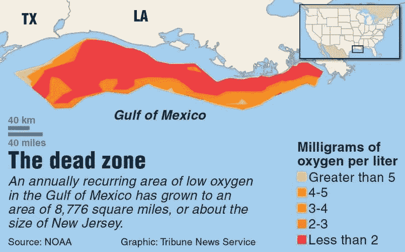
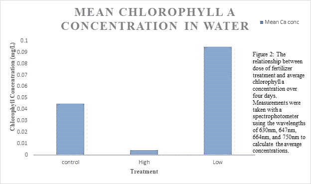
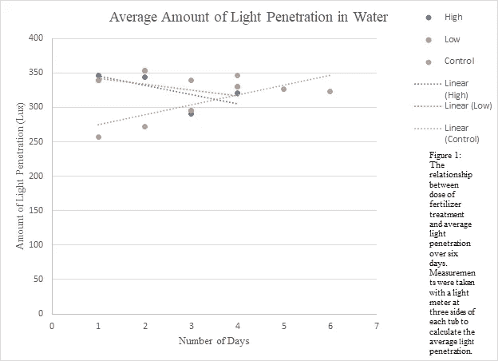

# 养殖富营养化:一种危害水生环境的阴险狡诈的过程

> 原文：<https://medium.datadriveninvestor.com/cultural-eutrophication-an-insidious-and-sneaky-process-that-harms-aquatic-environments-890a903c4b2?source=collection_archive---------4----------------------->

在海滩上美好的一天，有很多人在水里玩得开心，也有很多人在欣赏岸边的风景。舒适的微风让每个人都感到凉爽，海浪平静而安全，在这样一个完美的下午，绝对没有任何担忧。突然，一个波浪带着数百条死鱼冲上海岸，将它们洒在旁观的海滩游客面前，这些游客厌恶和恐惧地命令他们的孩子离开水。一群人聚集在一起，想知道为什么这么多鱼会同时死亡并被冲走。一些人问它是否可能来自石油泄漏或类似的环境灾难，但是，经过更仔细的检查，这些鱼没有被石油覆盖，水里或岸上都没有。目前还没有任何泄漏或天然气泄漏的报告，所以这些情况是不可能的。

大多数人甚至没有开始考虑的一种可能性是养殖富营养化，这是一种非常致命的半环境过程，它剥夺了水生栖息地的氧气，因此杀死了那里的任何生物。这些情况在墨西哥湾太常见了，那里有一个巨大的死区，覆盖了北部内陆和中大陆架之间 6000 到 7000 平方英里的区域，一直延伸到德克萨斯州的上海岸。然而，死亡区不仅出现在南部各州，还出现在墨西哥湾的其他地方，对我们的沿海环境构成了全国性的问题。养殖富营养化的过程本身是半环境的，因为人为因素有助于促进和恶化它，造成这些死亡区。

随着时间的推移，不可预见的**负外部性**增加了死区，这个术语描述了人们采取的行动，其后果是他们没有意识到的。一个例子是农民使用强效化肥、杀虫剂或杀虫剂来提高他们每个季节的作物产量。那些不知道这些化学物质对环境的影响的人不知道，保护措施将不会实施以防止它们产生最终将进入水体的径流，墨西哥湾就是其中之一。养殖富营养化的其他来源包括农场的粪肥径流、经处理/未经处理的城市污水、大气中碳排放导致的酸雨、溶解的氮氧化物、街道和工业区的化学径流、洗涤剂的排放，甚至是自然径流。

此外，这些化学物质大部分流入墨西哥湾，因为密西西比河流域的流域消耗了流经该国的大部分化学物质，从蒙大拿州到宾夕法尼亚州，沿着密西西比河向南延伸。这就是为什么墨西哥湾的墨西哥湾是地球上最大的墨西哥湾之一，而另一个大墨西哥湾位于伊利湖。美国的渔业已经受到死亡区的显著影响，如果在不久的将来它扩张得更多，这些挑战将继续恶化。我们的经济可能因此受到严重打击，所以这是许多人，尤其是那些不相信对我们的环境有害的人应该担心的一个原因。此外，在今天的社会中，很多人并不担心我们的自然世界，直到这些问题开始直接影响他们和他们的利益。

**Source**: [https://www.thegazette.com/subject/news/nation-and-world/gulfs-dead-zone-is-biggest-ever-20170804](https://www.thegazette.com/subject/news/nation-and-world/gulfs-dead-zone-is-biggest-ever-20170804)

养殖富营养化的实际过程本身就是地狱般的，给水生物种带来死亡前的巨大痛苦。首先，过量的营养物，尤其是氮和磷，通过上述来源进入水生环境，导致藻类和其他水生植物大量生长。然后，水藻花覆盖了水面，利用阳光，并随着其他植物的死亡慢慢耗尽环境中的氧气，因为它们被切断了光源。这导致水浑浊，因为阳光无法到达水生环境的较低水平。最后，随着水藻和所有其他植物一起死亡，它们的分解消除了剩余的氧气，以至于生命不再能够维持，甚至浮游生物也不能。这是鱼类和许多其他物种因缺氧而死亡的时候，这些缺氧发生在该地区或遇到它，使种群进一步分散，减少了足够安全的栖息地数量。

幸运的是，冬天确实带来了喘息，并自然地清洁了那些受影响的环境，但对于水生物种来说，等待急需的缓解需要很长时间。此外，墨西哥湾的死亡区每年都在扩大，随着死亡人数继续惊人地上升，危及更多的生物。过去，研究人员承诺他们将在 2005 年前大大减少墨西哥湾的死亡区，但这一承诺没有兑现，因此，现在我们比以往任何时候都更需要共同努力，保护主义者和公众都一样，来拯救它。我们不仅需要每一个人的参与和实际的奉献来兑现这些承诺，我们还需要新的技术和巧妙的方法来防止进一步的流失。

为了证明养殖水体富营养化是多么致命，我将举一个我和我的大一生物班在拉格朗日学院进行的实验。在收集了西点湖的水样本后，我们想测试我们的假设，即在 6 天的时间里，加入 6 毫升营养物的小水体比用低得多的营养物处理的小水体具有更高的平均叶绿素 A 浓度和更少的光穿透性。我们的目标是确定富营养化在较小水体和较大水体中的发生是否不同，用已经含有微生物和藻类的湖水装满浴盆。我们希望收集有关化学径流如何对我们的湖泊造成潜在危害以及如何防止危害的见解。

为了准备这个过程，我们在两个浴盆里装满了 1.5 升水，一个装有 4 毫升蒸馏水和 2 毫升粉色营养水(含有神奇 Gro 肥料)，另一个装有 6 毫升粉色肥料。第三个浴盆作为我们的对照，里面只有湖水。一旦实验盆准备好了，我们就把它们放在纸板盒里，用测光表测量光的穿透力。盒子上刻有三个洞，直接放在一盏顶灯下。孔位于两个盒子的前面、右边和左边，一旦将测量仪插入所有三个盒子中，计算每个处理的平均透光率值。

之后，每天将这两个盆放置在发出红色、蓝色和紫色光的生长室中 24 小时，并将它们留在室内 6 天，并在第 1、2、3 和 4 天进行额外的光穿透测量。至于提取叶绿素 A，从每个试管的中间取出四个样品，放入贴有标签的离心管中。将它们以 2000 RPM 离心两分钟，以在底部形成细胞沉淀，并提取上清液以分离沉淀。然后，使用涡流将沉淀与剩余的水混合，将溶液转移到标记的离心管中，以 8000 RPM 离心两分钟。

我们用杵研磨颗粒一分钟，破坏液体中叶绿体周围的质膜。随着研磨的继续，向样品中加入 1 毫米 95%的乙醇，向每 1.7 毫升样品中加入 0.5 毫升 95%的变性酒精。将样品本身放置在黑暗的位置 20 分钟，并以 8000 RPM 离心两分钟。为了计算吸光度，将它们分别加入比色杯中，放入分光光度计中，使用 630 纳米、647 纳米、664 纳米和 750 纳米的波长。

使用 750nm 波长是因为残留的颗粒悬浮在每个样品中，并且这些值是五个时间点的平均值。从每个样品在其他三个波长的平均吸光度读数中减去 750nm 处的平均读数，并进行 t 检验以确定处理之间叶绿素 A 浓度的差异在 p 值为 0.05 时是否显著。高剂量处理在第一天具有较高的光穿透量，为 349 勒克斯，但在第二天降低到 340 勒克斯(图 2)。同时，低剂量处理在第一天具有较高的光穿透量，为 346 勒克斯，但在第二天降低到 341 勒克斯。我们的结果如下图所示。

**Figure 1**: Chlorophyll A concentrations in the tubs of lake water

**Figure 2**: Light penetration in the tubs of lake water over the course of a week

总的来说，用 301 勒克斯的高剂量处理 4 天的水浊度较低，而用 320 勒克斯的低剂量处理 4 天的水浊度较高。在两天的范围内平均光穿透率为 260 勒克斯的对照盆和每个处理之间没有显著差异。在四天的过程中，高剂量处理的叶绿素 A 浓度较低，为 0.005 毫克/升，而低剂量处理的叶绿素 A 浓度较高，为 0.09 毫克/升(图 1)。对照组在四天中叶绿素 A 的平均浓度为 0.045 毫克/升，各处理之间也没有显著差异。低剂量处理的浊度低于高剂量，因为前者的平均光透过率为 320 勒克斯，在图中为负趋势线。

从我们的实验中，我们确定了富营养化在池塘和湖泊等较小水体中的发生方式不同于营养水平较高的低地。为了解释有关叶绿素 A 浓度的令人惊讶的结果，已经进行了研究，探索生态系统缺氧和营养物增加之间的关系如何表现出类似阈值的行为，即一旦超过营养物输入的特定阈值，以前经历过缺氧的生态系统更容易受到未来情况的影响。根据这些研究，低剂量处理可能比高剂量处理更快地达到缺氧阈值，从而导致更高的叶绿素 A 平均浓度。尽管在我们的案例中有这些可能性，但这并不意味着不可能有任何可能扭曲我们数据的错误。

也许培养桶没有在培养室中放置足够长的时间，以允许更多的藻类生长并产生更多可行的数据。这可能导致了两个缸中出乎意料的平均叶绿素 A 浓度。也许我们应该把培养桶在培养室里的时间延长到一周半，让藻类有更多的时间生长。计算错误也可能是一个问题，特别是对于平均叶绿素 A 浓度和平均透光率。当使用 750 纳米波长时，可能没有考虑到所有的碎片，留下了几种可能性。

知道了养殖富营养化对我们的水生野生动物有多危险，有几种不同的方法可以帮助减少它的发生。我强烈建议农场和其他农业区包括由植被组成的缓冲区来环绕湖泊和溪流。这将有助于防止土壤和岩床的侵蚀，这种侵蚀会通过土壤中嵌入的营养物质的释放以及反硝化过程来加速富营养化的过程。此外，化肥、杀虫剂和/或杀虫药不应在湖泊、溪流和河流附近使用，而来自饲养场、农田和农场粪肥等营养源的径流需要更好地控制。不要忘记，使用低磷酸盐洗涤剂可以减少住宅实践中的养殖富营养化，阻止大部分此类化学物质产生径流。

不幸的是，一个更具侵略性且昂贵的方法是开始沿着我们的海岸线建立膜状屏障，集中在墨西哥湾和密西西比河附近。事实上，进行这样一项努力的成本将是非常昂贵的，可能要花费几十亿美元或更多，特别是当环境组织每年只收到这么多工作经费的时候。然而，我们作为一个社会不能两者兼得。我们不能指望通过让我们重要的水体不断受到威胁来节省资金，这将影响渔业和我们 GDP 的其他来源，我们也不能指望任何可靠的解决方案是廉价的。虽然我们的政府可能是个坏脾气的人，但我们不能让这阻止我们利用尽可能多的资源来解决世界上最大的环境冲突。

现在是我们停止害怕冒险拯救我们的环境的时候了，因为如果我们不这样做，我们以后会失去更多。处理与文化富营养化相关的问题也是如此，只有每个人都改变对自然世界的看法以及它对人类的真正价值，这个问题才能得到解决。当然，解决方案正在到位，试图扭转其影响，但是，如果我们想完全摆脱可怕的事件，我们必须看到我们的努力进行到底。否则，我们将会看到更多的海滩日被翻卷到我们海岸上的死鱼毁掉。