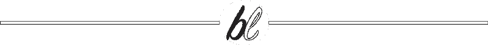
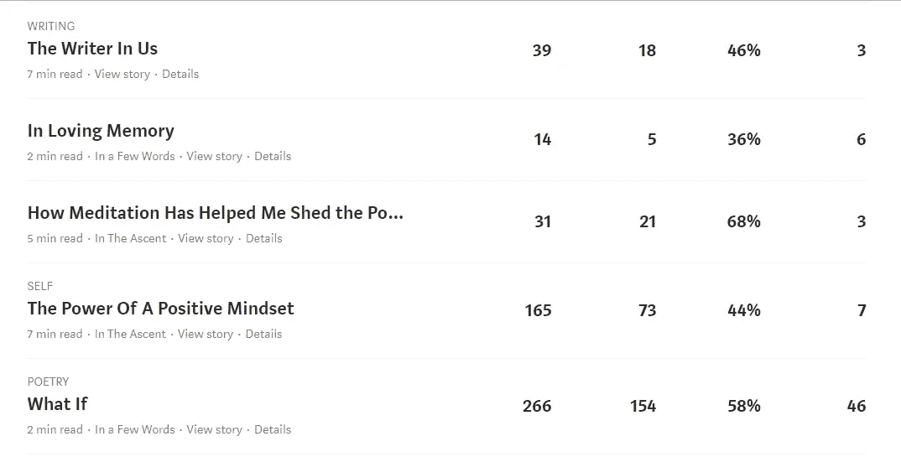

# 培养基固化

> 原文：<https://medium.datadriveninvestor.com/curation-on-medium-e3c5ab6f9c62?source=collection_archive---------13----------------------->

## 真的有区别吗？

Photo by [Ezra Jeffrey-Comeau](https://unsplash.com/@emcomeau) on Unsplash

我想，到现在为止，你应该已经读过很多关于媒体策展的文章了。我肯定读过我的那份。

我从那些文章中得到的信息？

 [## 零工经济如何改变未来的就业前景|数据驱动的投资者

### 随着自动化的发展和 Z 世代的出现，劳动力的构成和动态正在发生变化…

www.datadriveninvestor.com](https://www.datadriveninvestor.com/2018/12/19/how-is-the-gig-economy-changing-the-future-jobs-landscape/) 

老实说，信息混乱。

有人说让你的文章有条理是非常重要的。

有人说应该没关系。

一些作家对于他们的文章没有被策划而变得如此激动。

有些人只是顺其自然。

我吗？我在中间。

迄今为止，我已经发表了 60 多篇文章，其中大约 20%是由媒体策划的。

有区别吗？

***是*** 和 ***否*** 。

与没有策划的文章相比，我策划的所有文章都获得了最多的浏览量。这些观点也转化成了更多的阅读。

但是，这并不总是转化为更多的粉丝，这就是你在 Medium 上赚钱的原因。

观点和阅读不能让你赚钱，掌声可以。

你可以在你的文章上获得数百万的浏览和阅读，但是如果没有一个人为你鼓掌，你的收入将会是一个巨大的零。

我迄今为止点击率最高的文章是在诗歌栏目下。这也是迄今为止粉丝最多、收入最高的一部电影。

 [## 如果呢

### 一首关于提问的诗

medium.com](https://medium.com/afwp/what-if-8ec407d7ffc1) 

我有另一个目前仍在等待统计其收益。它是由 SELF 策划的，目前拥有我所写的所有文章中最高的点击量(迄今为止有 984 次，很可能成为我第一篇点击量达到 1000 次的文章)。

 [## 自己喝水

### 就像植物需要浇水才能生长一样，我们也一样

medium.com](https://medium.com/blueinsight/water-yourself-53fc3fe41fce) 

被策划无疑有助于推动这些文章的流量。我知道读者能够找到它是因为它出现在 Medium 的主页上，对此我很感激。

但是，我也有两篇文章是策划好的，但是获得了很低的浏览量、阅读量和零掌声。

那两篇文章不会让我赚到一分钱。

另一方面，我有一些文章没有策划，但获得了很好的观点、阅读和相当多的掌声。与那两篇被策划但没人叫好的文章相比，那些文章会让我赚更多的钱。

对于一个拥有少量追随者的新作家来说，策划是非常重要的。这有助于将你的作品传播给更多的观众。如果你的文章足够好，它会为你吸引一批追随者。

但同样，这并不一定等同于良好的收益。

如果你看看我上面文章的统计数据，你会发现我的文章《美国作家》尽管被归入写作类，但总体来说做得并不好。

就连文章《积极心态的力量》也没有获得同样多的掌声，尽管它获得了超过 150 次浏览和 73 次阅读。

所以，是的，你确实得到了更多的关注，但是关注并不等于更多的钱。

如果你是一个拥有超过几千粉丝的作家，你不一定需要你的文章被策划。

为什么？

因为你已经有一大群追随者了。

你的作品将会被成千上万已经关注你的人看到，如果你的作品发表在像 Startup，Ascent 等大型出版物上，那么它将会有更多的关注者。

让你的作品在出版物上发表也会增加你被策划的机会。

然而，从长远来看，重要的不是监管，而是你的追随。

喜欢你作品的人会阅读并支持你的作品，因为他们欣赏你为之付出的努力。一旦你拥有了足够多热爱你作品的读者，他们会确保你能在 Medium 上有所收获。策划你的文章只是让你达到目的的一步。

我还想让我的文章被策划吗？

当然了。

如果可能的话，我希望我的每一篇文章都被策划。

因为那样我会有更多的观众，那些喜欢我作品的人会开始关注我，希望也支持我。

但是如果我不这样做，也没什么大不了的，因为我还是会写出我最好的作品，并把它放在那里。

在媒体上策划不是我的目标。

激励和帮助他人——同时做我喜欢做的事情——这就是我在这里的原因。如果我能在这个过程中赚些钱，那就太好了！

所以，如果你问我被策划是否有所不同？

我想说这真的取决于你是谁，你现在是怎样的一个作家。

如果你是那些拥有数万甚至数十万粉丝的大公司之一，那也没什么大不了的。虽然我敢打赌，一旦你进入了那个联盟，你的文章可能会更经常地被策划。

但是如果你仍然是一个像我一样拥有少量追随者的新作家，那么是的，策展对你来说肯定是一个巨大的推动。这将有助于让你的作品传播出去，接触到更多的读者。

虽然，如果你不经常被策划(像我一样)，请仍然尽你最大的努力写好每一篇文章。

这是最重要的。