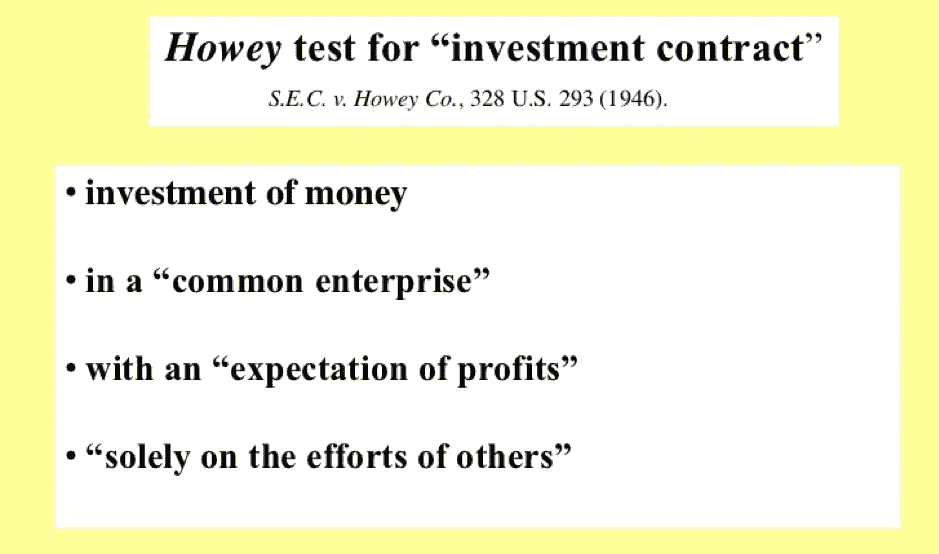
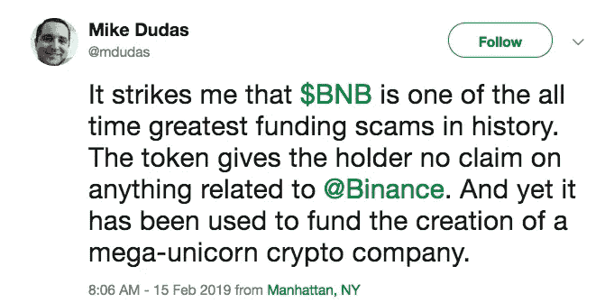
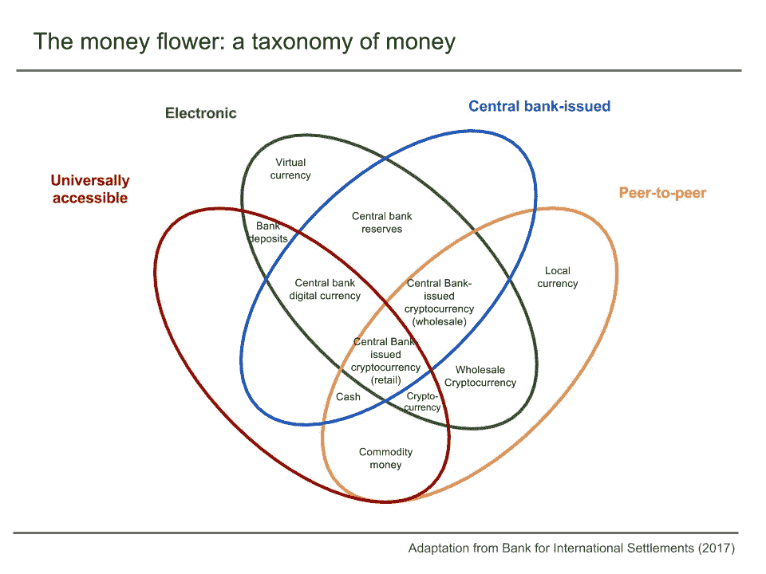
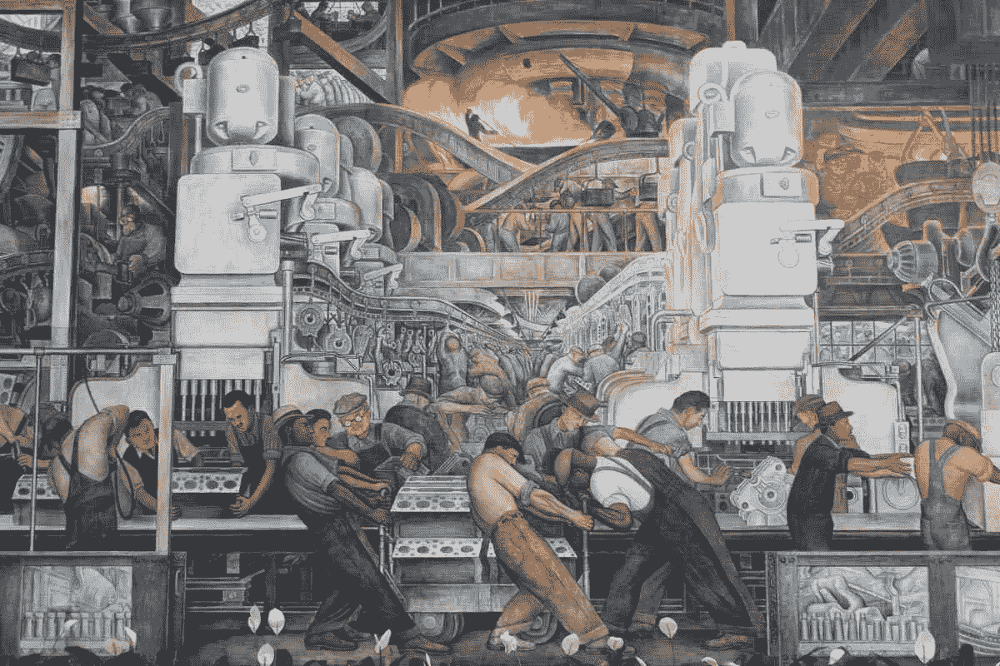
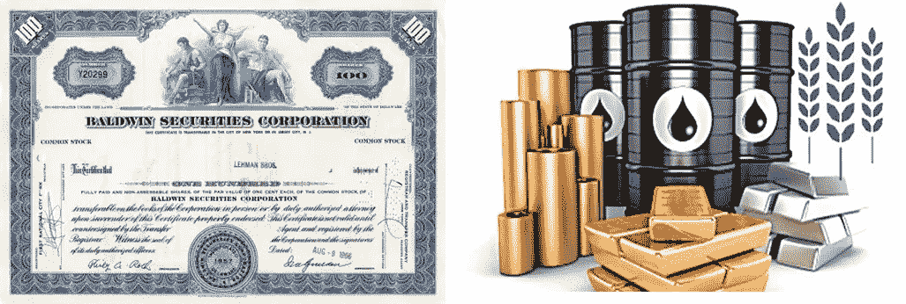
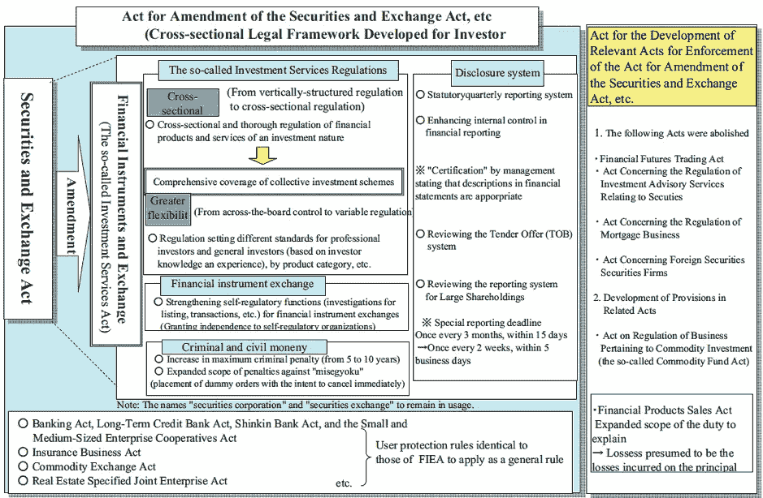
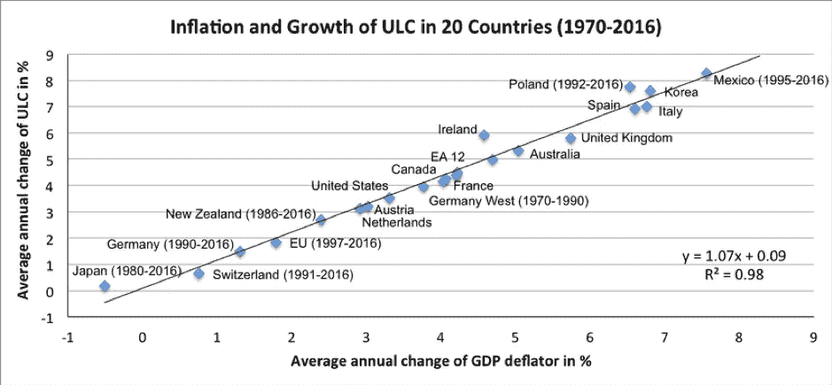
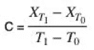
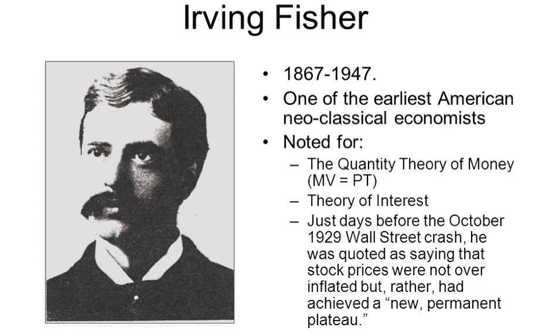

# 货币革命:将商品、证券和货币融为一体:“超级载体”币安加密货币(BNB)(第一部分)

> 原文：<https://medium.datadriveninvestor.com/currency-revolution-combining-commodities-securities-and-currency-in-one-super-carrier-4d11bcef7db2?source=collection_archive---------6----------------------->

作者 Robin Gu 是 X-Order 的研究员，我们投资于区块链、数据科学开发和理论研究，以推动一种新的网络自然金融基础设施的出现。

本文以 BNB 为例，探讨了加密货币的商品、证券和货币属性，旨在提供一个新的观察框架。这种观察方法只着眼于经济视角，排除了证券监管层面的相关法律法规。豪威测试主要用于确定加密货币是否是一种证券。BNB 不是被任何监管机构归类为证券的加密货币。

> 在第一部分中，我们探讨了与劳动报酬相关的商品、证券和货币的定义，并试图与 BNB 进行比较。

毫无疑问，由于 BNB 强劲的上升趋势，它在漫长的熊市中获得了关注。然而，围绕 BNB 有很多争论:这种令牌是被归类为具有商品属性的“实用令牌”还是具有安全属性的“安全令牌”？区块链媒体的创始人迈克·杜达斯和币安的创始人赵昌鹏在推特上发起了一场辩论，吸引了知名投资者和主要意见领袖。

忽略 BNB 的法律和合规问题，BNB 是商品还是安全仍然是主观的。我们认为，对 BNB 的评估不仅应基于其实用性和安全属性，还应基于其货币属性。在代币经济学和金融文献中，BNB 可以作为一个案例来研究。

 [## 如何创建自己的加密货币，让您的企业为未来做好准备-数据驱动…

### 加密货币是如何工作的？如何制作加密货币？如何推出我的加密货币？所有这些问题必须…

www.datadriveninvestor.com](https://www.datadriveninvestor.com/2019/03/25/how-to-create-your-own-cryptocurrency-and-make-your-business-ready-for-the-future/) 

这三个概念的结合——(1)商品(2)证券(3)货币——可能会导致未来的“货币战争”或“货币革命”。

我们试图引入经济学中“劳动报酬”的概念，作为加密货币新理论框架的基础。我们需要重新审视“商品”、“证券”和“货币”的基本概念，以明确隐藏在伴随加密货币增长和演变的概念发展中的潜在范式转变。

# **用劳动报酬重新定义商品、证券和货币**

传统经济理论中商品、证券、货币的定义是什么？

**商品**

商品有两个主要属性:可以交换，包含劳动报酬。一般来说，随着劳动力交换的发生，劳动报酬会逐渐减少。当然，有些产品，如软件产品，随着时间的推移，劳动报酬的衰减率很低，甚至可以忽略不计。

> *因此，商品在交易中的价值就是生产者过去创造的劳动报酬的未来使用权的价值。*这强调了劳动报酬在被创造出来后会价值衰减。

**证券**

证券通常被定义为用来证明持有人拥有某种权益或权利的证书。好像和一个商品的定义完全不一样。但是，如果我们分析它的属性，证券可以像商品一样交换吗？

至少在某些情况下(在合法的交易中)是这样的。

这些证券是否也包含劳动报酬或潜在的未来劳动报酬？答案似乎是正确的。大宗商品凝聚了过去的劳动，而股票等证券包含潜在的未来劳动回报，即公司的未来业绩。大宗商品需要实体交易所，大部分证券都局限在某个空间——例如纳斯达克市场、上海证券交易所等。有趣的是，我们看到随着世界金融行业的不断创新，有主流机构开始认识到证券和商品划界的问题。

2006 年，日本将《证券交易法》改为《金融工具法》。

> *当人们购买证券时，交换的价值被用来购买生产者未来的劳动报酬。*需要注意的是，未来的劳动报酬不是固定的，可能会有波动。

**货币**

根据马克思主义，货币是一种特殊的商品，可以作为一种普遍交易的商品。日本经济学家阿玉木·泰富在他 1994 年发表的题为“货币的出现和崩溃”的论文中有一个更容易理解的定义。他重复了一个复杂的进化过程，从只有商品的市场开始，到有通用货币的市场结束。这导致他得出一个结论，金钱是“最受欢迎的商品”。

苏黎世联邦理工学院的 Richard Senner 和 Didier Sornette 发表了一篇题为“加密货币的圣杯”的论文。本文强调货币必须与某种“单位劳动成本”或“单位劳动报酬”相联系，这种劳动报酬随着整个市场的劳动报酬数量而变化。

Average annual change of Unit Labour cost (y-axis) as a function of the average annual change of the GDP deflator (x-axis) for 20 countries from 1970 to 2016\. Source: Ameco, publisher’s calculations

基于上述讨论，“单位劳动报酬”的概念可以进一步细化。一种货币出现的不同情况有哪些？货币的出现与满足不同商品不能同时交换的需求有很大关系。换句话说，货币是劳动报酬中不能立即转化的部分，因为劳动报酬的数量从过去的状态变化到未来的状态。

数学上表示，假设 *X* 代表劳动报酬的数量，T0 代表时刻 0，T1 代表时刻 1， *C* 代表货币。“货币”的公式可以表示为:

基于美国经济学家埃尔文·费雪的利息理论，他提出了一种被称为*“计价单位”的交换计量单位。*我们将此描述为“劳动报酬”。

我们试图用“劳动报酬”交换单位来衡量当今全球商品和证券的总价值。我们要注意的是，上述与传统的评价方式最大的区别在于，前者不涉及货币。

> 本质上，我们刚刚区分了货币和劳动报酬是不同的东西。货币是“单位时间的劳动报酬”，而劳动报酬本身是一个无量纲的计量单位。

请查看下面的第 1 部分:

## [货币革命:集商品、证券、货币于一身:“超级航母”币安加密货币(BNB)(下)](https://medium.com/datadriveninvestor/part-2-of-2-currency-revolution-combining-commodities-securities-and-currency-in-one-super-97753e1bfbe3)