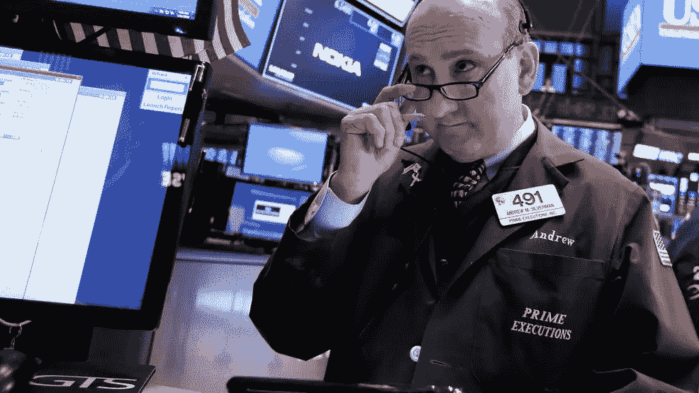

# 目前的政府关门将是历史上最长的一次

> 原文：<https://medium.datadriveninvestor.com/current-government-shutdown-is-about-to-be-the-longest-in-history-531978253dd1?source=collection_archive---------17----------------------->

周五股市小幅下跌，因为人们越来越担心政府持续关闭以及与中国贸易关系的不确定性。

标准普尔 500 下跌 0.01%。美国原油价格下跌 2 %,打破了连续 9 天的上涨。道琼斯工业平均指数下跌 0.02%，至 23995.95 点。纳斯达克综合指数下跌 0.21%，至 6971.48 点。尽管周五略有下跌，但 1 月份股市表现相对较好。标准普尔 500 在去年 12 月下跌约 9%后，已经上涨了 3.5%。

美国官员暗示，中国的贸易谈判代表可能会在本月底访问华盛顿。特朗普总统也表示，“我们正在与中国谈判，并取得了巨大成功。”

本届政府停摆已持续 21 天，与 1995 年 12 月至 1996 年 1 月的历史最长停摆持平。很快它将成为美国历史上关闭时间最长的一次。大约 80 万联邦工作人员受到影响。大约一半人被告知回家，另一半人被迫无偿工作。唐纳德·特朗普总统仍在要求资金，在美国南部边境修建他巨大而昂贵的隔离墙。