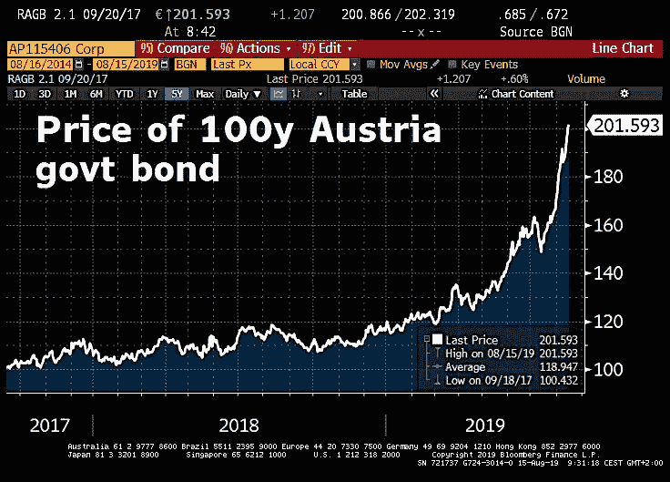

# 目前的利率环境对股票非常有利！

> 原文：<https://medium.datadriveninvestor.com/current-interest-rate-environment-is-great-for-stocks-89983b276fb4?source=collection_archive---------12----------------------->

现在是 2017 年 9 月。欧洲央行(ECB)将 2%作为其长期持有的通胀目标，奥地利政府正在拍卖 100 年期主权债券。2%,与中央银行的通货膨胀目标一致，这大约是证券定价的收益率……对于 100 年期证券来说，这是一个好的名义年利率吗？这将刚好覆盖央行期望的通胀。

嗯，事后看来，这确实是太高了*的利率。诚然，欧洲央行继续低于通胀目标。尽管如此，投资者会继续抢购超高期限债券以推低其收益率，这似乎确实令人惊讶。*

 [## 算法交易的机器学习|数据驱动的投资者

### 当你的一个朋友在脸书上传你的新海滩照，平台建议给你的脸加上标签，这是…

www.datadriveninvestor.com](https://www.datadriveninvestor.com/2019/01/30/machine-learning-for-stock-market-investing/) 

如下图所示(由@ schuldensuehner 提供),随着越来越多的债券(以西欧国家主权债券为首)进入负利率收益率区域，奥地利 100 年期债券价格飙升(收益率下降)。当然，债券不会以负息票发行(要求最初发行的购买者向发行者支付利息)，但随着债券价格上涨，其隐含收益率可能会下降，如果债券持有至到期，其隐含收益率将导致今天的购买者获得负回报。

如今，奥地利 100 年期债券仍然没有出现负收益率(也没有发行负息票的债券)，但这种发展似乎不再不可想象。在 7 月 31 日的一篇文章中，我提出了一个问题，即我们是否正处于一个新的范式中，这个范式的特征是我所说的“挤入”现象。更多详情请参考那篇文章，但在这样的环境下，越来越多公司的首席财务官(CFO)面临着新的挑战和决策。接下来的部分有点技术性，如果你对这些细节不感兴趣，可以跳过。

***利差:绝对项、百分比比较还是百分点差异？***

我几乎每个工作日都会去我们当地的外汇商店看看，这是我有趣的、轶事般的尝试，旨在评估零售客户兑换外币需要支付的费用。这家外汇连锁店有几个地点，包括在柏林最受游客欢迎的地区，在整个城市提供相同的报价。奇怪的是，买卖价差(例如，客户卖出美元换成欧元时得到的汇率与他们用欧元换成美元时必须支付的汇率之间的差额)在欧元和/或美分中总是相同的(以绝对值计)。贵金属币和金条也是如此，他们也买卖。

随着货币汇率和黄金价格的波动(有时波动很大)，买卖差价的绝对值保持不变意味着它会随着给定交易的百分比而大幅波动。黄金价格基本上全年都在上涨。因为商店愿意购买黄金的每盎司价格和它愿意卖给你的每盎司价格之间的差额总是以欧元计算的，这种买卖差价一直在显著缩小。现在，金条的收益率刚刚超过 2%，金币的收益率不到 3%。这种黄色金属的买卖价差远远小于任何货币的最低价差。

不足为奇的是，外汇买价和卖价之间最小的百分比差异是坚如磐石的瑞士法郎。新兴(更不用说前沿)市场货币的买卖差价要大得多。我在以前的文章和 LinkedIn 帖子中讨论过土耳其里拉的价差趋势。

买卖差价的话题让我想到了其他价差。例如，类似的问题也适用于风险利差。在最重要的风险利差中，我必须不断努力应对的是股票风险溢价和国家风险利差。除了一般的股票风险溢价之外，我每天都在研究 *beta* 的概念，它最终成为单个股票的风险分散(在多元化的股票指数上，比如美国股票的标准普尔 500 指数&)。

我最近开始问自己以下问题。我们应该认为这种类型的利差总是(1)绝对值，(2)百分比或(3)百分点？从专业角度来说，当我在个股估值中研究贴现现金流(DCF)模型时，为了计算股权的*成本，*我倾向于(a)采用“无风险”利率(美国 10 年期国债的当前收益率)，(b)为与相关股票最相关的特定国家增加一个(随时间变化的)国家风险利差(以百分点计)，增加一个(随时间变化的)股权风险溢价(也以百分点计)，以及(d)将结果乘以个股的最终结果将是权益成本，我将使用它来计算加权平均资本成本(WACC)以贴现未来现金流，从而得出特定股票的 DCF“公平”价值。

应该指出的是，我的正式职业经历是在新兴市场，在那里，国家风险溢价是一个特别重要的考虑因素，在那里，回到美元作为共同标准曾经非常普遍，特别是因为我在美国公司工作。

但是，这仍然是普遍的做法吗？鉴于目前的“无风险”利率水平，这是全球股市的最佳投资方式吗？我仍然认为基于贴现现金流的估值比简单地使用市盈率等比率更稳健，尽管它的主观性不亚于前者(而且只是多了一个广泛工具包中的估值工具)。

回到这个观点的起源——货币买卖差价的绝对值是静态的，例如，即使“无风险”利率暴跌,“公平”的股票风险溢价应该保持相对静态的百分比吗？在我过去专业操作的世界里，无风险利率通常在 3%到 6%之间，4%到 8%之间的股权风险溢价可以简单地加入其中。

例如，常见的情况是无风险利率为 4%。对于一个信用风险利差为 300 个基点的国家来说。，这将增加 3 个百分点。(三个百分点)。4+3 将给你 7%的国家特定利率。如果股票风险溢价是 6%。，你可以加上这个数字，得出 13%是该国的“公平”股权贴现率。假设你要评估的股票的贝塔系数是 1.1。你可以将 13 乘以 1.1，得出 14.3%的权益成本，将其包含在你的 DCF 模型的 WACC 计算中，以试图得出特定股票的“公平”价值。

这只是我过去的做法，我并不认为这是正确的。我现在意识到，我是在混合各种方法，从名义上的“无风险”利率开始，加上各种百分比的风险利差，最后乘以β，这将增加特定股票风险的百分比。在刚才讨论的例子中，通过乘以 1.1，我实际上是将该国股票风险增加了 10%。

我很好奇现在人们是否有很大的不同。我认为最好的方法是什么值得讨论。在“更长时间更低”的利率环境下，即使是美国股票的“无风险”利率现在也远低于 2%，那么“公平”的股票风险溢价应该在旧的百分点范围内保持多久？我看到最近美国股票风险溢价约为 4%的良好计算结果。

4%比我曾经工作过的股票风险溢价要低，但在目前 10 年期美国国债收益率约为 1.6%的情况下，即使是这个数字也太高了吗？在几年前的一个假设但现实的场景中，你可以获得 4%的无风险利率(RFR)和 6%的股票风险溢价(ERP)。这意味着 ERP 将增加 6%的点数。在我的方法中，RFR 为 4%,总股本成本为 10%。此外，有效保护率将是 50%或 2%的百分比。比 RFR 大(6%比 4%)。

当今最好的方法是什么？即使是“低”的 4%的 ERP 也会增加 2.4 个百分点。而是高达 150%到 1.6%的 RFR。在我看来，将由此产生的市场股票风险溢价乘以贝塔系数仍然是合理的，但大多数人同意吗？同样，这里的问题多于答案。最后，我想强调的一点是，在其他条件相同的情况下，我认为你的投资期限越长，你的股票风险溢价就越低。因为公共股票的每日定价允许有意义的短期股价波动，所以 ERP(更不用说个股 beta)可能非常高。

***利率环境持续走低对股票有利***

上一节对于非从业者来说太专业了，但回到这里的唯一一点是，低利率水平(以及我认为我们将在更长时间内保持更低利率的环境)要求对股票前景进行重新评估。沃伦·巴菲特说过，如果你能让*向他保证利率会永远保持在低水平，他会愿意花更多的钱购买股票。*

永远是一段很长的时间，但 100 年也是。奥地利主权债券相当独特，因为一个资产负债表稳健的国家的超高期限债券的稀缺性导致了价格泡沫般的抛物线式飙升(收益率暴跌)。全球投资者对久期风险表现出越来越大的兴趣，但对信用风险却没有兴趣。超高期限但相对较低的信用风险相结合，为奥地利 100 年期主权债券创造了非同寻常的需求。不过，我预计会有越来越多的公司效仿瑞士雀巢公司，发行负收益率债券。

资产负债表坚如磐石、位于“低风险”国家的公司将受益于越来越低(甚至为负)的融资成本。这将使他们的首席财务官面临“挤入”现象。可以说，金融工程的风险比以往任何时候都大，但谨慎的首席财务官可以也应该实施稳健的财务管理。我在过去的文章、帖子和我 2017 年的书*中广泛讨论了我对平衡现金流部署方法的偏好，反对#shortermism* 。我明明做*不是*提倡金融工程。然而，当前的环境确实扩大了首席财务官的选择范围，在其他条件相同的情况下，也确实提高了股票的公允价值。