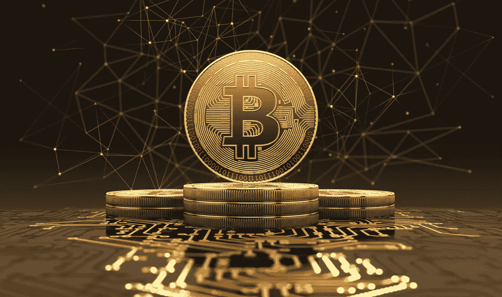

# 区块链上的库里:一种不同的网络事件

> 原文：<https://medium.datadriveninvestor.com/curry-on-the-blockchain-a-different-kind-of-networking-event-3c9e89969551?source=collection_archive---------7----------------------->

我常听人说，区块链缺少的是人。我知道这听起来很奇怪，因为现在有成千上万的创新者在区块链从事新的开发，但这不是我想说的。

我指的是这样一个事实，对很多人来说，区块链仍然是一个如此神秘的地方，以至于根据你住在哪里，在你所在的地方寻找其他人进行交流有时会很困难。

 [## 2019 年成为主流的 7 大区块链挑战及更多...数据驱动的投资者

### 教训是永远不要停止学习和成长。关于技术、金融、工作场所、生产力和…

www.datadriveninvestor.com](https://www.datadriveninvestor.com/2019/03/25/top-7-blockchain-challenges-to-go-mainstream-in-2019-more/) 

这曾经是英国的情况，甚至在伦敦也是如此。至少在艾丽卡·斯坦福出现之前是这样。像加密行业的许多领导者一样，她对英国缺乏高质量的区块链网络机会感到沮丧。

# 秘密咖喱俱乐部的诞生

因此，她做了任何优秀企业家都会做的事情——并创造了自己的公司。尽管埃里卡知道它会越来越受欢迎，但她从来没有想到它会像现在这样迅速发展成全国性的网络活动。

她的活动与该领域许多其他活动的不同之处在于，人们可以在一个非正式的环境中通过食物和饮料更多地了解彼此——因此得名“秘密咖喱俱乐部”。

艾丽卡解释说:“我从 2018 年 10 月开始，因为伦敦没有任何好的活动。大多数只是推销，许多人向演讲者收费。在 Crypto Curry 俱乐部，大多数参加我们活动的人都是区块链公司或项目的创始人。很多高级管理人员和律师事务所的合伙人。我们的活动仅限受邀者参加。我们的活动侧重于介绍，而不是销售。

“它非常成功，内部发生了大量交易和合作。我有一种感觉，它会很受欢迎，但我不认为我知道它会有多受欢迎。一切都很顺利，非常令人谦卑和兴奋。”

Erica 自己的区块链技术之旅始于三年前，当时她了解到区块链技术，以及汇款是多么简单快捷，没有法定货币带来的延迟和高额费用。

从那以后，她就迷上了加密货币，除了组织活动，她还从事销售和营销工作，之后与人合作创办了一个名为“加密货币简化版”的教育网站。不久后，她成立了 Crypto Curry 俱乐部，在那里她聚集了区块链行业的一些最大的领导者和公司董事。

她解释说:“我在伦敦，可能是在英国，拥有最大的一群资深区块链人。许多区块链公司的数百名高级管理人员参加了我的活动。几天内就卖光了，有些几小时内就卖光了。我的计划是让它成为英国最大的区块链活动网络公司。我意识到，在伦敦没有其他人真正了解 crypto 的其他人，我想去参加活动，结识更多的人，但不要让二手车销售员进行推销。”

# 区块链技术的经济效益

当她开始从投资中获利并看到该技术的潜在应用后，她对加密货币产生了兴趣。她和一个团队花了整整一年时间研究加密货币，阅读白皮书并在网上寻找。

她补充说:“三年前，我通过一个朋友开始接触加密货币，并开始研究和投资它。我看到了潜力，也看到了免费即时汇款的可能性。我可以看到这比传统的汇款方式要好得多。”

在南美旅行了一段时间后，她对加密货币的欣赏与日俱增，因为她意识到加密货币能够让人们在最需要的时候快速汇款。

艾丽卡的信用卡在南美被偷了。与收款相关的延迟和费用凸显了加密货币可能有助于解决的潜在挑战。

埃里卡解释说:“在危地马拉，有一段时间我所有的信用卡都被偷了，我还被抢劫过几次。我没有留下任何卡片，我住在危地马拉的一个小村庄里。

“我不得不步行数英里，穿过这个非常危险的地区，来到最近的西联汇款公司。这是赚钱的唯一途径，但它的营业时间有限。我打电话给我爸爸，他给我寄了一些钱，但花了三天时间，费用是 14%。这并不理想。

“银行收取的平均费用是 6%，但在许多地方，西联汇款是唯一的选择，他们收取 14%。但是有了加密技术，任何人都可以立即向世界上的任何人汇款。我可以看到这在许多不同行业的潜力，包括小额支付、交易和向国外汇款。我可以看到它变得更好、更透明，而且我喜欢它打破现状的事实，因为它不需要银行或中央集权。”

# 区块链技术的商业障碍

然而，区块链技术并非没有挑战。主要的障碍是，许多可能从中受益的企业并不总是了解它的潜力。

这是埃里卡努力克服的挑战。

她说:“问题是区块链有太多的炒作和骗局，这没有帮助，因为人们不相信整件事。有些大公司不了解它，但很多了解它的人非常聪明，他们正在研究这项技术，但不知道如何解释它。所以我们需要的是用一种人们能理解的语言来简化它。

“最让我兴奋的是利用区块链来提高可持续性。如果你真的看看它能做什么，它可以用来让公司负责。例如，它可以跟踪他们的产品来自哪里，他们支付了多少钱，他们为工人支付了多少钱，它可以帮助客户看到产品实际上是有机的还是回收的。它还可以在供应链中提供物理责任，一些公司已经使用它来跟踪塑料的回收。这是我最感兴趣的事情。”

然而，尽管她对加密货币和投资充满热情，但她也警告人们在完成研究之前不要投资。

她补充道:“在你做了大量研究之前，不要这么做，除非你愿意输掉这笔钱。市场是高度不稳定和高风险的，它是不受监管和高度操纵的。不要相信社交媒体，因为它不受监管，许多人都是靠推广项目赚钱的。Cointelligence.com 是揭露骗局的一个很好的信息来源。”

# 未来计划

展望未来，Erica 计划围绕各种主题举办更多主题活动，如可持续发展、小额支付、数字权利和银行业务。

区块链技术影响了许多不同的行业，如视频日志、音乐流媒体或数字版权管理，后者跟踪所有权并允许人们实时支付观看视频或阅读文章的费用。由于所涉及的成本，这些都是法定货币目前不存在的可能性。

埃里卡的计划是通过演讲和活动让其他人了解区块链的潜力。

她补充说:“我计划为制药公司、金融、建筑和银行等行业举办区块链等小众活动。但它们更多的是小众活动。我被邀请在大学里做一些教育活动，比如区块链的 crypto，这真的很酷。我期待着做其他活动，如货币的未来，以及更多关于加密的活动，人们可以了解更多。我还计划做一些关于可持续发展的活动。

“真正好的是，你有一屋子真正聪明的人，他们正在积极研究这项技术。所以我们得到了很多非常好的辩论和讨论。我们拥有享誉全球的行业领袖。”

下一次秘密库里俱乐部会议将于 9 月 20 日在布里斯托尔举行，10 月 2 日在伦敦举行，10 月 11 日在牛津举行。

如果你有兴趣了解更多关于 Crypto Curry 俱乐部的活动，请发送电子邮件:[hello@cryptocurryclub.com](mailto:hello@cryptocurryclub.com)。你也可以前往 [ccc.events](http://ccc.events/) 了解更多信息。