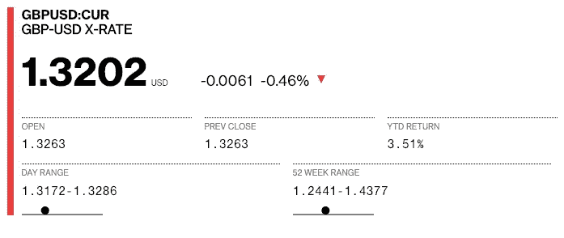
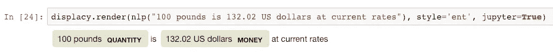
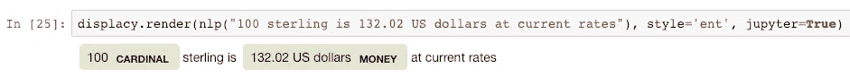
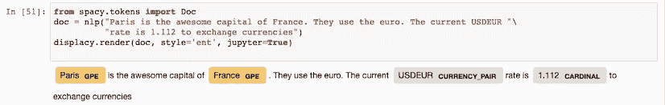

# NLP 中的自定义词汇(带空格的财务术语)

> 原文：<https://medium.datadriveninvestor.com/custom-vocab-in-nlp-financial-terms-with-spacy-810604ca6083?source=collection_archive---------0----------------------->

[](http://www.track.datadriveninvestor.com/1B9E)

Spacy 是一个非常棒的自然语言处理开源库。它是由一个小型商业组织(explosion.ai)建立的，但它完全免费使用。他们的盈利策略是出售 Prodigy UI 的许可证，这使得训练模型变得更加容易。

假设你有一个英语语言模型(T-shirt size medium)，你将有一个包括超过 100 万个词汇、许多种类的实体识别和许多复合名词识别的模型。但是当我们需要添加自定义金融术语时会发生什么呢？

> [DDI 编辑推荐— Python 数据科学和机器学习训练营](http://go.datadriveninvestor.com/pybootcamp/matf)

在本文中，我们将探索一种向实体匹配添加众所周知的词汇集的方法。在许多情况下，您可以简单地使用正则表达式来查找实体。在下面的例子中，我们将以货币对为例。当有人在现货市场交易外汇时，会有各种各样的货币对，格式为 CCY1CCY2，没有空格。“现货”仅仅意味着我们今天正在交换现金流。所以如果我交易美元，我今天会把美元换成欧元。

如果你看看彭博，你可以看到英镑兑换美元的汇率。https://www.bloomberg.com/quote/GBPUSD:CUR[。惯例是你拿第一种货币，乘以汇率，得到第二种货币的等值。在下面的例子中，我们可以取 100 英镑，乘以 1.3202，等值的美元就是 132.02 美元。](https://www.bloomberg.com/quote/GBPUSD:CUR)



spacy 模型在识别货币金额和给实体贴上标签方面已经相当不错了。下面显示了一个例子，它期望磅是一个数量而不是货币。也许我们可以期待模型做得更好，因为它的背景都是货币，但是跳出这个框框就很好了。



我们越深入研究金融术语，它的质量就越差。英镑不被认为是货币。忘记像 cable(英镑的俚语)和 greenback(美元的俚语)这样的术语。



不管怎样，我们可以改天再谈！今天，我们主要关注如何明确地捕捉货币对:欧元兑美元、美元兑英镑等。这不会捕获诸如“欧元对美元”、“欧元对英镑”等内容。下面的方法使用了可以扩展的正则表达式，但是改天我们会做一些更复杂的事情。

您将了解如何在 spacy 中创建自定义管道并覆盖标签。这是相当手动的，因为它在管道的末端，所以没有任何 tagger 或 ner 管道可以利用的一般化。

[源代码在这里](https://github.com/dado0583/JupyterNotebooks/blob/master/SpacyExamples/AddCustomEntityMatcher.ipynb)。您需要下载并运行来查看显示样式，因为 GitHub ipynb 渲染器不会拾取 css。

# 代码

首先，我们从磁盘加载模型，并向管道添加一个定制标签。在后台，这将把自定义实体添加到 vocab 中。这意味着字符串存储中将有实体的哈希。

```
nlp = spacy.load(‘en’) #Loads the model
custom_entities = ['CURRENCY_PAIR']
p = nlp.get_pipe('ner')
for ent in custom_entities:
    if 'extra_labels' in p.cfg and ent in p.cfg['extra_labels']:
        pass #See below for rationale on this
    else:
        p.add_label(ent)

p.cfg['extra_labels'] = custom_entities #See below for rationale on this
```

***侧边栏*** :有个怪癖，不知道是 bug 还是特性。如果您使用相同的字符串多次调用“add_label ”,您将在“extra_labels”配置中得到重复项。我发现我需要在训练时避免这种情况，在其他情况下，多个额外标签会影响模型性能。因此，当我创建自定义标签时，我会在添加之前检查它是否在 extra_labels 部分，然后在最后显式覆盖配置。

```
class CurrencyPairPipeline(object):
    def __init__(self, nlp):
        self.label_hash = nlp.vocab.strings["CURRENCY_PAIR"]

    def __call__(self, doc):
        import re
        from spacy.tokens import Span
        new_tokens = doc.ents for idx, token in enumerate(doc):
            #Checking if a currency pair, e.g. USDEUR, EURUSD, etc    
            if re.search(r"((USD|EUR|GBP|JPY|CAD)+[A-Z]{3})|([A-Z]{3}(USD|EUR|GBP|JPY|CAD))", token.text, re.IGNORECASE):
                #We found a match so need to update the entities
                span = Span(doc, idx, idx+1, label=self.label_hash)
                #Spacy only supports one label per phrase, so need to conditionally replace (e.g. USDEUR may be wrongly labelled as an ORG or GPE)
                new_tokens = tuple([t for t in new_tokens if t.start != idx]) + (span,) doc.ents = new_tokens
        return doc
```

以上是自定义管道的代码。鉴于是 python，就没太多 it 了。只要匹配 init 和 call 方法的签名就可以了。在初始化时，我从 nlp vocab 中获取散列以备后用。

稍后，当我们在 call 方法中接收到一个 doc 时，我们会做一个简单的正则表达式检查。令牌长度应为 6 个字母，并且需要以 5 种特定货币(美元、欧元、英镑、日元和加元)中的一种开始或结束。大多数外汇市场对美元报价，因此这将捕捉大多数货币以及更受欢迎的交叉(即，美元兑日元是一对交易不多的货币)。请注意，这将错误地将单词“caddie”匹配为货币对。我并不是想让这个模型变得完美，更多的只是向你展示你是如何定制管道的。

```
ccy_pipeline = CurrencyPairPipeline(nlp)
try:
    nlp.remove_pipe(name='ccy_pipeline')
except:
    print("Couldn't remove pipe")nlp.add_pipe(ccy_pipeline, name='ccy_pipeline', last=True)
```

现在，每当我们调用 nlp(“我要标记的字符串”)时，定制代码就会执行。注意，我是在最后明确添加的。目前有一个[错误](https://github.com/explosion/spaCy/issues/3345)阻止我将它添加到管道的其他部分。理想情况下，我们应该将它放在 EntityRecognizer 管道(通常称为“ner”)之前，以便它可以从我们的显式标记中学习。

因此，现在我们应该能够运行我们的自定义管道，并看到输出。



所以基本上就是这样。我想玩一堆东西，稍后展示给你们看，因为这还远远没有完成:

*   把这个推上管道，看看管道的其余部分是否能弄清楚什么是货币对，什么不是(例如，那个球童不是！).
*   构建一个自定义扩展来获取文本的上下文。例如，如果是围绕外汇/外汇/货币等的对话，我可以应用这种逻辑，但如果不是，就忽略这部分渠道。

请联系或评论任何建议/改进！