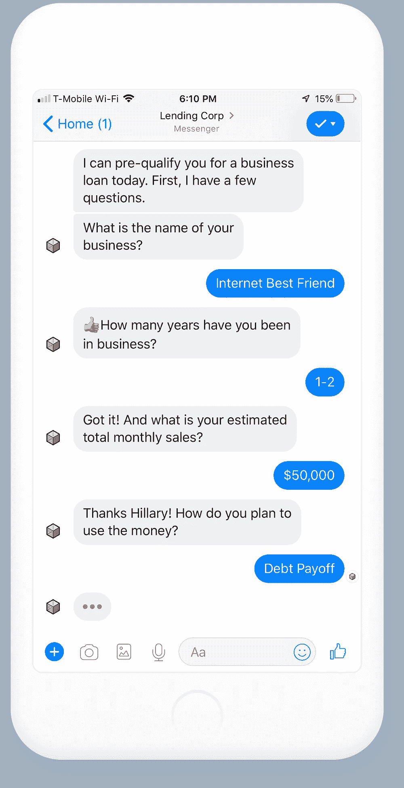
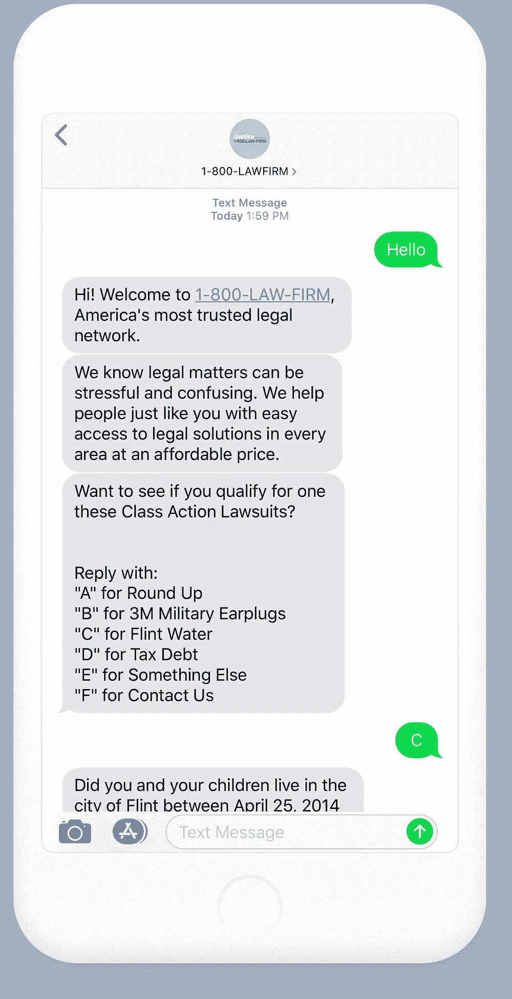
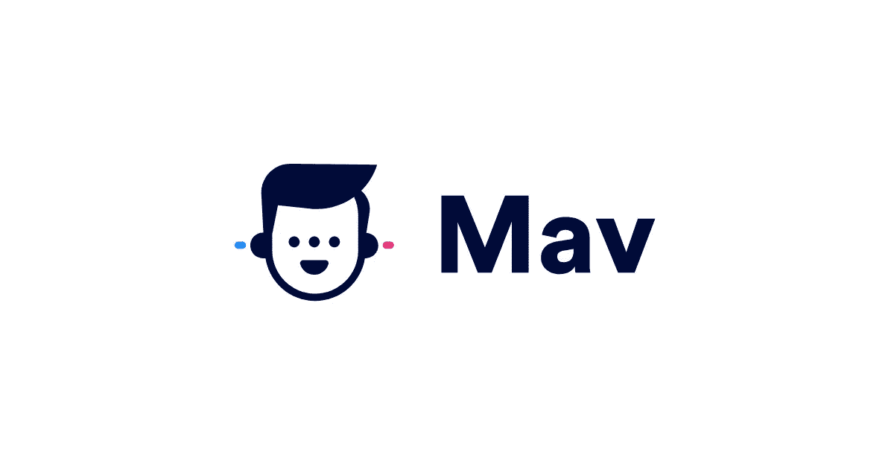

# 客户获取聊天机器人的 5 个对话设计技巧

> 原文：<https://medium.datadriveninvestor.com/customer-acquisition-chatbot-9fd08a44d878?source=collection_archive---------3----------------------->

聊天机器人最有价值的用例之一是获取客户。通过创建实用程序、战略设计和强烈的行动号召(CTA)体验，您可以在更短的时间内获得更多的客户，并跟踪您的聊天机器人经过验证的投资回报(ROI)。通过在社交信息平台(如脸书、Twitter 或 SMS)上接触这些潜在客户，你可以增加转化的可能性。在我为像 [TradeStation](http://m.me/tradestation) 和 [Haven Life Insurance](http://m.me/havenlifeinsurance) 这样的大品牌设计收购聊天机器人的经历中，我发现了许多将用户转化为合格潜在客户的最佳实践，同时降低了收购成本。

# 客户获取机器人与其他聊天机器人有何不同

*收购机器人*推广公司或服务，通过对话激活销售线索。这些机器人应该总是有一个具体的和可衡量的目标。他们经常使用付费广告(脸书广告和谷歌 AdWords)来获取用户。其他聊天机器人，如新闻和通知、技能和习惯养成、客户支持和简单的娱乐体验，可能有完全不同的目标(或根本没有目标)。这些类型的聊天机器人可能是有效的，但要真正以完全自动化的方式发展你的业务，收购机器人是促进你销售的最佳选择。

 [## 对话式营销是文字数据驱动的投资者

### 在购买之前，先谈一谈。这样做的营销人员将走在游戏的前面。这是保罗·因斯的前提…

www.datadriveninvestor.com](https://www.datadriveninvestor.com/2019/01/31/conversational-marketing-is-the-word/) 

在对话界面中转化客户的策略归结为感知价值、易用性和实用性。添加个性和战略跟进，你就能快速发展你的业务——即使是在你睡觉的时候。

# 为赢得客户而设计时要记住的 5 个技巧

# 1.列出期望

当用户第一次使用你的聊天机器人时，他们应该马上知道该做什么。你的前两条信息应该问候他们，分享你是谁，并告诉他们通过完成这次经历将会获得什么。例如，他们会通过回答几个简单的问题得到报价吗？说吧。安排试驾？参加小测验后获得免费试用或下载？让他们知道。根据他们的喜好看到具体的产品推荐？无论你的目标是什么，用户应该知道你对他们的期望(例如，信息或问题的答案)以及他们将从中获得什么(有价值的东西)。

这就是聊天机器人目标的具体部分。在设计体验时，想一件你希望聊天机器人做得非常好的事情，并记住你的业务的最大卖点。传达这些信息将提高完成率，降低用户出错的可能性。如果你在脸书、推特或谷歌上用“信息”作为行动号召来获取付费广告用户，期望就特别重要，因为用户可能不熟悉你的公司。聊天机器人启动时，对话应该与消息广告的文案和创意相匹配，体验应该是对话的无缝延续。

# 2.销售前提供价值

保持用户参与的最佳方式是提供价值，这样他们更有可能转化为客户。类似于你如何通过电话或面对面向客户推销你的产品或服务，你的聊天机器人应该传达你公司的价值观。聊天机器人的不同之处在于它必须做的不仅仅是提供信息。它还应该在顾客的生活中创造联系和直接价值。这将你的聊天机器人(和你的公司)定位为一个有用和有帮助的工具。无论消费者在哪里看到社交广告，他们都应接不暇，但聊天机器人让广告成为一种互动的双向对话。这创造了一种新的获取形式，一种更亲密的大规模参与方式。

# 3.像人一样说话

一个具有有效个性的聊天机器人是你成功的关键。这赢得了用户的信任，并帮助他们在前进的道路上获得乐趣，使他们更有可能转化和分享他们的体验(并为你带来更多的客户)。就像战略社交媒体的文案和创意一样，就像网站和应用程序的架构一样，机器人需要 UX 设计。

创造独特的个性是设计聊天机器人以获得特定受众的最重要的任务之一。创造机器人个性的一个好方法是考虑你的品牌个性。这也有助于想象这个机器人可能是谁，它喜欢什么，或者它做什么工作。你甚至可以给它一个名字。你可以为你的理想用户创建一个配置文件，让他们在你写对话的时候一直在你的脑海里。你选择的单词、表情符号和媒体应该让用户感觉有关联，从而使你的聊天机器人人性化。聊天机器人相对于其他类型的社交广告的一个关键优势是，你可以通过在对话中包含用户的名字来保持事情的私密性。

# 4.保持对话

战略对话设计的核心基础之一是记住对方是人。在双向对话中不断地与用户互动是很重要的。由于聊天机器人具有*状态感知*(也就是说，它们会记住用户说的话)并以一种积极的方式与观众互动(即时回复)，因此有许多方法可以保持对话流畅。这可以以一种让用户感觉真实的方式来完成——不像你在对他们说话或用冗长的信息轰炸他们。向用户发送消息时，遵循 3:1 或 2:1 的比例(这在语音和短信平台上会有所不同，在这些平台上没有快速回复)，这意味着，每第二条或第三条消息，您的聊天机器人都应该要求用户做出响应。这可以是用户键入的快速回复或 CTA。保持信息不超过三或四行。如果信息需要更长，可以将它们分开，或者考虑添加文本图像或视频。易用性是聊天机器人的一大优势，在设计你的聊天机器人时，请记住，对话框应该简单明了。如前所述，用户应该清楚地知道聊天机器人想要他们做什么或者如何回答，并且问题不应该是开放式的。这将使用户保持在正确的轨道上，并减少出错的空间。

# 5.跟进，但不要压倒

有时候生活会碍事。用户可能会在通勤上班、与朋友外出或忙碌时发现你的机器人。当要求用户提供更多关于他们自己的信息时，你可能会在某一点上看到下降。与单向广告相比，使用聊天机器人的一个好处是，这些聊天机器人用户是你的。只要你愿意，你随时都可以再次与他们交战。但是，当然，你需要对何时伸出手和说什么有策略。向用户伸出手的甜蜜点可能是一个友好的提醒。“喂，是我！想从你停下来的地方继续吗？”提醒应该传达他们具体在做什么(比如报价或约会)以及你是谁，并且应该问一个他们点击一下按钮就能轻松回答的问题。

# 额外提示:计划失败

当聊天机器人不理解用户时，它如何处理对话会影响或破坏潜在客户的体验。用户现在希望机器人做的不仅仅是说“你好”和“对不起，我没听懂——它们应该这么做！当出现问题时，实现多级全面控制可以减少用户摩擦。以下方法是一个好方法:

*   **第一级:**道歉并重申最后一个问题。
*   **第二级:**道歉，让用户回到正轨，提供一系列建议，描述用户*可以用这个聊天机器人*做什么。
*   **第 3 级:**将用户交给一个人，或者为他们提供一种即时方式来启动与客户支持的联系。

对于第三级，可能是用户试图离开机器人，或者技术根本不起作用。无论哪种方式，通过提供机会让用户首先回到正轨，用户通常可以回到正确的流程。而且他们比那些反复看到“对不起，我不明白”消息的用户要开心得多。

总之，当设计一个聊天机器人来获取客户的时候，永远把用户放在你思想的最前面。这种体验是为他们设计的。他们应该清楚自己的期望，知道自己的价值是什么，并且感觉就像在和一个人聊天。一个像人一样说话并从头到尾保持对话的聊天机器人，允许用户成为有时很忙(但欣赏你的后续)和偏离轨道(但可以被引导回来)的人，是最好的交互。最好的聊天机器人体验。

如果你想获得更多的线索，但你的营销策略不再奏效，收购聊天机器人是一个聪明的主意。当根据这些技巧进行战略性设计时，收购聊天机器人可以成为你的销售秘密武器。

# **想开始与客户聊天，但不确定从哪里开始？我们抓到你了。**

认识一下[**【Mav】**](http://hiremav.com)，你的新客户收购聊天机器人。Mav 通过短信和 Facebook Messenger 全天候为您确认销售线索，并将其显示在一个漂亮的收件箱中，您可以随时获得我们团队的专业知识和支持。**我们为您做所有的艰苦工作，您收集线索**🔥没有设计，没有编程，没有托管，**没有 BS。**这很容易开始，公司可以在 90 天内从发布到获得投资回报。 [**今日聘 Mav。**](http://hiremav.com)

*我是希拉里，Black Ops 的聊天机器人战略和对话设计主管。想聊天机器人？* [*加入我的私人脸书群吧！*](https://www.facebook.com/groups/210860349731183)

这篇文章最初出现在亚马逊的发现机器人博客