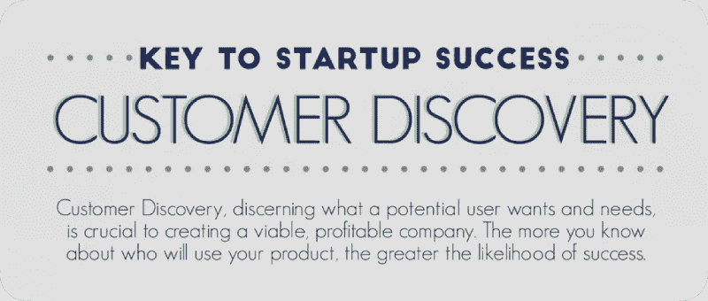
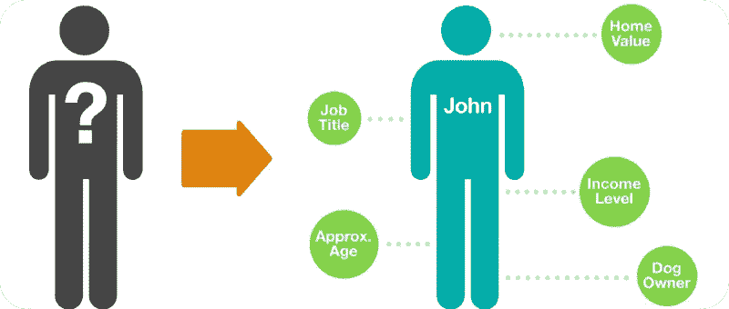

# 客户发现——如何进行研究并了解客户的难题

> 原文：<https://medium.datadriveninvestor.com/customer-discovery-how-to-do-research-and-understand-the-pains-of-your-clients-11b2604a470d?source=collection_archive---------8----------------------->

客户发现的定义足够宽泛，但简言之，它是一种研究目标受众的方法，也是客户开发方法的一部分。它有助于准确地创造出人们会使用的产品，并且这将是有利可图的。这篇文章讲述了如何进行客户发现。

## 谁以及为什么需要客户发现？

客户发现的目标是识别客户的困难和需求。更好的消费者知识有助于简化流程。有时候根本就不要开始。在超过 50%的情况下，我们的客户自己并不想象观众在现实生活中需要什么。他们没有进行详细的市场调查，也没有试图找出用户。结果，产品没有达到预期。但这还不是最糟糕的。产品没有回报。
不了解当事人的痛苦，就很难修复。面向客户的方法展示了你对客户和用户的关心。将干巴巴的技术信息需求与关于产品目标、愿景及其使命的详细调查进行比较。回答你自己你会选择什么。

 [## 睁大眼睛冲破多样性壁垒|数据驱动的投资者

### “科技女性”是蒂芙尼·霍兰的激情之一，最初她在 Twitter 上主持“科技女性”聊天。她也是一个…

www.datadriveninvestor.com](https://www.datadriveninvestor.com/2019/03/20/hurtle-diversity-barriers-with-eyes-wide-open/) 

## 为什么需要客户发现？

*   **判断有无需求。**需要跑项目吗？根据客户发现的原则，注意力应该集中在产品的潜在用户上:痛苦、需求和困难。主要任务是发现它们，解释并制定行动计划
*   **确定客户想法的充分性:**是否可以实施？有必要了解客户的能力水平，他是否了解市场，以及他如何代表他的潜在用户
*   **寻找并确定产品是否适合选定的目标受众。**客户必须明白，测试前的一切都是假设和前提。他们需要被检查，带着问题去见真正的观众
*   **了解客户，了解他的性格。这将有助于与此人的进一步合作。了解客户的思维方式、世界观和沟通方式，你们的关系会变得更有成效**
*   **研究市场和消费者需求。**这些信息不仅对客户有用，对您也很有用，有助于您从产品中赚取更多利润。

## **如何在实践中使用客户发现流程？**

过程的循环性很重要。客户发现模型包括 3 个阶段:创建—测量—学习。按照这个顺序，提出的假设被检查，期望的目标受众被发现，他们的痛苦被确定，解决方案被提出。

*   寻找听众:客户假说的证实或反驳。

找到解决客户产品难题的正确方法非常重要。
不总是直接用户——真正选择产品或服务的人。假设一个客户正在开发一个教孩子外语的付费应用程序。显然，目标受众是孩子，你需要做简短的互动课，使用大量的图片、动画、音乐等。你根本不能教语言。最主要的是吸引和保持注意力。
这是错误的心态。应用程序的真正受众是孩子的父母。如果他们看不到结果，他们就不会为课程付费。所以，除了明亮的界面，还要规划好内容:课程和语言游戏。在这种情况下，他们更重要。没有父母会为无效的教育买单。
所以在说你有把握之前要三思。请记住，决策并不总是由直接用户做出的。

*   **02 目标受众的确认。检查商业模式。寻找产品和市场的一致性。**

需要验证选定的假设。这可以通过命令或您自己来完成。重要的是要记住:验证和测试应该是循环的。与观众的一次性接触不会提供完整的理解。所有进一步的工作都将毫无意义。
有必要创造一种商业模式。作为基础，建议使用 9 块策略。研究问题类型——答案。作者是商业理论家亚历山大·奥斯特瓦尔德和计算机科学家伊夫·皮涅尔。2017 年，他们在全球最具影响力的商业思想家 50 强排名中并列第七。
**区块 1** —产品价值。这些问题旨在确定产品是满足用户并获得益处的一种方式。换句话说，观众为什么需要这个？
**block 2** —用户研究。要搞清楚一个人的一切:他是谁，来自哪里，进入什么社会和年龄段，长什么样
**block 3** —产品推广。问题应该有助于理解销售和促进发展如何更有利可图
**block 4** —与观众沟通。建议提问如何启动、维持和改善沟通
**block 5** —利润来源。每个细分受众带来什么收入？用户欣赏的到底是什么？产品的“金矿”在哪里？
**第 6 块** —附件。关于业务系统和产品运行需要哪些资源的问题。这可能是资本、贷款、资产和其他方式
**区块 7** —合伙人。他们真的需要吗？如果是，合作如何以及多快能盈利，这些合作伙伴是谁等等。
**第 8 块** —动作。关于团队必须如何完成计划的问题
**第 9 块** —费用。提问时，你需要确定整个成本结构。开发或任何其他过程中最昂贵的是什么？有没有可能在不损失产品质量的情况下降低生产成本？

从在 9 个街区建立商业模式开始，你将立即确定目标市场。接下来，你需要开始测试你的假设。要做到这一点，找到目标受众的代表并采访他们。这是发现客户的重要一步。负责任地回答问题，提前想清楚。

**记住:**封闭式问题可以用来“探查土壤”或生成统计数据。"你使用移动应用程序学习外语吗？"
开放式问题用于获取意见，更清晰地描述目标受众及其偏好和愿望。“你用什么教育类的移动应用？”、“你用什么手机应用？”，“告诉我，移动设备有助于你学习外语吗？”。问题的开放程度可能不同，由情况决定。测试假设时，优先考虑开放式问题

这个阶段的好工作并不能决定 100%的成功。但是，坏的百分之百决定失败。

不要忘记跟踪竞争对手的市场。它会让你避免徒劳的工作——重复别人的产品。探索用户缺什么，现有的和你类似的产品有什么不适合人的等等。永远不要退出信息领域。它可能非常昂贵。

*   **03 创造和产品规模化**

首先构建一个测试版本— MVP。它应该有最少的功能，反映产品的想法，并解决客户及其目标受众的主要问题。将产品的测试版本给同事和朋友。采访他们并写下所有评论。分析评论，给产品添加新的功能，并再次分发给你的朋友。在第二版的评论和他们的考虑之后，继续进行“清洁”的发展。当然，不要忘记测试是开发过程的一部分。一切都应该像瑞士表一样运转。
产品准备就绪后，计划、协调并开始营销和公关活动。向目标受众和“传道者”介绍产品。不要忘记，你需要决定哪个市场是你的:大众市场、中间市场、奢侈品市场还是利基市场。探索市场，再次分析目标受众。如果你没有能力建立促销活动，我们建议你外包给代理。但是要认真准备一份简报，尽可能诚实地回答问题！一旦你决定要做什么，就推出产品。

不要忘记持续发展。即使每件事都计算正确，做得正确，但市场是变化的，现代人是挑剔的。然而，全球 it 市场依赖于务实和挑剔的用户。

表现出对客户和用户的关心，让他们给你回电。顾客对工作过程的记忆不亚于对结果的记忆。因此，客户发现不仅有助于创造需求产品，还能给你留下积极的印象。

*原载于*[*https://geniusee.com*](https://geniusee.com/single-blog/customer-discovery)*。*