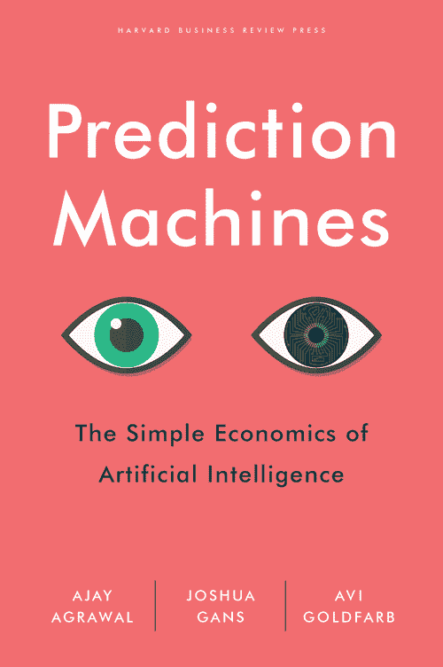
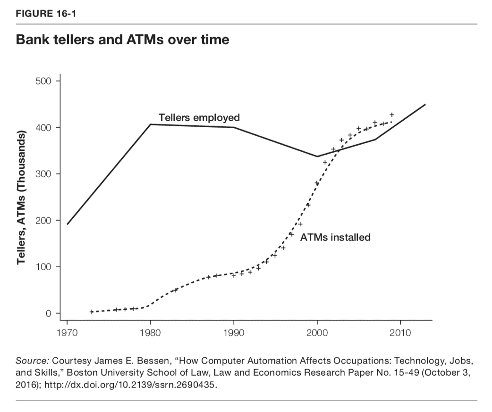

# 打破人工智能的炒作

> 原文：<https://medium.datadriveninvestor.com/cutting-through-the-ai-hype-db2c849329a0?source=collection_archive---------0----------------------->

# Ajay Agrawal、Joshua Gans 和 Avi Goldfarb 的《预测机器——人工智能的简单经济学》书评

通过著名的“10 人”达特茅斯夏季会议，人工智能(AI)的研究领域已经在 1956 年建立。参加精英研讨会的有约翰·麦克哈迪(达特茅斯学院)、马文·明斯基(哈佛大学)、纳撒尼尔·罗彻斯特(IBM)和克劳德·香农(贝尔电话实验室)等人。

然而，关于 AI 的公共辩论才刚刚开始。经过半个多世纪的密集研发，这项技术终于成为主流业务:网飞和亚马逊正在向你推荐电影和书籍。由于数百万个人用户产生的大量大数据，可以计算出当你已经看过《纸牌屋》和《毒枭》时，你是否有可能喜欢《鸟箱》。背后的系统基于机器学习(ML)算法。

 [## 挑战你对人工智能和社会的看法的 4 本书——数据驱动的投资者

### 深度学习、像人类一样思考的机器人、人工智能、神经网络——这些技术引发了…

go.datadriveninvestor.com](http://go.datadriveninvestor.com/4AI1) 

自从史蒂夫·乔布斯在 2007 年旧金山 Mac 世界大会上展示 iPhone 以来，我们生活在一个由智能手机主导的世界——这项发明显示出人类历史上最快的大规模采用。因此，我们正在习惯于利用许多基于人工智能的发明，即使我们没有意识到这一点。例如，当你用智能手机自拍时，一种基于人工智能的算法会计算出你头部的位置，这有助于相机知道聚焦在哪里。

今天，关于人工智能的公共辩论严重扭曲了研究人员、技术专家、风险资本家、记者和博客作者的乌托邦或反乌托邦观点。凯茜·奥尼尔(Cathy O'Neil)等悲观主义者认为，在最糟糕的情况下，错误训练的机器可能会成为“数学毁灭武器”，从而加剧不平等并威胁民主。乐观主义者将人工智能视为一个永无止境的梦想，旨在将人类从体力和脑力劳动中解放出来。从这个意义上说，谷歌的工程总监雷·库兹韦尔预测“奇点”的势头将在 2045 年左右出现。

这意味着将会出现‘有意识的机器’，它们超越了人类水平的智能。因此，这将转化为一个失控的经济增长时代，人类的工作变得过时。事实上，牛津大学的研究人员弗雷和奥斯本得出结论，47%的美国工作面临自动化的高风险。他们写道，在未来行业适应的第一波浪潮中，“运输和物流行业的大多数工人，以及大量办公室和行政支持人员，以及生产行业的劳动力，很可能会被计算机资本取代。”由于这种戏剧性的愿景，人工智能有可能引起广泛的公众恐惧就不足为奇了。

如果你想阅读一个简单的指南，以减少炒作，多伦多教授 Ajay Agrawal，Joshua Gans 和 Avi Goldfarb 的《预测机器》是你应该读的书！

[Source](https://www.predictionmachines.ai/pre-order/) of the book front side.

作者对人工智能目前能够做什么和还没有实现什么提供了一个软而合理的经济分析。以一种冷静的思维方式，他们说:“如果经济学家擅长一件事，那就是避开炒作。”。其他人看到的是变革性的新创新，而我们看到的只是价格的下跌。

在他们看来，计算机的出现和商业化使得算术变得便宜。换句话说，解决一个复杂的数学方程比以前更容易，用的时间更少。听起来很无聊，没什么前途？坚持住。

**那么，AI 技术会让什么变得便宜呢？**

从作者的角度来看，这是预测。预测是不确定情况下决策的核心，因此也是任何一种商业的基础。更好的预测为从保险到医疗保健和零售的各种公司提供了新的机会。

作者在展示一堆真实世界的用例及例子方面做得很好，这有助于打破你的“人工智能时刻”。例如，超过 5 亿中国用户使用深度学习服务 [iFlytek](http://www.iflytek.com/en/) 来翻译、转录和交流自然语言。苹果手表应用程序[心电图](https://cardiogr.am/)能够拯救生命，因为它使用深度神经网络以 97%的准确率检测到不规则的心律。 [ZipRecruiter](https://www.ziprecruiter.com) 将工作要求与潜在申请人的用户资料相匹配，而 [Atomwise](https://www.atomwise.com) 旨在缩短发现有前途的制药药物前景所需的时间。此外，像[优步](https://www.uber.com)、 [Lyft](https://www.lyft.com/) 或 [Waze](https://www.waze.com/en) 这样的应用程序正在通过使用真实世界的数据来预测从 A 点到 B 点的最快方式。在这里，用户越多，应用程序的性能越好，越有价值。这样的机会被经济学家称为‘网络效应’。

正如我们所看到的，以前翻译和解释的语义问题已经应用于概率计算。人工智能系统通过大量的输入数据或语言特征进行训练，以提供一个输出，该输出指出句子的意思。在类似的情况下，以前依赖出租车司机知识的导航问题变成了概率挑战，匹配街道上的大量信息以生成最佳路线。

**那么，乔布斯呢？人工智能将如何影响劳动力市场？**

当预测因人工智能系统而变得廉价时，最直观的答案是，人类将更少用于预测任务。“任务”的概念非常重要，可能也是之前提到的牛津研究的主要失败之处，因为弗雷和奥斯本试图从整体上预测“工作”类别的自动化潜力。然而，一个“作业”由数百个不同的任务组成。想象一下，一个秘书必须接电话、管理议程、理解、分类和归档文件和电子邮件、给老板暗示、准备会议室和接待客户等等。并非所有这些任务都可以自动化。

此外，并不是每个客户都乐意受到机器人的欢迎和服务，这就是为什么许多企业对自动化一切都不感兴趣。作者以校车司机为例。如果自动驾驶汽车进入我们的道路，校车司机可能不会失业。这是因为许多父母不喜欢他们的孩子在没有任何成人监督的情况下自动开车去学校。因此，公共汽车司机的工作宁愿被重新设计。他的新的主要任务不是开车，而是指导孩子们，以及管理任何类型的冲突和不确定事件。尤其是这种情况，因为机器在预测罕见情况方面非常糟糕。总的来说，仍然需要人的判断。

从历史上看，这种工作的重新设计发生在自动取款机(ATM)发明并在全球安装的时候。正如作者詹姆斯·贝森指出的那样，这种演变并没有导致银行出纳员失业，而是让更多的人找到了工作。他们的新工作不是给客户现金，而是提供咨询，为他们提供贷款建议和信用卡选择。

[*Source*](https://www.predictionmachines.ai/figures-from-the-book/ivj2ly3g3no1o9n2x176vyl3nnev61) *of Figure 16–1 from the book.*

因此，当预测变得更便宜时，对决策的补充投入，如数据以及人类的解释、判断和行动，将变得更有价值。综上所述，与其说整个 AI 系统实现了完全的工作自动化，不如说更有可能的是，我们可以期待很多工作被重新设计。一些工作将被取代，但其他工作将会增加。许多公司以及公共行政部门将需要重新思考他们的公司级结构、层级、指挥链和工作流程。当你是一名企业家时，阿格拉瓦尔、甘斯和戈德法布就如何做到这一点提供了大量建议。预测机器是一个清醒的经济分析和全面阅读充满了似是而非和有益的例子。

**进一步阅读:**

Agrawal，a .，Goldfarb，a .，& Gans，J. (2018)。人工智能的简单经济学。哈佛商学院出版社书籍。

Bessen，J. E. (2016 年)。计算机自动化如何影响职业:技术、工作和技能。波士顿大学法学院。法律与经济学研究论文。

Buhr，S. (2017 年)。UCSF 研究称，苹果手表能以 97%的准确率检测出异常心律。检索自:[https://TechCrunch . com/2017/05/11/apple-watch-can-detect-a-anomaly-heart-rhythm-with-97-accuracy-UCSF-study-says/](https://techcrunch.com/2017/05/11/apples-watch-can-detect-an-abnormal-heart-rhythm-with-97-accuracy-ucsf-study-says/)

弗雷，剑桥大学，奥斯本，文学硕士(2013)。就业的未来。牛津大学。

未来主义(2017)。库兹韦尔声称奇点将在 2045 年发生。为人性 2.0 做好准备。2017 年 10 月 5 日。检索自:[https://futurism . com/kurzweil-claims-the singularity-before-2045/](https://futurism.com/kurzweil-claims-that-the-singularity-will-happen-by-2045/)

奥尼尔，C. (2016)。数学毁灭武器:大数据如何增加不平等并威胁民主。纽约:百老汇图书公司。

# DDI 推荐阅读:

*   人类不需要申请:人工智能时代的财富和工作指南
*   [*生活 3.0:人工智能时代的人类*](http://go.datadriveninvestor.com/daib04/mbmp000111) *马克斯·泰格马克*
*   [*Python 人工智能:为 Python 初学者和开发者构建智能应用的综合指南*](http://go.datadriveninvestor.com/daib09/mbmp000111) 作者 Prateek Joshi