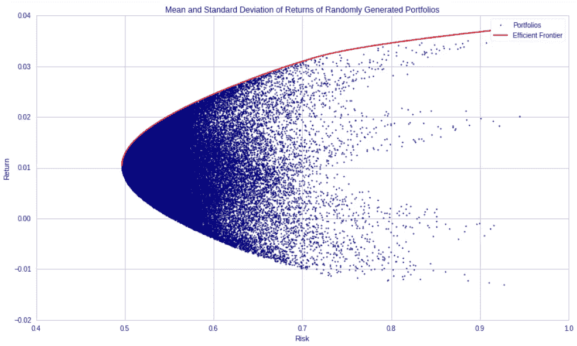
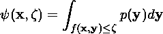
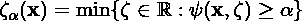
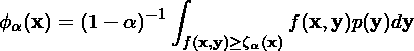
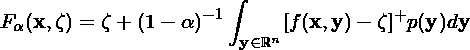
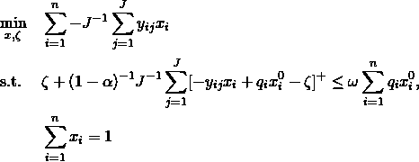

# CVaR 优化

> 原文：<https://medium.datadriveninvestor.com/cvar-optimization-c503959bc24f?source=collection_archive---------2----------------------->

当一个投资者或交易者有一个股票投资组合时，有必要了解如何在其中分配他的资本。然而，当投资组合中的股票数量很大(成百上千)时，这可能会很棘手。为了提供帮助，大多数投资组合经理实施某种形式的凸优化来优化他们的回报函数，其范围可以从预期回报到夏普比率，再到他们开发的一些专有指标。一种方法是使用条件风险价值(CVaR)作为损失函数。这将是本文的主题。

CVaR，也称为预期亏空(ES)，是一种衡量投资者在底部百分位数(由投资者定义)中预期会损失多少的方法。例如，在 5%的区间，CVaR 将是预期损失，假设损失在底部的 5%。为了用数学方法表示它，我们首先需要定义一个损失函数 f(x，y ),其中 x 是投资组合中的权重，y 是组成投资组合的风险因素。因此，投资组合的损失不超过某个阈值的概率由下式给出

现在，我们可以定义我们的风险价值(VaR)和 CVaR，如下所示:

现在我们了解了 CVaR 是什么，我们可以继续研究优化方法。

 [## 准备在 2019 年改变世界的技术-数据驱动的投资者

### 很难想象一项技术会像去年的区块链一样受到如此多的关注，但是……

www.datadriveninvestor.com](https://www.datadriveninvestor.com/2019/01/17/the-technologies-poised-to-change-the-world-in-2019/) 

## 凸规划

大多数优化库处理凸优化，这可以用许多方法来解决，并且相对有效。这主要是因为如果优化问题是凸的，也就是说，目标函数和约束都是凸的，那么找到的任何局部最小值也保证是全局最小值。这个结果是非常有用的，因为该算法不会在函数空间中遇到多个最小值，并且不会潜在地混淆自身。此外，函数是凸的条件允许函数是无噪声的，这对于涉及函数导数的优化算法可能是一个问题。

在凸优化中，有不同的优化类，如…这些类中最简单的是线性规划(LP)优化问题，这确实是每个分析师的梦想，因为解决方案很容易找到，而且绝对稳定。

不幸的是，CVaR 优化不是凸优化问题，因为它涉及我们不完全知道的概率空间上的积分(毕竟，我们只有有限的数据样本来模拟概率分布)。因此，优化 CVaR 本身几乎不可能实现任何一致性和稳定性。

## 将 CVaR 制作成 LP

优化 CVaR 的关键是将其转化为 LP 问题。这就是天才所在。将 CVaR 转化为 LP 问题有三个步骤。第一是认识到以下函数与 CVaR 具有等价的最优值:

第二，我们需要认识到，优化有投资组合回报约束的 CVaR 等价于优化有 CVaR 约束的投资组合回报。这给了我们收益最大化的优化(或一些其他措施)，同时限制 CVaR 到投资组合的最小百分比。这类似于大型组织如何管理他们风险，并使用 CVaR 作为约束措施。

最后，我们需要将积分近似为数据样本及其估计概率的有限和。这是通过使用历史数据或从历史数据获得的分布中进行蒙特卡罗抽样来完成的。要阅读更多关于如何对历史数据进行统计建模的信息，请阅读下面的文章。然而，最终的优化问题归结为以下几点:

这个问题可以在当前大多数软件中实现，如 cvxpy for python 或 MATLAB。我将把它留给热情的读者去探索！