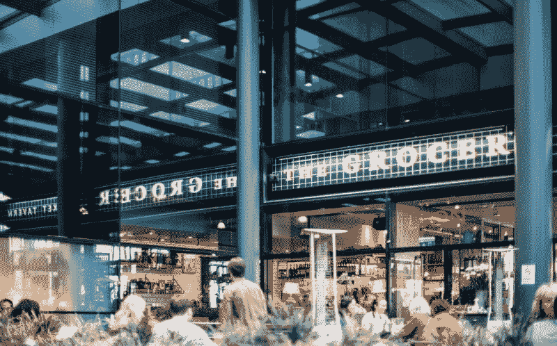
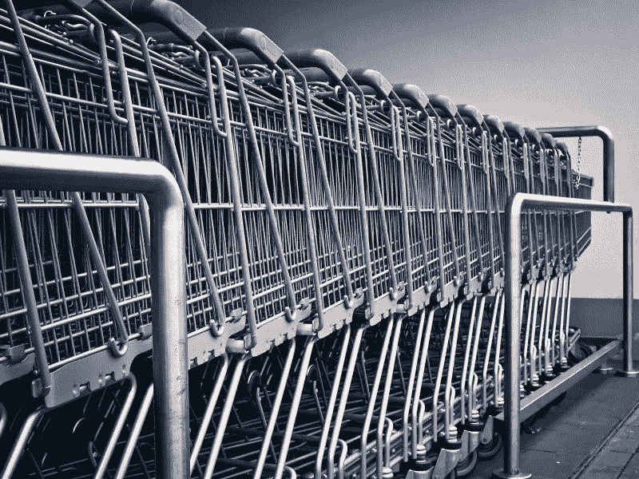
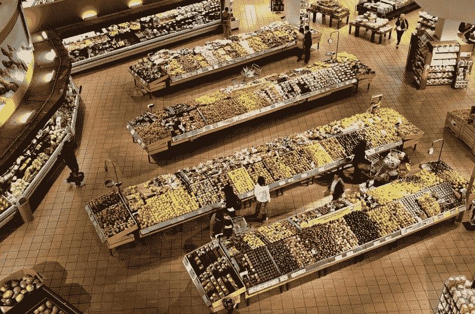
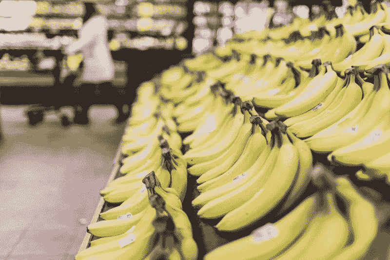
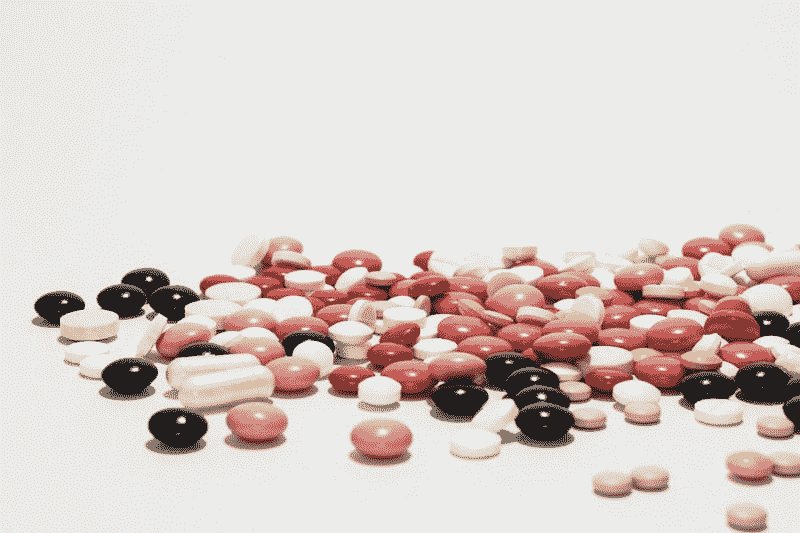
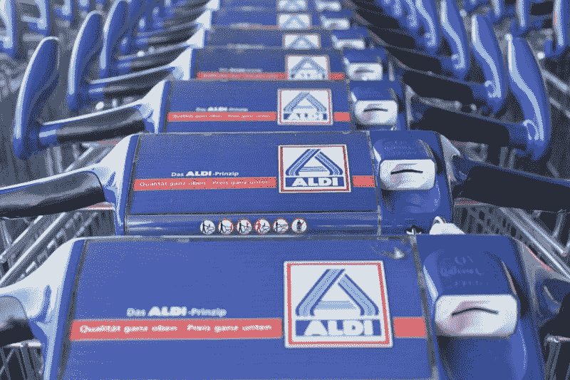
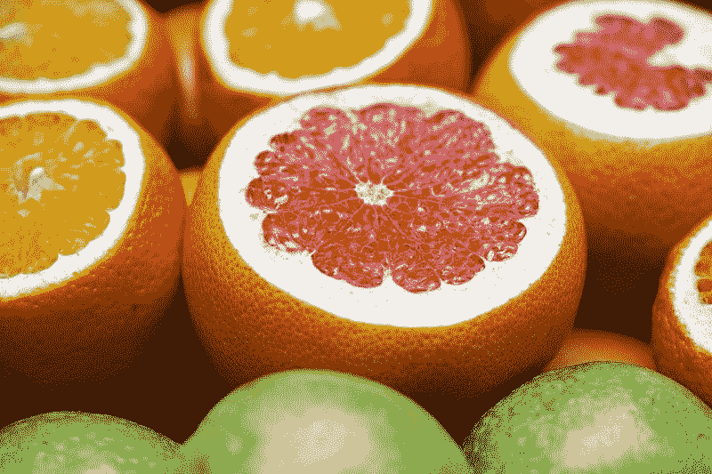

# CVS Health 是美国最大的杂货店之一——Market Mad House

> 原文：<https://medium.datadriveninvestor.com/cvs-health-is-one-of-americas-biggest-grocers-market-mad-house-8c254f42906?source=collection_archive---------7----------------------->

奇怪的是，药店经营者 CVS Health 是美国最大的杂货店之一。事实上，**CVS Health Corporation(NYSE:CVS)**在 2017 年美国杂货市场的份额超过了 Aldi、Trader Joe's 和 Whole Foods。

澄清一下，2017 年，CVS 在美国杂货市场的份额为 3.9%，*《卫报》* [注意到](https://www.theguardian.com/us-news/2019/jun/04/food-swamps-cvs-outsells-trader-joes-whole-foods-processed-shopping)。与此同时，瑞士联合银行[估计，2017 年，Aldi 在杂货市场的份额为 1.1%，Whole Foods 的份额为 1.4%，Trader Joes 的份额为 1%。有趣的是，经济学教授史蒂文·霍维茨估计 CVS 现在是美国第四大杂货商。](https://www.businessinsider.com/where-americans-are-buying-their-groceries-2017-6)

 [## 医疗保健的未来正在被一场巨大的技术入侵所塑造——数据驱动的投资者

### 过去十年，全球经济的所有部门都经历了大规模的数字颠覆，而卫生部门现在…

www.datadriveninvestor.com](https://www.datadriveninvestor.com/2018/11/02/the-future-of-healthcare-is-being-shaped-by-a-big-tech-invasion/) 

此外，CVS 在杂货市场的份额比**美元树(纳斯达克:DLTR)** 大 1.7%；**美元通用(纽交所:DG)** ，1.5%，**塔吉特(纽交所:TGT)** ，2.7%，Publix 3%，**沃尔格林(纳斯达克:WBA)** 2.4%，梅耶尔 0.9%，以及**新芽(纳斯达克:SFM)** 0.4%。

然而，与美国最大的“杂货商”**沃尔玛(纽约证券交易所:WMT)、**和最大的独立杂货商**克罗格(纽约证券交易所:KR)** 相比，CVS 仍然是一个小角色。根据记录，克罗格占有 10.2%的杂货市场，沃尔玛占有 21.4%。

# 为什么 CVS 是主要的杂货商？

因此，一个基本上是健康保险公司、药店经营者和处方计划管理者的公司就是一个主要的杂货商。

奇怪的是，CVS 可能是偶然获得了杂货市场份额。《卫报》声称 CVS 的许多商店都处于“药店荒漠”药店沙漠是一个有药店但没有杂货店的社区。

因此，许多人；尤其是低收入的美国人，把药店当成他们的超市。不幸的是，CVS 卖的食物往往不健康。例如，常见的药店商品包括冷冻食品、加工食品、预包装食品、糖果、汽水、含糖谷类食品和预包装零食。

由于商业模式的原因，传统超市很难在低收入和市中心地区运营。低利润的超市经常面临高租金、小客户群、劳动力短缺以及城市和低收入地区的高劳动力成本。

另一方面，CVS 可以在这些地区经营，因为它的规模较小，员工较少，商业模式以高利润的药品处方为中心。此外，CVS 还利用健康保险、医疗保险和医疗补助等其他收入来源。

# CVS 怎么是主要杂货商？

美国更大的趋势包括工资停滞、收入不平等加剧和收入下降，这有助于解释 CVS 杂货店的成功。

汉密尔顿计划[估计](http://www.hamiltonproject.org/papers/thirteen_facts_about_wage_growth)尤其是美国经济产出中流向工人的份额正在下降。具体来说，美国工人在 1974 年第三季度获得了国民收入的 64.5%，在 2017 年第三季度获得了国民收入的 56.8%。结果，工人们的钱少了，这阻碍了他们去超市购物。

此外，美国的劳动力参与率正在下降*[估计](https://www.thebalance.com/labor-force-participation-rate-formula-and-examples-3305805)。具体而言，美国男性劳动力参与率在过去 60 年中下降了 8%。此外，女性劳动力参与率也在下降。*

*显然，没有工作的人不太可能去更贵的超市购物。此外，低收入者不得不忍受在超市领取食品券的耻辱。许多 SNAP 或者粮票，用户[报告](https://humanparts.medium.com/the-mythical-mooch-of-poverty-f84a50ca4776)在超市被其他顾客辱骂和嘲笑。然而，你不太可能在 CVS 排队，避免在你的邻居面前使用你的卡的羞辱。*

*最后，那些劳动力之外的人更有可能有需要处方的健康问题。因此，他们更有可能在 CVS 购物，可能缺乏体力或能力在两家商店购物。*

# *CVS 还能保持主要杂货商的地位吗？*

*CVS 在杂货市场的份额引发了关于垄断、营养和收入不平等的问题。两党的商业批评家们都想知道美国联邦贸易委员会是否应该将药店从食品杂货店中驱逐出去。*

*许多进步人士将利用美国人无法在超市购物作为基本收入和工作保障等激进经济解决方案的借口。与此同时，健康倡导者将批评 CVS 在销售不健康的加工食品时拒绝携带香烟是虚伪的。*

**

*因此，离开食品杂货店对 CVS Health 来说可能是一个明智之举。不幸的是，CVS 退出杂货店可能会让一些低收入社区没有食品店；或者便利店作为唯一的食物来源。因此，药店沙漠可能会变成没有食品零售商的食品荒地。*

# *CVS 是离开杂货吗？*

*美国消费者新闻与商业频道[声称](https://www.cnbc.com/2019/06/04/cvs-to-add-healthhub-stores-drugstore-announces-ahead-of-investor-day.html)CVS 计划在 2021 年前开设 1500 家 HealthHub 商店，这很能说明问题。*

*一家 [HealthHub](https://www.cnbc.com/2019/02/13/cvs-health-unveils-its-new-concept-stores-post-aetna-acquisition.html) 商店设有一个诊所、一个验血、健康筛查实验室和一个药房。此外，一些健康中心可以提供呼吸专家、营养师，甚至瑜伽。*

*健康中心和去年对保险公司 Aetna 的收购是 CVS 努力将自己转变为英国国民健康服务(NHS)私人版的一部分。国民保健制度在一个地方为女王陛下的所有臣民提供健康保险和医疗保健。CVS Health 希望在美国利用类似的商业模式来降低医疗成本，并从不断变化的医疗保健行业中获利。*

**

*特别是，我认为 CVS 正试图利用美国部分地区基本医疗服务的日益短缺、对成本上涨的愤怒以及对政府医疗保险计划的日益依赖。*

*联邦政府是美国的健康保险公司。据美国人口普查局[估计，它通过医疗保险覆盖了 17.2%的美国人口，通过医疗补助覆盖了 19.3%的人口，通过军事保险覆盖了 4.8%。此外，91.2%的美国人口拥有某种医疗保险；这使他们成为 HealthHub 的潜在客户。](https://www.census.gov/library/publications/2018/demo/p60-264.html)*

# *CVS 想退出食品杂货业吗？*

*最后，CVS 管理层可能希望退出利润率低、竞争激烈的杂货业务。*

*随着亚马逊(NASDAQ: AMZN)和 Lidl 进入市场，Aldi 致力于大规模扩张，杂货竞争正在升温。我认为 Aldi 是 CVS Health 在食品杂货领域最危险的直接竞争对手，因为它经营着专注于低价商品销售的小型商店。*

*此外，Aldi 还在低收入地区、农村地区、市中心以及其他大多数美国杂货店都不去的地方开店。此外，Aldi 还提供更多的食品杂货，包括肉类、蔬菜和乳制品。*

**

*超越阿尔迪；和它的德国竞争对手 Lidl 一样，网上食品杂货配送的威胁正在逼近，这种威胁可能会触及市中心和低收入消费者。亚马逊、克罗格、沃尔玛和 Instacart 都在大力推进杂货配送。*

*在这种情况下，退出杂货店可能是 CVS Health 的明智之举。通过退出杂货店，CVS 可以放弃低利润和低利润的部分，并结束其向穷人出售不健康食品的批评。此外，CVS 可以通过减少对食品和收银员的需求来降低劳动力成本。*

# *CVS 健康赚钱吗？*

*许多投资者会问，CVS Health 是否因为涉足杂货业务而赚钱。*

*目前，答案是肯定的；CVS Health 报告毛利 109.4 亿美元；截至 2019 年 3 月 31 日，净收入为 14.21 亿美元，营业收入为 26.9 亿美元。此外，CVS Health Corporation 在截至 2019 年 3 月 31 日的季度收入为 616.46 亿美元。*

**

*Stockrow 估计，CVS Health 上个季度的收入呈爆炸式增长，增长率为 34.77%。更重要的是，CVS 正在产生一些现金，运营现金流为 19.48 亿美元，融资现金流为 8.16 亿美元，最后一个季度的自由现金流为 12.32 亿美元。*

*因此，CVS 在 2019 年 3 月 31 日拥有 58.96 亿美元的现金和等价物以及 24.26 亿美元的短期投资。因此，CVS 在上个季度末获得了 83.22 亿美元的现金和短期投资。*

# *CVS 健康是价值投资吗？*

*我认为 **CVS Health (NYSE: CVS)** 股价低，是价值投资。2019 年 6 月 11 日，市场先生对 CVS 的定价为 54.37 美元。以这个价格，CVS 似乎很划算，因为它在美国经营着近 10，000 家商店和一家大型医疗保险公司。*

*值得注意的是，CVS 于 2019 年 5 月 3 日支付了 5₵股息。然而，自 2016 年 11 月 4.25₵.以来，这一差距并没有扩大目前，Dividend.com 估计 CVS Health 的股息率为 3.68%，年化派息为 2 美元，派息率为 28.4%。*

**

*鉴于这些数字，我认为 CVS 是零售和医疗保健领域的一项价值投资，随着美国医疗保健需求的上升，它可能会增长。特别是，美国人口老龄化、传统医疗服务提供商的衰落以及对单付费医疗保险需求的增长为 CVS 带来了巨大的增长和利润机会。因此，我认为 CVS Health 是一项具有显著增长潜力的价值投资。*

**原载于 2019 年 6 月 11 日*[*【https://marketmadhouse.com】*](https://marketmadhouse.com/cvs-health-is-one-of-americas-biggest-grocers/)*。**