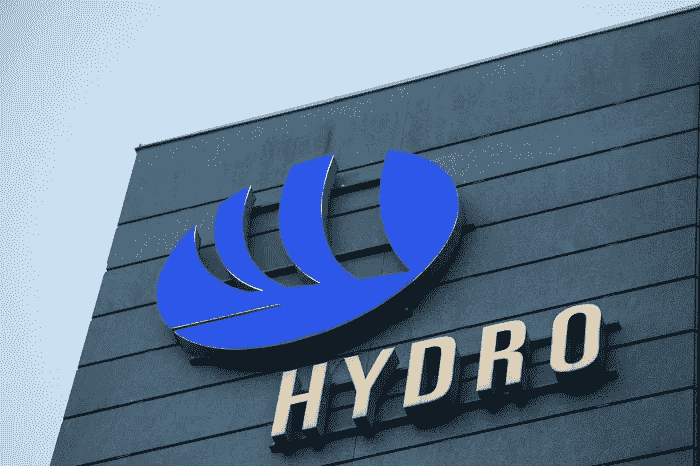

# 网络攻击使挪威水电公司遭受前所未有的经济损失

> 原文：<https://medium.datadriveninvestor.com/cyber-attack-strikes-norsk-hydro-for-unprecedented-financial-loss-5100496148b2?source=collection_archive---------7----------------------->

## 这实际上就是网络恐怖主义有多危险。读下去就知道损失了。

时至今日，网络恐怖主义和黑客攻击依然猖獗。如果你不相信，或者你生活在岩石下，只需看一眼你自己的收件箱，就可以看到来自未知公司或个人的疯狂垃圾邮件“投资”的涌入，这些公司或个人希望你签署从埃及王子那里收到一些神秘的“包裹”或“遗产”。这是常有的事。这些是网络恐怖主义的种子:以无助者的天真为食，但信不信由你，这不仅仅是个人的问题:

# 事实上，就连公司也遭受网络恐怖主义，这可不太妙

**挪威海德鲁**就是这样一家公司。作为一家来自挪威的铝制造商，这家公司仅仅因为针对公司 IT 系统的一次网络攻击就损失了超过**4000 万美元**。造成损害所需要的只是网络的完全关闭，而停机时间会相对容易地导致这些损失。

 [## 网络安全非营利组织帮助中小企业打击网络犯罪-数据驱动的投资者

### 一个名为全球网络联盟(GCA)的非营利组织发誓要改善…

www.datadriveninvestor.com](https://www.datadriveninvestor.com/2019/02/22/cybersecurity-non-profit-to-help-smes-fight-against-cybercrime/) 

黑客通过感染该公司一些系统的勒索软件实现了这一点，这些勒索软件阻止了访问，并使运营虚拟地绑定在数字链中。什么也做不了。

好消息是，水电确实为这类问题准备了一份很棒的保险，但当然，就保险范围而言，有一个上限。事实是，伤害是在最多只有 80%的操作有效的情况下造成的。然而，建筑系统业务部门却无动于衷，因为所有的网络病毒都被有效地消灭了，一切都恢复了正常。

这些黑客的意图非常明显:这是勒索软件。有点像恐怖分子劫持人质，并期待一些大的支出。然而，Hydro 很聪明，选择通过备份服务器恢复一切，代价是损失一些收入，但相比之下，这可能比不得不付钱给罪犯要少得多。

# 想知道为什么身份盗窃保护和网络安全如此重要吗？这就是为什么。

向网络安全技术和平台致敬。对吗？没错。如果我是一家大公司，我也会希望我的数字资产和系统受到保护。毫无疑问。你如何看待我们为确保网络空间安全而采取的措施？我们做得好吗？还是我们忽略了目标？ [**注册一个 VIGYAA 账户**](https://vigyaa.com/accounts/login/) 还有 [**查看《数据驱动投资者》了解更多关于科技的新闻和故事**](http://datadriveninvestor.com) **。**