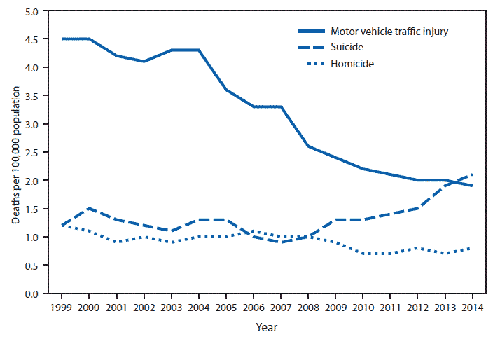
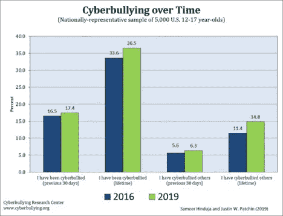

# 网络欺凌、自杀和人工智能:技术使其发生，技术必须成为解决方案

> 原文：<https://medium.datadriveninvestor.com/cyberbullying-suicide-and-ai-technology-made-it-happen-and-technology-has-to-be-the-solution-6a2baaa5034c?source=collection_archive---------0----------------------->

©Kat J on Unsplash

昨晚有近 7000 张床空着。由于无情、残酷、持续的网络欺凌和校园欺凌，睡在里面的儿童、青少年和年轻人自杀了。根据统计数据，这个问题的严重程度还没有被完全认识到，这也表明报道的网络欺凌事件的数量明显上升。

2017 年，超过 47，000 人自杀，即每 11 分钟就有一人自杀。这个数字令人震惊，应该会让任何人在面对它的时候犹豫一下。根据疾病控制中心的统计数据，自杀是 10-34 岁年龄段人群的第二大死因。2017 年，1060 万成年人认真想过自杀。

并非所有的自杀都是由网络欺凌引发的。自杀也是与工作或任何形式的欺凌相关的抑郁和焦虑的结果。家长举报网络欺凌攻击的事实需要进一步调查。总体而言，报道与真实的网络欺凌事件大相径庭。许多攻击没有被报告，因为儿童/青少年可能不愿意告诉他们的父母对他们采取的行动。攻击的总数可能比研究显示的要多得多。[去年，43%的青少年成为网络欺凌的受害者。是什么促成了这种程度的虐待？](http://archive.ncpc.org/resources/files/pdf/bullying/cyberbullying.pdf)

计算机已经向任何有机会接触技术的人打开了世界，在这里必须保持警惕和使用技术。这项技术是滥用的媒介。根据 2016-2019 年的统计数据，全球范围内的网络欺凌呈上升趋势。我们通过技术与整个世界的联系使得网络欺凌增加了。技术也促进了对孩子们卧室和家的令人痛苦的入侵。

技术的一个因素是个人隐藏在匿名网络面具后面的能力。一项在 2018 年对美国和加拿大 18 至 64 岁的成年人以及所有其他国家 16 至 64 岁的成年人进行的超过 20，000 人的[研究揭示了应该令人不安的信息。](https://www.comparitech.com/internet-providers/cyberbullying-statistics/)

在美国，26%的受访父母称他们的孩子是网络欺凌的受害者。同一项调查概述了父母的共同信念，即他们的孩子是网络欺凌的受害者。据报道，印度的父母比例为 37%，巴西为 29%，比利时为 25%，南非为 26%，马来西亚为 23%，瑞典为 23%，加拿大为 20%。

据报道，父母意识到自己的孩子受到网络欺凌最少的国家是俄罗斯，比例为 1%。后一项统计必须考虑到计算机的可用性、互联网连接以及政府对互联网的控制。也许是其他因素在起作用，而不是网络欺凌减少了。俄罗斯的统计可能揭示的是*更少获得*参与网络欺凌的手段。

[CDC death rates](https://www.cdc.gov/mmwr/volumes/65/wr/mm6543a8.htm?s_cid=mm6543a8_w) for children 10–14, US 1999–2014

一张图表从不同的角度展示了网络欺凌对受害者的破坏性。自杀与汽车死亡和他杀的比较显示了明显的进展。车祸死亡人数下降，而青春期前和青少年自杀人数上升。网络欺凌被认为在这个新的统计方向上有着明确的作用。

在 2016 年至 2019 年期间，网络欺凌在每个类别中都有所增加；*过去 30 天内被欺负过，生前被欺负过，过去 30 天内被人网络欺负过，并随时参与网络欺负他人*。所有地区都出现了增长，其中最显著的增长是“我(一生中)受到过网络欺凌”问题是:他们为什么要这么做？

他们为什么要搞网络霸凌？

恶霸们正在通过互联网展示他们的新影响力，但驱动力是一样的，原因也是一样的。在一项大型研究中，40%参与过网络欺凌的学生报告称，在遭受网络欺凌后没有任何感觉，而只有 16%的网络欺凌者报告称有负罪感。此外，一些学生报告说网上欺凌让他们觉得“有趣、受欢迎、有力量”。"

*[*研究表明，男孩*](https://www.psychiatrictimes.com/articles/cyber-bullying) *比女孩更有可能从事传统的欺凌行为(即伤害另一个人、反复发生、使受害者难以为自己辩护的身体和言语行为)。**

**“男孩也比女孩更有可能参与直接的身体形式的欺凌，而女孩更有可能参与间接形式的欺凌(例如，排斥和闲聊)。毫不奇怪，女孩(13%)比男孩(9%)更多地报告实施了网络欺凌——一种间接的侵犯形式。重要的是，更多的女孩(25%)比男孩(11%)报告成为网络欺凌的目标。**

*最近的一份出版物“网络欺凌，识别，预防，应对”这样描述这个问题:*

*"**网络欺凌发生在网络空间的各种场所和媒介，它最常发生在青少年聚集的地方也就不足为奇了。***

**在 21 世纪初，许多孩子在聊天室里闲逛，因此，那里是大多数性骚扰发生的地方。近年来，大多数年轻人都被社交媒体(如 Instagram、Snapchat、抖音/Musical.ly 和 Twitter)、热门游戏(Roblox、英雄联盟、Overwatch、PlayerUnknown Battlegrounds、堡垒之夜)中的语音/文本聊天以及视频共享和流媒体网站(如 YouTube、Twitch 和 Live)所吸引。我)。**

***“这一趋势导致在这些环境中发生的网络欺凌报告增多。我们也看到它在增强现实(AR)和虚拟现实(VR)环境中，在社交游戏网站上，以及在定期出现和消失的匿名应用程序中发生。”***

**正如研究人员指出的那样，网络欺凌和面对面的欺凌确实与自杀有很大关联。“*那些只经历过校园欺凌或网络欺凌的人没有更大的自杀未遂风险，而那些经历过两种形式欺凌的人试图自杀的可能性是那些没有受到欺凌的人的 11 倍以上*……”学校官员或家长不能忽视 11 倍的自杀风险。**

**科技公司正在反击**

**打击或阻止网络欺凌可能不是互联网用户或他们的父母所熟悉的事情。当 Twitter 和脸书等主要平台正在设置守卫和报告违规者的方式时，这里有一个关于如何在脸书保护自己的简单图形指南。**

**由宾汉姆顿大学的研究人员开发的 Twitter 算法已经能够以 90%的准确率从 Twitter 的普通用户中识别出网络恶霸。研究人员解释说，“我们建立了爬虫——通过各种机制从 Twitter 收集数据的程序，我们收集 Twitter 用户的推文，他们的个人资料，以及(社交)网络相关的事情，如他们关注谁和谁关注他们。”使用一系列其他方法，他们能够将用户分为两类；网络欺凌和网络攻击。**

**从事骚扰行为的两类用户发出死亡威胁或种族主义言论。该算法只是研究人员试图帮助减少这种做法的第一步。下一阶段将更加积极主动地帮助消除网络欺凌。**

**脸书在美国和 T2 都建立了网站，打击网络欺凌，并提供相关网页。一则[解释性 PSA](https://www.youtube.com/watch?v=jNdBmjUvzEU) (公益广告)已经上传到 YouTube。**

**Twitter 正在积极打击仇恨言论，从已知种族主义者的个人资料中删除蓝色的、经过验证的复选标记。**

**Twitter 用户也开始了反对网络欺凌的活动。个别团体也为打击网络欺凌贡献了自己的力量。其中一个提供了一份各州的法律清单和其他应对这一问题的努力。**

**这项工作已经开始并将继续下去，因为那些欺凌弱小者不会停止，但没有人需要为他们提供一个平台。**

**法雷尔博士在亚马逊上:[https://tinyurl.com/y6hnbx6r](https://tinyurl.com/y6hnbx6r)**