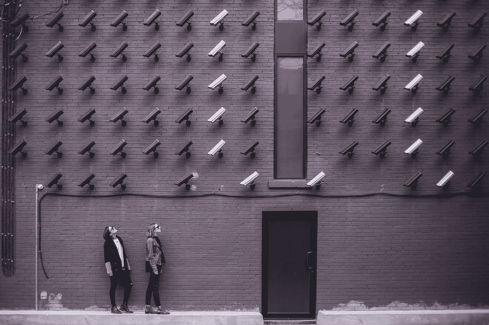

# 网络安全生活是一个缺口

> 原文：<https://medium.datadriveninvestor.com/cybersecurity-life-is-a-breach-2393bfc1795e?source=collection_archive---------8----------------------->

## 在线隐私和安全是个人和企业面临的问题

Photo by Matthew Henry on Unsplash

搜索“在线隐私和安全”，搜索引擎会指向一篇文章，文章称“[两者兼而有之是个好主意](https://us.norton.com/internetsecurity-privacy-privacy-vs-security-whats-the-difference.html)

具有讽刺意味的是，另一个对“谷歌健康数据”的搜索聚焦于[一个关于该公司如何“与一个大型医疗保健系统合作收集数百万美国人的健康数据”的 NPR 故事](https://www.npr.org/2019/11/14/779208282/google-health-data-project-under-scrutiny)。该项目引发了关于患者隐私的问题。”

 [## 人们对隐私的不理解是什么？数据驱动的投资者

### 你知道那种感觉。无论是访问应用程序、订阅还是你最喜欢的运动鞋。你按下…

www.datadriveninvestor.com](https://www.datadriveninvestor.com/2019/04/11/privacy-and-convenience/) 

伊冯娜·c·康威-威廉姆斯发现这些结果具有警示意义。作为 WordPress Women 的董事会成员和 paradox prime Information Assurance 的联合创始人，她已经在 WordPress 的网络安全会议上发表了演讲。

康威-威廉姆斯和作家兼博客作者卡罗尔·斯蒂芬谈论了在线隐私的危险以及如何应对。

在线隐私在术语上可能是矛盾的，但理想情况下，用户应该致力于保护个人身份信息。

Conway-Williams 说:“隐私涉及保护互联网上的个人数据。"这包括何时、何地以及如何分发或使用信息."

不幸的是，谷歌收集数百万人的信息被称为星期二。冷嘲热讽来得容易。

康威-威廉姆斯说:“人们没有拒绝的选择，这一事实令人担忧。”。“然而，收集的信息可能有助于改善患者护理。也许吧。或者它可能只是帮助资本主义。”

常见的网络威胁包括看似无辜的脸书测验，人们自愿放弃他们的私人数据。

“人们如此自由地张贴重要的个人信息，这让我感到震惊，”康威-威廉姆斯说。“不要发布你的医院身份证手镯、新护照或孩子新驾照的照片——尤其不要公开发布。”

在保护在线隐私的最佳实践中，不要让别人想起你母亲的娘家姓或你的生日。在你回来之前，不要谈论你的旅行。

康威-威廉姆斯补充了这些建议:

*   使用虚拟专用网络或 VPN。
*   安全密码。
*   检查网站和应用程序的权限。
*   检查社交网络上的隐私设置。
*   避免使用公共 Wi-Fi。
*   保持防病毒更新。
*   定期清除浏览历史。
*   避免与安全性或隐私声誉差的公司做生意。

# **永无止境的修复**

如果隐私被侵犯，那就第无数次修改你的密码。注册免费的身份保护，尽管你可能已经是一打这样的程序的成员。

康威-威廉姆斯说:“尽你所能遏制、改变、补救、报告和监控。”。“遏制伤害。更改密码、电子邮件、安全问题——尽你所能。向当局和企业报告。监控任何未经授权使用信息的行为。”

企业必须公布程序以确保客户隐私，并遵守这些程序。

“加密，教育员工安全程序，实施文件销毁政策和控制访问，”康威-威廉姆斯说。

 [## 网络安全威胁比恐怖更可怕

### 惊人的违规数据比看起来更糟糕

medium.datadriveninvestor.com](/cybersecurity-threats-scarier-than-scary-60fcc2f704c2) 

为了保护在线隐私，请检查在线安全设置，这些设置的强度取决于您坚持到底的意愿。不要公开告诉朋友你不想让坏人知道的事情。

康威-威廉姆斯说:“使用 VPN、加密信息应用、强密码、密码管理器，并检查社交媒体上的隐私设置。”

每次关机的时候删除 cookies 就好了。

“你删除 cookies 的频率取决于来源和你在做什么，”Conway-Williams 说。“阻止 cookies 可能比删除它们更好。将您最常访问的网站列入白名单。”

她更喜欢 TOR(T2)，这是一种让人们匿名浏览互联网的方式，是确保数据隐私的最佳浏览器。

“火狐是一个很好的选择，”康威-威廉姆斯说。“还有谷歌的开源浏览器 Chromium。无论您使用哪种浏览器，都要检查您的设置。”

她经常采取预防措施来保护在线隐私，但这位专家似乎听天由命。

“我尽可能地锁定我的在线活动，但在雅虎、Equifax 和其他许多公司的大规模数据泄露事件中，我意识到我的许多信息已经在那里了，”康威-威廉姆斯说。“我已经改变了可能改变的，并将监督其余的。”

**关于作者**

吉姆·卡扎曼是拉戈金融服务公司的经理，曾在空军和联邦政府的公共事务部门工作。你可以在[推特](https://twitter.com/JKatzaman)、[脸书](https://www.facebook.com/jim.katzaman)和[领英](https://www.linkedin.com/in/jim-katzaman-33641b21/)上和他联系。