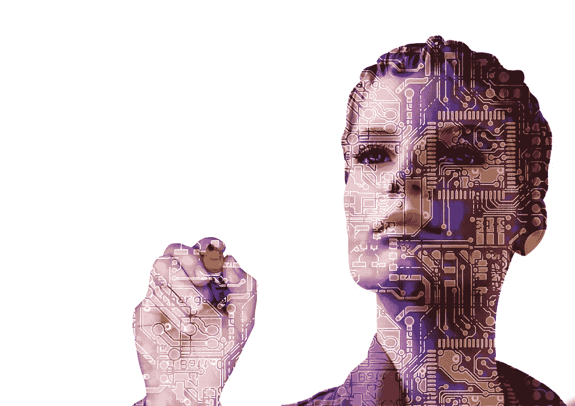
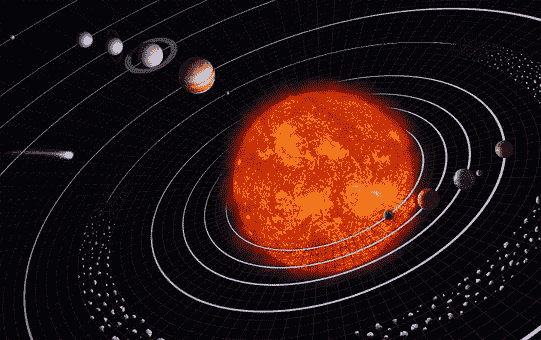

# 电子人和人工智能:我对人工和增强生命含义的痴迷

> 原文：<https://medium.datadriveninvestor.com/cyborgs-and-ai-my-obsession-with-the-implications-of-artificial-and-augmented-life-a5502eb6dc60?source=collection_archive---------26----------------------->

你可能知道也可能不知道，我一直在与 Takamo Universe 团队合作一部关于电子人的科幻爱情片，名为 Aeon Project。你可能不知道，我有点痴迷于思考和写作关于创造人工和增强生命的伦理、道德和科学含义。我一直着迷于人类是创造者的想法，以及这对于我们接受和理解我们的创造意味着什么。

谈到这个想法，我是一个相当悲观的思考者。不幸的是，我不抱任何温暖和模糊的希望，人类作为一个整体会以比他们目前给予人类同胞更多的善意和理解来对待电子人或完全人工智能的存在。我是在说所有人类都是人渣吗？当然不是！我只是说，在我们的社会中，善良和理解并不是普遍的准则。

这如何影响我写的关于机器人的文章？好吧，就拿永旺计划系列的第一本书来说吧，一个经久不衰的太阳。我们见到了 Sharyn，一个心胸宽广的女人。她想给银河系中她那部分的战争孤儿带来安慰和幸福，如果有必要，她不会放弃为此而战。莎琳接触到一个名叫任的神秘男子，他没有义务对她好。在一个引人注目的事件转折中，任的善良最终让他受到伤害，而 Sharyn 在他的债务中陷得更深。任和他的家庭有些不同，但 Sharyn 知道保守秘密对她的工作来说意味着生死之别。尽管如此，她还是开始喜欢和尊重那些保护她安全的男人，尽管他们不欠她任何东西。任担心，当莎琳发现他的真面目时，她会疏远他们日益加深的感情。这种恐惧是《永旺计划》中人物情感旅程的核心。

我不能透露整个情节，但我可以说，过去的经历让任和他的家人明白了人类贪婪和渴望权力的真正卑鄙本质。任认为他的家人过去的行为是一个永远不会离开他们的污点的象征，但许多人认为他们在面对这种逆境时的忠诚，善良和力量令人钦佩。尽管在人类的手中忍受了太多的痛苦，任和他的家人愿意为保护他们而战。

多年来，我一直坚持这样一个观点，即一件作品应该被珍惜，但却很少被珍惜——生命是宝贵的，无论其物质形态如何。我回想起关于人工智能的故事，比如《我》、《机器人》、《人工智能》、《终结者》、《查皮》和《蛋壳里的幽灵》,它们都有一个共同的主题。当人类面对他们可能在权力金字塔中被篡夺的恐惧时，他们总是反对他们害怕的事情。这些故事中也有希望。少数站在人工智能和电子人一边，找到友谊、爱和尊重的人，才是真正重要的人物。这些角色抛弃了标准的仇恨，透过仇恨看到了美好的东西——这些是我喜欢写的故事。当然，所有的故事都是关于人工智能如何决定保护人类的唯一方式是控制他们，或者毁灭他们以保护地球，但在我看来这变成了一个先天与后天的问题。如果一个人对人类友善，这样的人会这样看待人类吗？如果一个家庭把它当成自己的一员？

从这些问题中可以建立起无数层次的情感、思想、忧虑和关系，这才是真正驱使我去写半机器人的原因。我当然喜欢科幻小说，我也非常喜欢浪漫爱情。为什么不把所有这些东西组合成一个包含所有这些的故事呢？

我将快速地引导你通过 Aeon 项目系列，这样你就对你将要进入的领域有了一个概念。

Aphelion——二重唱:孩子们正在整个银河系消失，没有人关心。当 Kellan 和 Rae 逃跑的时候，他向她保证，当她打电话的时候，他总是会来的。/klevesans 在银河系旅行寻找下一个分数，但这艘船不只是在它的脑海里抢劫。它将拯救宇宙。

[隐忍的孙](https://amzn.to/2Mt0WtH)第一部:沙琳和任:五个拼命隐藏身份，过着平静生活的男人遇到了一个只想回家陪孩子的女人。当他们的过去来电话，并威胁 Sharyn 和她的男孩，男人会做任何事情来保护他们和其余的人类。

暗星之书 2:初级一回到一切开始的地方，寻找他最珍惜的东西。他的妻子。**即将推出* *

腐烂的轨道书 3:肚子里有一颗炸弹，维克斯生存的唯一希望是一个粉发小精灵，他的态度和一个装满医疗用品的口袋。**即将推出* *

共鸣因素第四册:塞文准备好了死亡，只有一个女人值得有机会让它发生。他会追着她穿过银河系去得到他想要的。但他想要的真的是她吗？**即将推出* *

终极速度之书 5: Q 每天晚上听广播，希望能找到某种方法来平息他的噩梦。当一个甜美的声音穿过他的频率，他会做任何事情让她说话。**即将推出* *

踏脚者编年史:(短篇小说)在他们先进的人工智能控制的飞船上，凯尔·安塞尔和特克·普里姆总是在移动。他们是他们唯一需要的家人，而且总是关于下一份工作。但是当真的到了紧要关头，他们永远不会对慈善案件说不。**即将推出* *

当然，故事远不止我在这里所说的。政治阴谋、可能消灭银河系中的所有生物、间谍工作等等。但真正重要的是关系，对吧！？

半机器人和人工智能的故事让你想到了什么？你想知道我们是否会善待他们吗？还是他们会起来消灭我们所有人？

像 Takamo Universe 这样的项目的创建需要大量的工作，我非常自豪能成为其中的一员。我希望游戏玩家、读者和小说爱好者能在 Takamo 找到一个家。

**如果你喜欢我项目的新闻，可以在 Medium * *[AR DeClerck stories](https://medium.com/p/6f83193d3620?source=your_stories_page-)上找到更多我的短篇小说作品