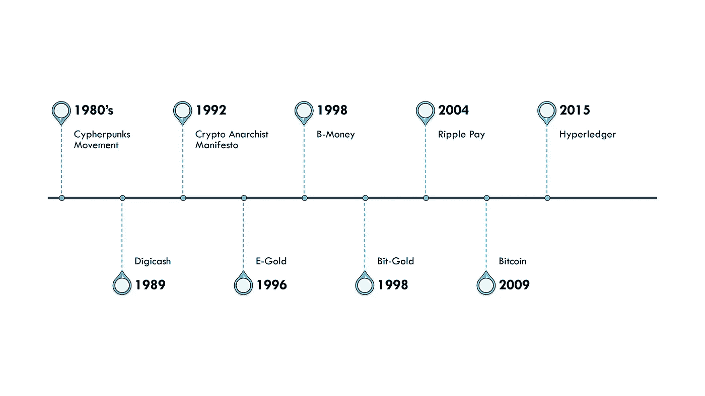
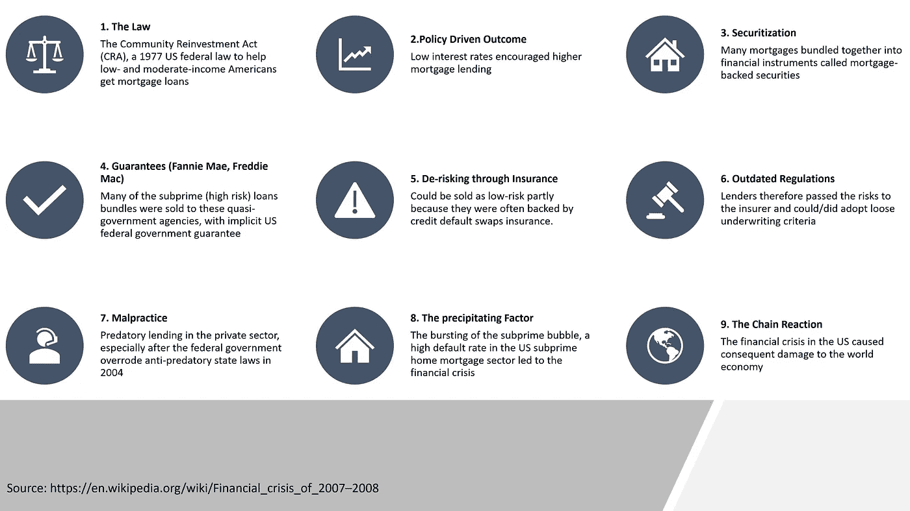

# 区块链的起源——从 Cypherpunks 到 Satoshi 再到 IBM

> 原文：<https://medium.datadriveninvestor.com/cypherpunks-to-satoshi-to-ibm-819ebcfdd674?source=collection_archive---------10----------------------->

## 80 年代的隐私激进主义如何导致区块链——透明技术的发展

[bitcointheme](https://flickr.com/photos/166102838@N03/45266467665); flickr photo by [sombando](https://flickr.com/people/166102838@N03) shared under a [Creative Commons (BY-SA) license](https://creativecommons.org/licenses/by-sa/2.0/)

比特币在近 10 年前推出。从那时起，我们看到了加密货币、ico 和点对点电子平台的稳步革命。比特币还为我们带来了区块链——通过其去中介化、不变性、透明性和信任应用，预计这项技术将改变我们几乎在每个行业开展业务的方式。

不管我们喜不喜欢比特币，很明显，比特币是 21 世纪最重要的技术发明之一。少数快速总结是—

*   比特币创造了数千亿美元的新资产
*   数以千计的新加密货币诞生了
*   数百个新的贸易与合作平台
*   成百上千的新企业诞生了
*   这个星球上数百家最大的公司正在合作建立几个联盟——利用区块链构建解决方案

> 为什么这项技术如此具有变革性？

为了充分理解它在历史上的地位，让我们回到几十年前，看看比特币背后的动机——是什么引发了这一切？然后介绍密码学的各种进化进步和导致比特币诞生的市场事件。最后，区块链——比特币的底层技术——是如何被确定为这种多功能和变革性的企业应用的。

这篇文章是针对普通读者的，但是，如果你是区块链的新手，请查看我的另一篇详细解释这项技术的文章，这是一篇 30 分钟的文章。你没有必要先阅读它，但是，它是一个有用的资源。

好吧，我们开始吧！

## 赛博朋克运动，80 年代后期的秘密无政府主义

众所周知，早在公元前 1900 年**就已经使用[加密技术](https://en.wikipedia.org/wiki/History_of_cryptography)，在公元前 1900 年左右刻在古埃及王国坟墓上的一些象形文字中可以找到。**

现代密码学在两次世界大战期间取得了巨大的进步，尤其是在第二次世界大战期间。问题是简单的无线电通信可以被任何人接收到，因此很容易被敌人截获。采用的解决方案是对无线电信号进行加扰或加密。只有拥有所需解密机制或密钥的目标收听者才能重建原始消息。

德国的 [**谜机**](https://en.wikipedia.org/wiki/History_of_cryptography) 因其在二战期间的广泛使用而为人所知并被研究。包括美国和英国在内的所有主要大国都参与了发展密码学的大规模项目。

**在 20 世纪 70 年代和 80 年代，**然而，数字通信的起飞也引发了政府和大企业的大规模监控——就像今天的谷歌或脸书对我的了解可能比我自己还多！

由几位当时的知识数学家和密码学家领导的“密码朋克运动”通过推进使用加密技术来保护个人隐私，从而抵制这种监控。这导致了持续的竞争，从 80 年代开始，然后在 90 年代，在加密活动家和政府监控社区之间，这也导致了加密领域的进步。

塞弗朋克运动，在 80 年代后期变成了 [**秘密无政府主义者**](https://en.wikipedia.org/wiki/Cypherpunk) **运动**并且包括了许多著名的计算机行业人物，比如——

*   比特币开发者哈尔·芬尼
*   Blockstream 的亚当回来了
*   BitTorrent 创建者布拉姆·科恩
*   秘密无政府主义运动的领导人蒂姆·梅
*   维基解密创始人朱利安·阿桑奇
*   Zcash 创始人佐科·威尔科克斯-奥赫恩。

[**秘密的无政府主义宣言**](https://www.activism.net/cypherpunk/crypto-anarchy.html) **，**由蒂莫西·C·梅于 80 年代末发起并于 1992 年出版，其中写道…

> “……计算机技术……使个人和团体能够……以完全匿名的方式进行通信……交换信息、开展业务和谈判电子合同，而无需知道对方的真实姓名或合法身份……通过大量重新路由加密数据包，无法追踪……”

进一步补充说，加密技术将从根本上改变经济交易的性质，减少或消除政府在其中的作用，类似于印刷技术如何削弱中世纪行会的权力，永久改变社会权力结构并彻底改变世界。

> “……与新兴的信息市场相结合，无政府加密将为任何可以用文字和图片表达的材料创造一个流动的市场……”

## 前比特币加密货币应用

到上世纪末，随着互联网和在线交流的普及，人们希望在网上进行交易。

第一个例子是共享文件，如**易货**。不过，与货币应用程序的一个显著区别是，对于**在线文件共享**，相同的数据可以尽可能多次共享，因为任何文件都可以有无限个副本。因此，文件共享起步相对较快。

然而，对于一种在线货币来说，关键的挑战仍然是所谓的**双重支出问题**。任何电子文档都可以被复制任意多次，因此，如果数字货币仅仅是某种货币文档的数字副本，它就不会起作用，因为它可以被无休止地复制，钱就会凭空产生。因此，由于重复支出的问题，这是行不通的。

遵循之前讨论的密码朋克和密码无政府主义者的哲学，几位著名的数学家和密码专家接受了挑战，通过实现密码学的进步来解决双重支出问题。这些尝试和改进极大地促进了学习曲线、平台和加密能力生态系统的建立，这些都可以用于 2009 年开发和推出比特币。

[Evolutionofblockchain](https://flickr.com/photos/166102838@N03/46125399242); flickr photo by [sombando](https://flickr.com/people/166102838@N03) shared under a [Creative Commons (BY-SA) license](https://creativecommons.org/licenses/by-sa/2.0/)

最值得注意的进步和应用是—

**1989 年至 1998 年，** [**数字现金**](https://en.wikipedia.org/wiki/DigiCash)

由著名的密码学家大卫·乔姆创建，旨在促进匿名的、无法追踪的在线交易。由于电子商务尚未起飞，该实体于 1998 年宣布破产，不知何故从未广泛流行。

**1996–2009，** [**电子黄金**](https://en.wikipedia.org/wiki/E-gold)

E-gold 由道格拉斯·杰克逊和巴里·唐尼于 1996 年创立，到 2009 年因法律问题停止运营时，账户数量增长到了 500 万。创始人道格拉斯·杰克逊最终承认犯有洗钱罪。

**1998 年，** [**B-Money**](https://en.bitcoin.it/wiki/B-money)

著名的计算机工程师和密码学家戴伟提出了一个匿名、分布式电子现金系统的建议，该建议公布在 Cypherpunks 邮件列表上。

Hashcash 是一种解决密码难题的工作验证(PoW)系统，由 Adam 在 1997 年在同一个 Cypherpunks 邮件列表中提出，可用于防止或限制垃圾邮件和拒绝服务攻击。

戴伟的 B-Money 协议提出使用 Hashcash 的工作证明(PoW)功能作为创造货币的手段。

在 B-Money 中，交易在所有参与者之间广播以转移资金。所有参与者都记录所有其他参与者的帐户。作为 B-Money 的一部分，提出了工作证明(PoW)和其他一些协议的使用。

> 在比特币出现近 10 年后，完全相同或非常相似的想法被使用，包括工作证明(PoW)、每个人都保留一份完整账本的分布式系统等。

**1998 年，比特金**

尼克·萨伯(Nick Szabo)提出了一个分散的货币系统，向贡献计算资源的人发行有限的数字货币。

[Nick Szabo](https://en.wikipedia.org/wiki/Nick_Szabo) 提出了一种去中心化数字货币的机制，从未实施过，但被称为比特币架构的直接先驱，其中—

> “参与者将把计算机能力用于解决密码难题，解决的难题将被分配给解算者的公钥，每个解决方案将成为下一个挑战的一部分，从而创建一个不断增长的新财产链”

“链接”的这一方面为网络对新币进行时间标记和验证铺平了道路，并在近十年后被用于比特币网络。

**2004 年，** [**涟付**](https://en.wikipedia.org/wiki/Ripple_(payment_protocol))

Ripplepay 由 Ryan Fugger 于 2004 年开发，旨在创建一个分散的货币系统，并有效地允许个人和社区创造自己的货币。

这导致了 Arthur Britto 和 David Schwartz 后来设计并构建了一个新系统，即我们今天所知的 Ripple，这是一个由 Ripple Labs Inc .创建的实时支付结算系统、货币兑换和汇款网络。

**2004，可重复使用的工作证明作为电子货币**

由著名的比特币开发者哈尔·芬尼设计。这是 Hashcash[Proof-of-work(PoW)](https://en.wikipedia.org/wiki/Proof-of-work_system)系统的另一个用途，这里用作可重用的令牌。这个想法是通过 PoW 中使用的计算能力的真实价值来支持虚拟货币。

比特币融合了许多这些很久以前就出现的加密突破。

## 2007-08 年的金融危机

被认为是自 20 世纪 30 年代大萧条以来最严重的金融危机，这些年见证了全球金融体系的崩溃，包括

*   政府救助阻止了大型金融机构的倒闭
*   全球股票市场的下跌
*   房地产市场崩溃导致丧失抵押品赎回权，驱逐，失业
*   阻碍经济活动的长期流动性问题——大衰退
*   以万亿美元计的财富估值下降
*   导致欧洲主权债务危机
*   并普遍侵蚀人们对政府支持的传统银行体系的信任。

几个事件在很长一段时间内叠加，导致了“次级抵押贷款泡沫”的产生、增长和破裂，然后像连锁反应一样，在各个部门、系统和国家之间产生冲击波，使世界经济陷入瘫痪。

[financial crisis 2007–08](https://flickr.com/photos/166102838@N03/31222664887); photo by [sombando](https://flickr.com/people/166102838@N03) shared under a [Creative Commons (BY-SA) license](https://creativecommons.org/licenses/by-sa/2.0/)

公众对政府和大企业的情绪降到了最低点。政府支持大型银行稳定金融市场被视为对金融业“不当行为”的“纾困”和“奖励”

这些事件无疑为政府支持的大银行带来了一个交易便利化的替代机制。随着许多加密技术的进步，并从以前的尝试中吸取经验教训，网上点对点的记账和转账系统是未来的发展方向。

## Satoshi —比特币白皮书和发布会

比特币白皮书于 2008 年 10 月发布，随后，比特币于 2009 年 1 月推出。至今还不知道 Satoshi 是谁。考虑到构建这样一个复杂平台的努力，一些人认为这是一个团体而不是一个人的努力。

关于时机的重要性也存在争议。许多人认为:比特币只是对金融危机的一种回应——政府“奖励”和“救助”金融领域潜在恶棍的“非法”方式，从而提供了一种不受任何政府约束的替代货币。

这个时机可能只是一个加强采用的有利时机，但正如我们在本文中回顾的那样，在线交易中匿名和不可追踪性的动机无疑是比特币以及在此之前密码学和加密货币应用的几项进步背后的主要驱动力。

## 区块链——企业应用

在比特币推出之后很久，到 2015 年左右，我们开始看到用比特币的底层技术构建的平台供企业使用。 [Hyperledger](https://en.wikipedia.org/wiki/Hyperledger) Fabric 由 Linux 基金会于 2015 年 12 月推出，最初由 IBM 和 Digital Asset 出资。

旨在为多样化的企业流程构建利用比特币底层技术的企业解决方案，该技术被恰当地命名为区块链，因为交易块使用加密哈希函数链接在一起以实现不变性。

该平台提供了模块化架构、即插即用的共识机制、智能合约和会员服务的集成，以及最终的隐私访问控制管理。

[Fabric Network](https://en.wikipedia.org/wiki/Hyperledger) 还引入了在分布式解决方案中从未出现过的概念，即在基础设施中的不同节点(对等节点、订购者节点、会员服务提供商)之间划分角色。

随着多样化应用程序的巨大潜力以及我们开展业务方式的转变，企业区块链的一些优势如下

*   去中介化——遵循分布式架构，去除中介，因此符合对等交易的最初目标
*   不变性——由于使用散列函数的加密链，链上的数据不能被移除、编辑或删除
*   出处——保留历史的不可变分类账
*   透明性—凭借分布式体系结构和不变性，只有在多方达成共识后才会记录交易，因此为区块链管理的流程带来了前所未有的透明性

## 结论

比特币起源于几项技术和加密技术的进步，这些进步来自于激进主义和对通过点对点系统进行匿名在线分享和交易的追求。加密激进主义背后的哲学——T2 的匿名交易或 T4 的不可追踪性，以及对抗政府或大企业的窥探——仍然是许多比特币纯粹主义者心中的核心。

最近，以太坊的联合创始人 Vitalik Buterin 博士说，IBM 的区块链公司“[没有抓住要点](https://finance.yahoo.com/news/ethereum-vitalik-buterin-says-ibm-120018299.html)。”

这一评论让许多人感到困惑，但至少可以说，当我们提醒自己，匿名和不可追踪是近 25 年前这场运动的主要目标时，这一评论就更有意义了，这场运动导致了比特币或以太坊等加密货币系统的出现。

然而，公司或经许可的区块链并不认同这些目标——因此 Vitalik 正确地指出了这一点——因为所有参与者的身份都经过验证，并且在任何经许可的分类帐中都为网络所知。

> 是的，有点讽刺。

区块链底层技术的民主化和再利用对企业来说是一个巨大的好处，也是给企业界和政府的一份礼物。然而，它远远超出了宣言的目标，也许是一个具有讽刺意味的结果，这不是它的创造者想要的。加密积极分子首先与这些实体竞争，寻求匿名和不受他们窥探的自由。

感谢阅读。请随时分享您的观点，或者询问您是否需要任何澄清或更多信息。您可以通过[邮箱](mailto:som.bando@outlook.com)、 [LinkedIn](https://www.linkedin.com/in/sombando/) 或 [Twitter](https://twitter.com/sombando) 联系或关注我。

**感谢阅读。如果你喜欢这篇文章，请随意点赞或分享，这样其他人也能找到它。**