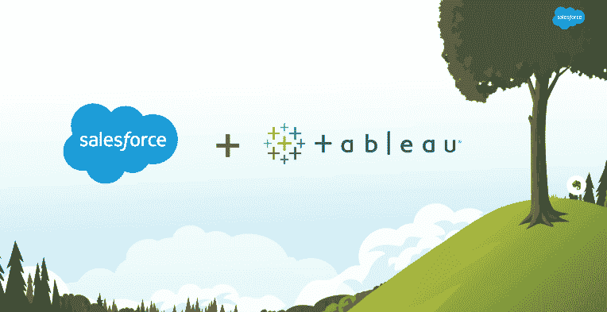
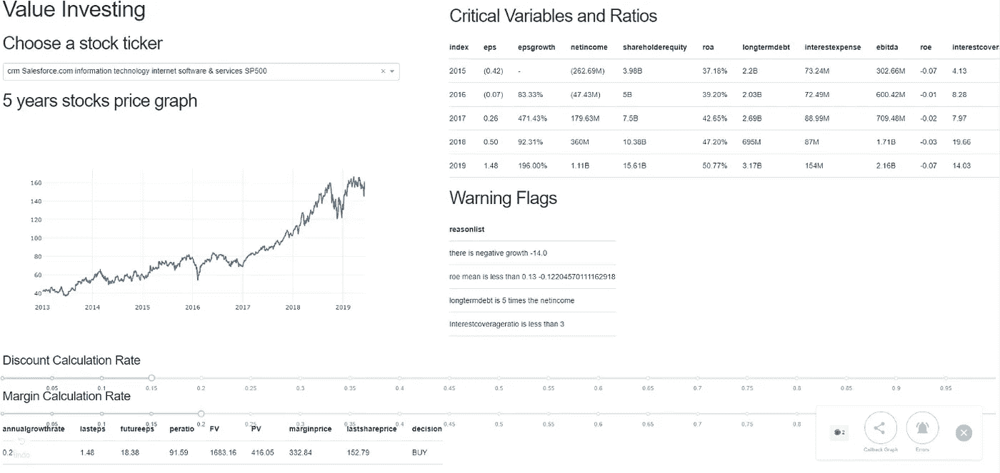
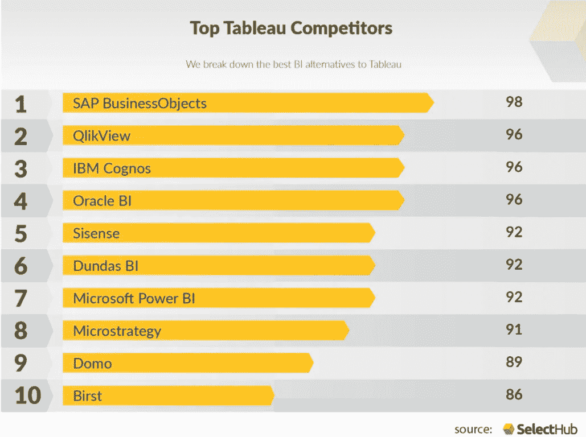

# Salesforce 和 Tableau 婚姻背后的危险

> 原文：<https://medium.datadriveninvestor.com/dangers-behind-salesforce-and-tableau-marriages-3d7b3cb02931?source=collection_archive---------1----------------------->

## 投资权威指南

## 鉴于 Salesforce 最近的大规模收购，使用价值投资分析其股票的买卖

Salesforce and Tableau Acquisition (Credit from Salesforce)

今天，我听说 Salesforce 宣布以 153 亿美元收购 Tableau Software，这是 Salesforce 有史以来最大的一次收购。作为全股票交易的一部分，Tableau 股东将获得 1.103 股 Salesforce 股票。这包括每股 177.88 美元的报价，占其收盘价的 42%。一切似乎很好的画面。

> 然而，这对 Salesforce 来说是一笔好交易吗？

为了回答这个问题，我决定对 Salesforce 和 Tableau 进行初步研究，然后使用我自己的价值投资工具检查当前的财务状况。

# Salesforce 和 Tableau 是怎么赚钱的？

## Salesforce 业务模式

Salesforce 是一个在线客户关系管理(CRM)工具，它为销售、营销和商务等部门提供了一个集成的视图。所有这些服务都位于内部托管的云服务器上。这意味着它为您提供了构建内容的工具，并随时随地实时跟踪内容。

由于它提供 SaaS(软件即服务)和平台即服务(PaaS)，Salesforce 依赖订阅和许可费作为主要的创收来源。例如，销售云从每个用户每月 25 美元开始，到每个用户每月 250 美元，具有无限的 CRM 功能和支持。在最近一个季度，该公司已经从销售云上赚了超过 6 亿美元。(转自 Vator News)

## Tableau 商业模式

Tableau 是一个数据可视化工具，旨在提供一个简单的拖放可视化工具，对任何人来说都是用户友好的。***Tableau 的使命是帮助人们更好地查看和理解数据，*** Tableau 在向专业人士和学生等不同用户群营销其产品方面非常积极。事实上，在过去的几年里，它的用户群已经增长了 80%以上

它从给公司的授权费和不断增长的学习 Tableau 的用户群中获利。对于每月的价格，Tableau Server 和 Professional 的价格大约为 40 美元，而桌面 Professional 的许可价格为 1999 美元。最近，Tableau 还专注于转向大数据和云，以满足一般的市场需求。

## 看似美好的婚姻？

粗略一看，这两家公司的目标似乎非常一致。两者都致力于云服务，并利用数据趋势作为他们的主要服务。同时，两家公司都专注于不同的数据分析渠道，Salesforce 专注于其 CRM 和云服务产品，Tableau 专注于其商业智能/数据可视化产品。

这似乎是数据和云时代非常期待的完美结合。然而，这真的是我们一直期待的完美婚姻吗？Tableau 可能给 Salesforce 带来的潜在危险是什么，尤其是在 153 亿美元的昂贵收购中？

The marriage of data among Salesforce and Tableau (Credit to The Standard)

# 价值投资观点

## 销售力量

## 加分点:销售队伍在增长中表现强劲

Salesforce 增长非常强劲，因为它在 5 年内实现了高 eps 增长(2018-2019 年增长了 196%)。年增长率达到 0.29，这突出了 Salesforce 引以为豪的利润增长。

## 加分:Salesforce 高预测未来值

鉴于过去五年的高市盈率和高每股收益增长率，Salesforce 对未来 10 年的价值预测似乎非常高。即使采用 15%的贴现率和 20%的利润率来保守预测金融通货膨胀和增长放缓，我们仍然可以拥有 332.64 美元的边际价值。这很容易超过目前的股价。

## 加分点:Salesforce 覆盖率高

在过去五年中，Salesforce 的利息覆盖率也在提高。这意味着 Salesforce 无法支付利息的违约风险越来越小，因为他们的收入覆盖面越来越大。这无疑是由利用 Salesforce CRM 服务(网飞、AirBnB 等)的爆炸性需求推动的。

## 风险点:自 2015 年以来，Salesforce 一直在举债

然而，似乎 Salesforce 一直在追债和高利息覆盖率，似乎 Salesforce 在杠杆方面真的很激进。这可能非常危险，因为 Salesforce 发展非常快，可能很难适应不断变化的行业。

## （舞台上由人扮的）静态画面

## 风险点:Tableau 仍未盈利

多年来，Tableau 一直在产生负收入。就每股收益增长而言，自 2014 年以来，他们在过去 5 年中损失了大量收入。他们的发展成本和市场收购被认为是非常高的快速股权增长。尽管他们在向数据可视化工具和云环境发展客户群方面做得很好。事实仍然是他们在赔钱。

就长期投资而言，Tableau 的风险很大，因为它的商业地位仍然很不稳定。然而，就品牌和总体市场情绪而言，Tableau 可能是当前数据时代的一个战略切入点。

## **加分点:Salesforce 与 Tableau 的战略合作关系**

Salesforce 与 Tableau 配对的原因是帮助企业理解数据，特别是关于他们的客户的数据。这符合 Salesforce 的使命。

考虑到 Tableau 这样的可视化工具如何成为 up for Salesforce 的资产，这一举动似乎是一个战略举措。同样可以理解的是，Salesforce 利用了 Tableau 现有的客户群，这一客户群似乎增长非常快。通过收购 Tableau，Salesforce 还公开声明将重点放在数据服务和产品上。

然而，鉴于 Tableau 的增长与其他产品的竞争运动相比放缓，如 Microsoft Power BI、IBM Cognos、Google 和 SAP，这些产品也在其他公司中获得了巨大的牵引力，此次收购可能不合理。

Top Tableau Competitors (Credit to SelectHub)

# 结论

收购 Salesforce 和 Tableau 对于 Salesforce 来说具有战略意义，可以将其云和 CRM 产品具体化为用户友好的数据可视化。

但是，在业务收购方面，Tableau 仍然是盈利路上的一个 POC。它有很多未经证实的增长，却没有太多的利润来支撑。这突显出 Tableau 对于 153 亿美元的收购仍被严重高估。

## 婚姻会是什么样子？

从短期来看，全股票交易还将稀释 Salesforce 对利益相关者和财务资产负债表的价值，因为他们需要承担 Tableau 的无利可图的财务负担。

然而，从长远来看，如果 Salesforce 设法实现这两种产品的和谐集成，它可能成为一支不可忽视的力量，Salesforce 将引领 CRM 和数据可视化市场。很快，我们将开始在几秒钟内生成存储在云服务 Tableau 仪表板中的消费模式的可视化。

## Tableau 收购对 Salesforce 的危险

1.  Tableau 仍然没有盈利。Salesforce 收购和全股票交易对 Tableau 薄弱的财务状况将稀释 Salesforce 的财务实力。
2.  尽管 Tableau 努力提供云服务，但 Tableau 仍然是一家数据可视化软件公司。与 Salesforce 的集成不会是无缝的。
3.  对 Salesforce 和 Tableau 的昂贵收购仍将受制于云计算和数据可视化巨头的竞争格局，如谷歌数据工作室和微软 Power BI。未来仍然不确定。

## 买还是卖？

因此，就价值投资而言，现在就购买 Salesforce 有点太冒险了。我只能告诉你等到合适的时机。

然而，考虑到 Salesforce 现在的巨大增长和规模，最坏的情况可能只是 Salesforce 的一点点利润损失和它的轻微使命变化:

> ***帮助人们更好地生成和理解 CRM 云中的数据。—sales force+Tableau***

# 用 Python 和熊猫分析股票投资

代替今天关于股票分析的话题。你也可以看看我为有抱负的投资者出版的另一本书。您应该尝试本演练，以指导您编写快速而简单的 Python 代码来分析、可视化和预测股票。

 [## 12 分钟:熊猫和 Scikit 的股票分析-学习

### 使用 Python 快速分析、可视化和预测股票价格

towardsdatascience.com](https://towardsdatascience.com/in-12-minutes-stocks-analysis-with-pandas-and-scikit-learn-a8d8a7b50ee7) 

这篇文章是在我的价值投资仪表板工具的帮助下完成的。我做这个是为了让有抱负的价值投资者快速达到临界比率。请随意参考以下出版物。

 [## 价值投资仪表盘，配有 Python Beautiful Soup 和 Dash Python

### 价值投资的 Web 抓取与快速 Dash 可视化概述

towardsdatascience.com](https://towardsdatascience.com/value-investing-dashboard-with-python-beautiful-soup-and-dash-python-43002f6a97ca) 

希望从这两本出版物中，你可以学到如何通过讲故事来创造个人价值。喜欢请阅读:)。

# 感谢

我要感谢我的金融同行朋友们，他们帮我审阅了这篇文章的一些草稿。很高兴向您学习，希望这篇文章对我们的读者也有用。

## 最后…

咻…就是这样，关于我的想法，我把它写成了文字。我真的希望这对你们来说是一个伟大的阅读。因此，我希望我的想法可以成为你发展和创新的灵感来源。

请在下面**评论**以获得建议和反馈。

快乐编码:)

# 关于作者

Vincent Tatan 是一名数据和技术爱好者，拥有在 Visa Inc .和 Lazada 实施微服务架构、数据工程和分析管道项目[的相关工作经验。](https://bit.ly/2I8jkWV.)

Vincent 是土生土长的印度尼西亚人，在解决问题方面成绩斐然，擅长全栈开发、数据分析和战略规划。

他一直积极咨询 SMU BI & Analytics Club，指导来自不同背景的有抱负的数据科学家和工程师，并为企业开发他们的产品开放他的专业知识。

请通过 [**LinkedIn**](http://www.linkedin.com/in/vincenttatan/) **，**[**Medium**](https://medium.com/@vincentkernn)**或** [**Youtube 频道**](https://www.youtube.com/user/vincelance1/videos) 联系文森特

**免责声明**

**本免责声明告知读者，文中表达的观点、想法和意见仅属于作者，不一定属于作者的雇主、组织、委员会或其他团体或个人**。**参考文献是从列表中挑选的，与其他作品的任何相似之处纯属巧合**

这篇文章纯粹是作者的个人项目，与任何其他隐藏的目的无关。