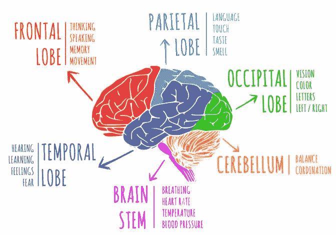
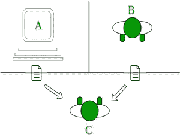

# 敢于学习人工智能。

> 原文：<https://medium.datadriveninvestor.com/dare-to-learn-artificial-intelligence-463526b51f05?source=collection_archive---------6----------------------->

Howdy People….???!!!.

技术人员和技术爱好者们，你们好，虽然已经过了一分钟，但迟到总比不到好😁😁。

正如我在以前的博客中介绍的那样，我将主修人工智能，稍后，我将把它缩小到深度学习。这将是我的主要关注领域，直到可能的启示🤔不管怎样，让我们深入研究一下。

 [## 挑战你对人工智能和社会看法的 4 本书|数据驱动的投资者

### 深度学习、像人类一样思考的机器人、人工智能、神经网络——这些技术引发了…

www.datadriveninvestor.com](https://www.datadriveninvestor.com/2019/02/28/4-books-on-ai/) 

我将在这篇博客中讨论的一些话题包括:

**1。什么是人工智能？**

**2。为什么我们需要研究人工智能？**

**3。人工智能的应用。**

**4。人工智能的分支。**

**5。图灵测试。**

# **话题一**:什么是人工智能？

人工智能是让机器像人类一样聪明地思考和行为的一种方式……基本上像正常人一样🤦‍♀️(in 过度思考者的头脑😂).

这些机器由内部的软件控制，基本上，这些软件程序控制着机器的逻辑。我们就不拐弯抹角了，简而言之，人工智能的主要概念就是让机器思考、推理、感知、行动。这与人脑的研究密切相关。研究人员认为，这可以通过模仿人类大脑在不同环境下的学习、思考和行为来实现。

# **话题二:为什么我们需要研究人工智能？**

通过人工智能，我们希望建立理解智能概念的智能系统。我们构建的这个系统对于理解像我们大脑这样的智能系统如何构建另一个智能系统非常有用。

我们研究人工智能的一个主要原因就是让很多事情自动化。在这个世界上，我们要处理难以逾越的数据量。大脑无法跟踪所有的数据，因为它一直在变化，因此我们需要开发智能机器，可以处理大量数据，并同时从多个来源摄取大量数据。

让我们看看数据是如何在不同的处理层次上转化为知识的，

Brain processing…

# **议题三:人工智能的应用。**

**计算机视觉-** 这些系统处理视觉数据，理解内容，提取基于用例的洞察。例如 Pinterest

**自然语言处理-** 我们可以通过使用自然语言语句与机器进行交互，例如在搜索引擎中

语音识别- 这个系统能够听到和理解口语。

**专家系统-** 利用人工智能技术，通过使用专家系统的数据库来提供建议或做出决策。

**游戏-** 帮助在诸如国际象棋的游戏中与人类竞争。

**机器人-** 拥有可以做不同事情的执行器和传感器。传感器可以看到不同的东西并测量它们，例如温度。

# **话题四:人工智能的分支。**

**机器学习-** 这是人工智能中最常见、交互最多的分支。它涉及一种能够从数据中学习的软件。基于学习模型，从未知数据集进行预测。因此，如果选择使用小数据集，这将限制学习模型使用有限的数据集。

**搜索-** 这种技术的工作方式是检查大量的可能性，然后选择最佳路径。

**知识表示-** 宇宙周围的事实甚至可能在 51 号行星上🌚需要以某种方式表示，以便系统能够容易地理解它们。这里多使用数理逻辑。

**规划-** 这个软件从一个特定情况的事实和一个目标的陈述开始。他们知道地球的事实，因此知道使他们能够获得最佳计划以实现目标的规则。

**启发式-** 这是一种用于解决给定问题的技术，这种技术很实用，在短期内解决问题也很有用，但不能保证是最优的。这是对应该采取什么方法来解决问题的有根据的猜测。

**基于逻辑的人工智能——**基于逻辑的人工智能中用于执行计算机程序的数学逻辑。基于逻辑的人工智能编写的程序基本上是一组以逻辑形式表达关于特定问题的事实和规则的语句。

**泛型编程-** 通过程序交配，优胜劣汰，得到解决任务的程序。它们被编码为基因，使用算法得到一个程序，能够很好地执行给定的任务。

# **议题五:人工智能中的图灵测试。**

艾伦·图灵(计算机科学家)在 1950 年开发的图灵测试。他提出“图灵测试用于确定计算机(机器)是否能像人一样智能思考”？

想象一个有三个玩家的游戏，有两个人和一台电脑，一个询问者(作为一个人)与其他两个玩家隔离。询问者的工作是通过向两个人提问，试图找出哪个是人，哪个是计算机。更糟糕的是，电脑试图让审讯者猜错。换句话说，计算机会尽可能地试图与人类区分开来。

图灵测试的“标准解释”,在这个测试中，玩家 C，也就是审讯者，被赋予了一个任务，试图确定哪个玩家——A 或 B——是计算机，哪个是人类。询问者仅限于使用对书面问题的回答来做出决定

审讯员和电脑的对话会是这样:
**C(审讯员):**你是电脑吗？
**A(电脑):**否

**C:** 一个大数乘以另一个数，158745887 * 56755647
A:停顿了很久，一个不正确的答案！

**C:** 添加 5478012、4563145
**A:** (停顿约 20 秒后给出答案)10041157

如果询问器不能区分人和计算机提供的答案，那么计算机通过测试，机器(计算机)被认为和人一样聪明。换句话说，如果一台计算机的对话不能轻易地与人类的区别开来，它就被认为是智能的。整个对话将被限制在诸如计算机键盘和屏幕之类的纯文本频道。

他还提出，到 2000 年，计算机“将能够很好地玩模仿游戏，以至于一个普通的询问者在五分钟的询问后做出正确识别(机器或人)的概率不会超过 70%。”没有一台计算机接近这个标准。

但是在 1980 年，约翰·塞尔先生提出了“中国房间论”。他认为图灵测试不能用来确定“一台机器是否被认为像人类一样聪明”。他认为任何像伊莱扎和帕里这样的机器都可以简单地通过操纵他们不理解的符号来轻松通过图灵测试。没有理解，他们就不能被描述为和人们一样意义上的“思考”。

这就是我这篇博客的全部内容，以后还会有更多。希望它是有帮助的和信息丰富的。

参考资料:G[eekforGeek.org](http://geeksforgeeks.org/turing-test-artificial-intelligence/)

《人工智能》作者 Prateek Joshi。

来自大胆编码者的疯狂爱💖。