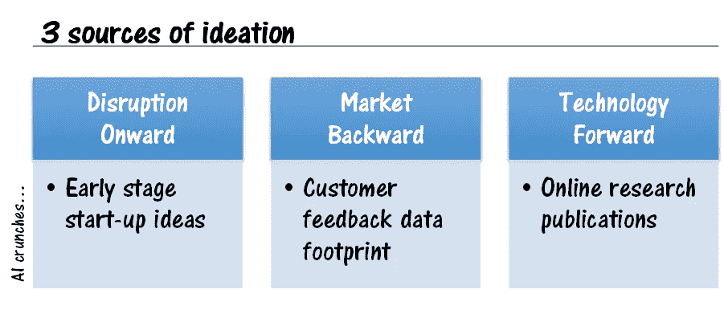
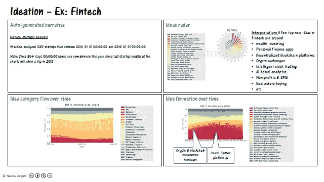
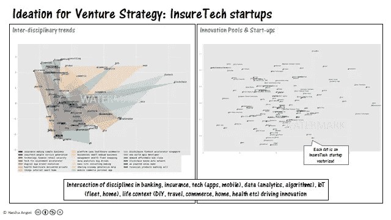
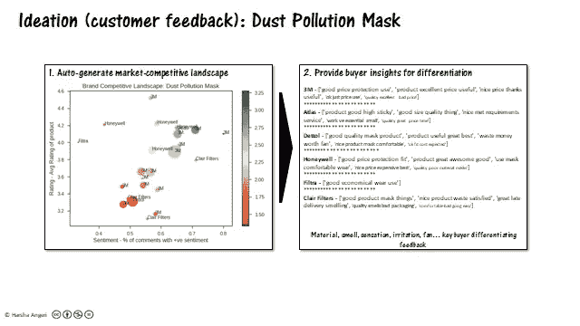
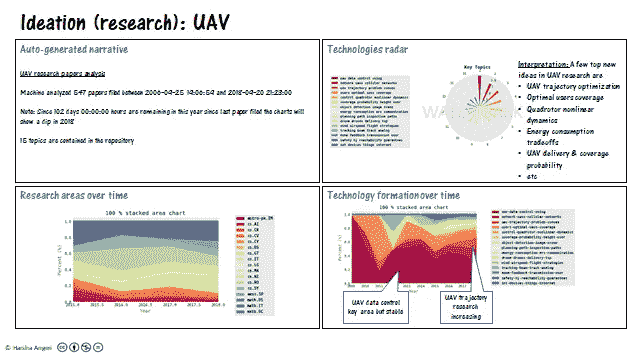
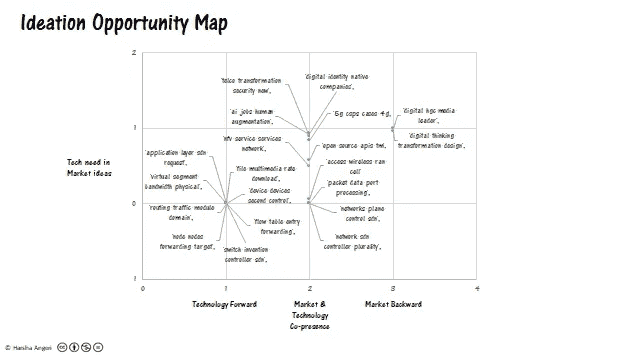

# 敢于将你的想法外包给机器

> 原文：<https://medium.datadriveninvestor.com/dare-to-outsource-your-ideation-to-a-machine-b9e8fa1edf35?source=collection_archive---------12----------------------->

忘记人类吧…机器可以给我们大量的无偏见的想法。在企业中，创意和员工的想法是骄傲和地盘之争的重要因素。谁的想法、什么过程、谁的选择和文化偏见使得新想法引导的产品开发过程成为一个低概率成功的活动。构思一直被视为企业智慧的标志。机器能否利用人工智能，接管这个堡垒？人工智能能成为新的企业智能吗？

可以，让我通过三个构思途径来说明(图 1)。想法有各种各样的形式。这个博客将专注于创新的增长理念(而不是绩效改进)。公司已经开始将构思外包给机器，下面的例子是提供给公司的实际结果。

Figure 1

传统的构思桶是市场向后的(例如:围绕问题、客户反馈等的想法)和技术向前的(例如:围绕使用新趋势技术的想法)。在一个创业驱动的世界里，公司和商业模式正在被颠覆，让我们添加另一个名为“颠覆向前”的桶。

**中断继续**

我们在这一类别下寻找的想法是可以扰乱通常与初创公司相关的业务或市场的方面。

因此，在这里我们制造了一台人工智能机器来处理全球早期创业数据，以找出人们追求的想法。你分析早期阶段，是因为他们最接近创意阶段。

下面(图 2)是 Fintech(金融科技)中创意形成的一个例子。这台机器被输入了创业公司的描述。这被转换成向量并被处理以识别趋势(这个过程在以前的博客中已经讨论过:“去杂乱的生活”([AI to De-cluster Life](https://medium.com/datadriveninvestor/ai-to-de-clutter-life-fc9c11d84776)))。个人金融应用、加密交易所、财富投资、分散的区块链平台、基于人工智能的股票交易等似乎是人们正在追随的一些大创意。人们可以深入了解这些初创公司的商业模式，这是一份让你的公司开始涉足金融科技的绝佳想法清单。

Figure 2

这里(图 3)是一家大型保险公司在规划新的风险投资策略时，在 Insuretech 中的想法。DIY(自己动手)似乎是一个与物联网支持的数据收集相结合的创意主题，并为家庭、健康、旅行、商业等各种生活环境提供定制保险。

Figure 3

左手边的多边形图表提供了关于这些不同想法如何重叠的额外见解。(详见更早的博客:“[盗梦空间:人工智能理解大趋势](https://medium.com/datadriveninvestor/inception-ai-understands-mega-trends-e3f0ce19ea1f)”)。人们也可以围绕多边形或点之间的空白空间产生想法，以播种新的创新/找到业务缺口。右边的图表在二维空间中描绘了所有的创业想法，因此人们可以深入研究有趣的商业模式等。

这在员工驱动的构思过程中是不可能的。这台机器给出了一套本质上不偏不倚的观点。此外，构思过程现在是交互式的、上下文相关的，并且可以点击查看详细信息。

人工智能机器可以“扰乱”思维过程，以找到可以“扰乱”的想法。

**市场落后**

我们在这里寻找的这类想法围绕着一个现有的市场或产品，在那里客户有反馈，而反馈可以成为创新的基础。

我们在《向前颠覆》中探索的机器思维的原则在这里仍然适用——向量、无偏、互动、上下文相关&细节可点击。数据的来源当然变化了。

客户反馈的一个重要来源是社交媒体和电子商务网站。单一产品的客户反馈可以被整理，围绕反馈的想法可以很容易地产生。(在更早的博客中提到:“[人工智能可以在在线市场](https://medium.com/datadriveninvestor/ai-can-de-clutter-crowd-wisdom-in-online-marketplaces-329e251ed3de)中整理出群体智慧”。

我们在这里举例说明了一种获得关于市场(有多种竞争产品)的想法的方法。让我们举一个简单的例子，比如灰尘污染口罩，污染城市的人们用它来防止空气污染。我们如何围绕这个市场而不是单一产品产生创意？这是人工智能真正变得聪明的地方。每个电子商务引擎都有一个人工智能支持的推荐引擎。机器的算法使电子商务推荐算法递归推荐。你突然有了 24 个灰尘污染口罩的景观(图 4 ),涵盖 6 个品牌，共有 5000 名客户提供反馈。Viola，竞争格局是自动生成的。让我们整理一下，你可以看到每个品牌的表现如何，以及哪些产品特性与众不同。这是构思的核心输入。

Figure 4

作为一个戴在脸上的粉尘污染口罩，所用的材料是关键，因为它可以闻到积累的灰尘。面膜留在皮肤上的感觉是一个重要的主题。任何形式的刺激都必须消除，上面的景观将指向对此有正面评价的竞争对手产品。一个清晰的想法出现了，并提供了一个例子，什么是基于客户反馈的低刺激性产品的基准。

**技术进步**

我们寻找一类基于即将到来并正在研究的技术的想法。概念的特征是相同的，但来源不同。在这个插图中(图 5)，机器处理围绕无人驾驶飞行器(UAV)的研究出版物。

Figure 5

如果你不知道无人机可以用于食品和电子商务送货，这台机器只是给了你这个想法。该机器还提供了优化无人机飞行轨迹的想法，管理轨迹和蜂窝连接之间的能量平衡等。

即使你是一个像电子商务这样的领域的新手，不像人类那样大量投资于无人机，它也不会看不起你的无知，而是以一种不偏不倚的方式告诉你无人机送货是未来……ideate。

经常被重复的人类习语的“想法多如牛毛”…有一打的界限… AI 只是做了 1000 个，如果不是几百万个的话。但是你可以用不同的方式与这些想法互动和联系。价值不一样。

让我给你留下一些关于这种构思方法的价值的令人费解的东西。假设市场想法向量空间是 M，技术想法向量空间是 T，数学上是什么(M 减 T)？

下图(图 6)是“*市场(M)减去技术(T)* ”交付给一家大型咨询巨头的“软件定义的网络”(电信行业的趋势投资空间)的机会图。机会图在世界正在谈论的背景下描绘想法…商业案例的第一步。

Figure 6

上面的机会描绘了针对各种创新的市场传言/反馈的想法。示例:

1.  产品构建——随着大量市场想法的涌现，研究中的技术想法也是如此……使用产品联系。
2.  解决方案——数字化转型需要技术干预，这是一个值得追求的理念。

员工的想法不能直接自动生成机会图…机器可以以令人难以置信的速度。您可以更改来源、镜头和阈值，以快速生成多个机会图，从而高效地做出决策。一个想法比一毛钱多得多。

注意:有兴趣在其组织/产品中利用上述知识产权的公司可以通过 [Linkedin](https://www.linkedin.com/in/harshaangeri/) 联系