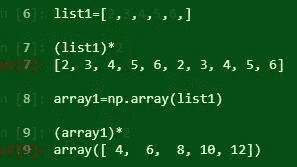

# 使用 Python 进行数据分析——第 1 部分

> 原文：<https://medium.datadriveninvestor.com/data-analysis-with-python-part-1-a794e08e96bf?source=collection_archive---------3----------------------->

[](http://www.track.datadriveninvestor.com/1B9E)

**数据分析/数据分析**是系统地应用统计和/或逻辑技术来描述和说明、浓缩和概括以及评估数据的过程。它包括检查、清理、 [t](https://en.wikipedia.org/wiki/Data_transformation) 转换和建模数据，目标是发现有用的信息、提供结论和支持决策。

注意-我们使用的是 python3.6 版的 jupyter 笔记本

## 数据分析方法

1.  **)数据挖掘:**数据挖掘是一种利用统计学、人工智能、机器学习和数据库的方法，在大型数据集中发现模式的数据分析方法。目标是将原始数据转换成可理解的业务信息。例如分类、聚类
2.  **)文本分析:**又称文本挖掘。它是从文本中获取有用信息的过程。它是通过处理非结构化的文本信息，从信息中提取有意义的数字索引，并使信息可用于统计和机器学习算法进行进一步处理来实现的。例如 Web 报废、自然语言处理、模式识别(识别电子邮件地址)
3.  **)商业智能:**它将数据转化为可操作的商业情报，可用于组织的战略和战术商业决策。它为人们提供了一种从收集的数据中检查趋势并从中获得洞察力的方式。例如产品定价、确定新市场
4.  **)数据可视化:**它非常简单地指数据的可视化表示。它使复杂的数据更容易理解和使用

## 数据分析的类型

1.  **)描述性分析**或业务中发生的事情 **:** “描述事物”。它是对事件生成的数据或内容的检查，通常手动执行，以回答“发生了什么？”。(案例研究、观察、调查)如谷歌分析
2.  **)诊断分析**或业务中为什么会发生 **:** 检查数据或内容，以回答“为什么会发生？”，其特点是采用了下钻、数据发现、数据挖掘和关联等技术。例如印度诺基亚陷落的根本原因分析
3.  **)预测分析**或可能发生的事情 **:** 它使用描述性和诊断性分析的发现，通过回归分析、预测、多元统计、模式匹配、预测建模和预测等技术来发现趋势和预测未来趋势。例如流失率预测
4.  **)规定性分析**或需要采取什么行动 **:** 规定性模型利用对已经发生的事情、为什么会发生以及各种“可能会发生什么”的分析来帮助用户确定要采取的最佳行动。它的特点是技术，如图形分析，模拟，复杂事件处理，神经网络，推荐引擎，机器学习。例如客户流失管理
5.  **)探索性数据分析(EDA):** 它是一种分析数据集以总结其主要特征的方法。
6.  **)验证性数据分析(CDA):** 它侧重于证实或证伪已有的假设。(即解决当前理论的真假问题)

# 数字基础

NumPy 是 Numerical Python 的缩写，是 Python 中最重要的数值计算包之一。

**为什么是 Numpy？**面向数组的计算——多维数组(ndarray ),内置数学函数、线性代数、随机数生成和傅立叶变换功能，C API 连接到以低级语言编写的库，可实现快速矢量化操作。NumPy 在内部将数据存储在一个连续的内存块中，独立于其他内置的 Python 对象。基于 Numpy 的算法比纯 python 算法快 10 到 100 倍。

> pip 安装数量
> 
> 将 numpy 作为 np 导入

1.  **Numpy vs list**:我们不能在 list 上做矩阵运算，但是我们可以用 Numpy 数组做同样的事情。我们可以使用 *array* 函数创建 numpy 数组。



2.**查找数组的大小和形状:**数组中的所有元素

```
array1=np.array([(2,3,4,5),(1,0,3,6)])
print(array1)
Output:array([[2, 3, 4, 5],[1, 0, 3, 6]])
print(array1.size)
output:8
print(array1.shape)
output:(2,4)
```

3.**重塑 numpy 数组:**将数组的维数从(2，4)改为(4，2)

```
array1=np.array([(2,3,4,5),(1,0,3,6)])
print(array1.reshape(4,2))
output:[[2 3]
 [4 5]
 [1 0]
 [3 6]]
```

**4。数据类型和改变数据类型:**我们可以使用 astype 函数直接改变数据类型

```
print(array1.dtype)
output: int32
##change datatype
float_array1=array1.astype(np.float64)
print(float_array1)
print(float_array1.dtype)
output:
[[2\. 3\. 4\. 5.]  [1\. 0\. 3\. 6.]] 
float64
```

**5。索引和切片:**索引和切片与一维数组的列表相同，但与二维数组不同。我们也可以改变二维数组的元素。 *array1[1，3]* 此处 **1** 表示索引 1 处的行，即第 2 行，而 **3** 表示索引 3 处的列，即第 4 列。作为一个整体，在第 2 行第 4 列，即 6

```
## 2-D array,  array1=[[2, 3, 4, 5],[1, 0, 3, 6]]
print(array1[1])
print(array1[1,3])
output:
[1 0 3 6]
6
##slicing in 2-d array
print(array1[:2,3:])
print(array1[:2,3])
output:
[[5]  [6]] 
[5 6]
```

**6。转置和点积:**转置和点积可以分别通过“T”和“Dot”函数来完成。对于点积(5，2)*(2，5)，各个数组的列数和行数应该相同

```
array3=np.arange(10).reshape(5,2)   ##5*2=10,5*2 matrix/array
print(array3)
output:[[0 1]  [2 3]  [4 5]  [6 7]  [8 9]]
print(array3.T)
## becomes 2*5 matrix/array
output:[[0 2 4 6 8]  [1 3 5 7 9]]
##dot product
print(np.dot(array3.T,array3))
output:[[120 140]  [140 165]]
```

**7。通用函数:** ndarray 函数 **(** Max，min，mean，sum，标准差(std)，方差(var))，numpy 函数(sqrt，exp，arange，random.randn，square，log)。ndarray 是 np.array

```
## Universal functions ; array2=[  0   1   2   3   4 100   6   7   8   9]
print(array2.sum())
print(array2.max())
print(array2.std())
print(array2.var())
print(np.median(array2))
print(np.sqrt(array2))
output:
140
100 
28.809720581775867 
830.0 
5.0 
[ 0\.          1\.          1.41421356  1.73205081  2\.         10\.   2.44948974  2.64575131  2.82842712  3\.        ]
```

**8。数组运算的条件逻辑:**使用“where”函数。“np.where(array4 > 0，2，-2)”表示列出数组 4 中所有大于 0 的元素→将所有这些元素改为 2 →否则改为-2(即如果 array4 < 0)

```
array4=np.random.randn(2,3)
print(array4)
output:
[[-0.83085561 -0.03896189 -0.57987359]
 [ 0.94076244  1.10094197 -0.82547172]]
print(array4>0)
print(np.where(array4 > 0, 2, -2))
output:
[[False False False]
 [ True  True False]]
[[-2 -2 -2]
 [ 2  2 -2]]
```

**9。行列运算:**“axis = 0”对数组内的每个 y 轴进行运算。“axis = 1”对数组中的每个 x 轴执行操作。“axis = None”对数组中的所有值执行操作，这是默认设置

```
print(array3)
print(array3.sum(axis=0))
print(array3.sum(axis=1))
print(array3.sum(axis=None))
output:
[[0 1]
 [2 3]
 [4 5]
 [6 7]
 [8 9]]
[20 25]
[ 1  5  9 13 17]
45
```

**10。连接数组:**我们连接了两个 2*4 的矩阵，结果是 4*4 的矩阵

```
array5=np.random.randn(2,4)
print(np.concatenate((array1, array5)))
output:
[[ 2\.          3\.          4\.          5\.        ]  [ 1\.          0\.          3\.          6\.        ]  [-0.91873449 -0.72439693  1.43363451  0.90857255]  [ 0.16981512  0.87093606 -1.6853128  -1.03449049]]
```

11。排序，唯一，集合:按行和列排序。第一排 desc 第二排 asc

```
array5.sort(1)
print(array5)
output:
[[-1.6853128  -1.03449049 -0.91873449 -0.72439693]  [ 0.16981512  0.87093606  0.90857255  1.43363451]]
names = np.array(['Chandu','Bob', 'Joe', 'Will', 'Bob', 'Will', 'Joe', 'Joe'])
print(np.unique(names))
print(sorted(set(names)))
output:
['Bob' 'Chandu' 'Joe' 'Will'] 
['Bob', 'Chandu', 'Joe', 'Will']
```

12.**单位矩阵:**

```
print(np.identity(2))
print(np.eye(2,4,k=2))
output:
[[1\. 0.]  [0\. 1.]]
[[0\. 0\. 1\. 0.]  [0\. 0\. 0\. 1.]]
```

在接下来的章节中，我们将关注熊猫和执行数据分析的步骤。

***Numpy 教程 Github 链接:***

[](https://github.com/ashukrishna100/Python_Data_Analysis/blob/master/numpy_tutorial.py) [## ashukrishna 100/Python _ Data _ Analysis

### 使用 python 进行数据分析的存储库。通过创建……为 ashukrishna 100/Python _ Data _ Analysis 开发做出贡献

github.com](https://github.com/ashukrishna100/Python_Data_Analysis/blob/master/numpy_tutorial.py) 

**第二部分:**

[](https://medium.com/@ashumountain/data-analysis-with-python-part-2-a8879c8f3b4f) [## 使用 Python 进行数据分析——第 2 部分

### 熊猫基础知识

medium.com](https://medium.com/@ashumountain/data-analysis-with-python-part-2-a8879c8f3b4f) 

**第三部分:手动操作**

> [https://medium . com/@ ashumountain/data-analysis-with-python-part-3-4c 13 aab 3267 c](https://medium.com/@ashumountain/data-analysis-with-python-part-3-4c13aab3267c)