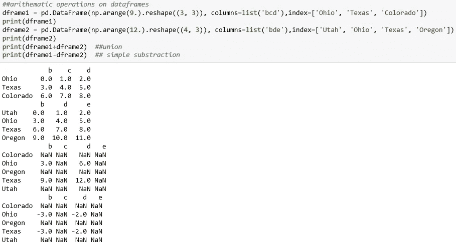
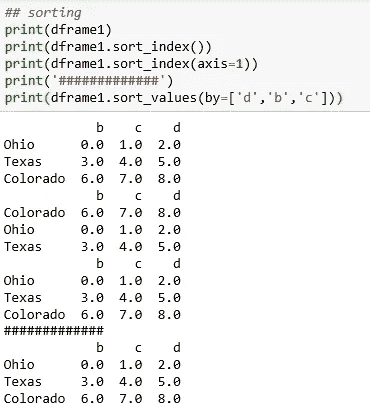
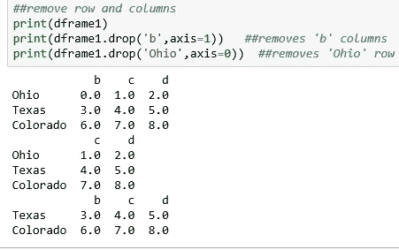
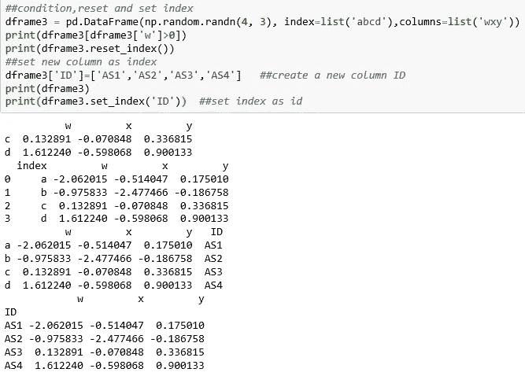
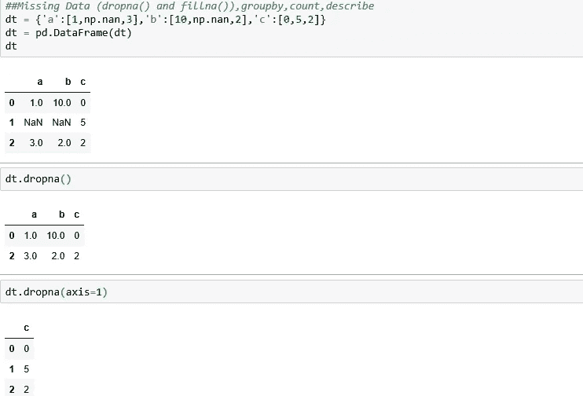
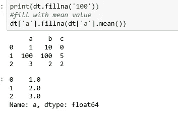
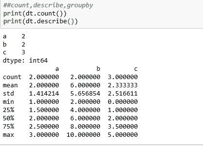
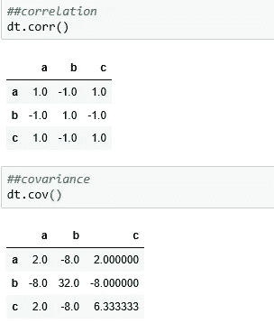

# 使用 Python 进行数据分析——第 2 部分

> 原文：<https://medium.datadriveninvestor.com/data-analysis-with-python-part-2-a8879c8f3b4f?source=collection_archive---------9----------------------->

[](http://www.track.datadriveninvestor.com/1B9E)

# 熊猫基础知识

Pandas 包含数据结构和数据操作工具，旨在使 Python 中的数据清理和分析变得快速而简单。Pandas 有两个主要的数据结构*系列*和*数据帧。*

> pip 安装熊猫
> 
> 进口熊猫作为 pd
> 
> 来自熊猫进口系列，数据框架

## **1。系列:**

Series 是一个类似一维数组的对象，包含一系列值(与 NumPy 类型类似)和一个相关的数据标签数组，称为其索引。最简单的序列仅由一组数据组成。下面的索引类似于列表的索引。

```
obj = pd.Series([4, 7, -5, 3])
print(obj)
output:
0    4 
1    7 
2   -5 
3    3 
dtype: int64
```

**获取熊猫系列的值和索引:**我们可以分别通过它的值和索引属性来获取系列的数组表示和索引对象:同样，我们也可以像在 list 中一样直接访问它的值。

```
print(obj.values)
print(obj.index)
print(obj[2])
output:
[ 4  7 -5  3] 
RangeIndex(start=0, stop=4, step=1)
-5
```

**在序列中分配自定义索引:**我们可以创建一个序列，其索引用一个标签来标识每个数据点。任何数学运算(如 np.sqrt)都将改变序列的值，而不是索引。

```
obj2 = pd.Series([4, 7, -5, 3], index=['d', 'b', 'a', 'c'])
print(obj)
print(obj2['a'])
output:
d    4 
b    7 
a   -5 
c    3 
dtype: int64
-5
```

**过滤和数学运算:**

```
print(obj2[obj2<0])
print(obj2**2)
output:
a   -5 
dtype: int64 
d    16 
b    49 
a    25 
c     9 
dtype: int64
```

**从字典制作系列:**

```
data1 = {'Ohio': 35000, 'Texas': 71000, 'Oregon': 16000, 'Utah': 5000}
obj3 = pd.Series(data1)
print(obj3)
'Ohio' in obj3output:Ohio      35000
Texas     71000
Oregon    16000
Utah       5000
dtype: int64
True
```

**为空且不为空:**

```
pd.notnull(obj3)
output:
Ohio      True 
Texas     True 
Oregon    True 
Utah      True 
dtype: bool
```

**覆盖索引:**

```
state=['California', 'Ohio', 'Oregon', 'Texas']
obj4 = pd.Series(data1, index=state)
print(obj4)
output:
California        NaN 
Ohio          35000.0 
Oregon        16000.0 
Texas         71000.0 
dtype: float64
```

合并系列:两个系列合并，索引按字母升序排列。

```
print(obj3+obj4)
output:
California         NaN
Ohio           70000.0
Oregon         32000.0
Texas         142000.0
Utah               NaN
dtype: float64
```

**命名系列和索引:**

```
obj4.name = 'population'
obj4.index.name = 'state'
print(obj4)
output:state
California        NaN
Ohio          35000.0
Oregon        16000.0
Texas         71000.0
Name: population, dtype: float64
```

## 2.数据帧

DataFrame 代表一个矩形数据表，包含一个有序的列集合，每个列可以是不同的值类型(数字、字符串、布尔等)。).DataFrame 既有行索引又有列索引；它可以被认为是一系列共享相同索引的字典。在底层，数据存储为一个或多个二维块，而不是列表、字典或其他一维数组的集合。

字典中的数据框架:这是制作数据框架最基本的形式

```
data = {'state': ['Ohio', 'Ohio', 'Ohio', 'Nevada', 'Nevada', 'Nevada'],
        'year': [2000, 2001, 2002, 2001, 2002, 2003],
        'pop': [1.5, 1.7, 3.6, 2.4, 2.9, 3.2]}
df1 = pd.DataFrame(data)
print(df1)
output:state  year  pop
0    Ohio  2000  1.5
1    Ohio  2001  1.7
2    Ohio  2002  3.6
3  Nevada  2001  2.4
4  Nevada  2002  2.9
5  Nevada  2003  3.2
```

**头尾法:**

```
print(df1.head(2))
print(df1.tail(2))
output: state  year  pop
0  Ohio  2000  1.5
1  Ohio  2001  1.7 state  year  pop
4  Nevada  2002  2.9
5  Nevada  2003  3.2
```

**从数据中选择特定的列:**

```
df2=pd.DataFrame(data, columns=['year','pop'])
print(df2)
output: year  pop
0  2000  1.5
1  2001  1.7
2  2002  3.6
3  2001  2.4
4  2002  2.9
5  2003  3.2
```

**DataFrame 函数:**‘loc’和‘iloc’用于行。(df2.iloc[0])

```
print(df2.columns)
print(df2['year'])
#print(df2.year)
print("#######") ##to selct rows
print(df2.loc[2])
output:Index(['year', 'pop'], dtype='object') 0    2000 
1    2001 
2    2002 
3    2001 
4    2002 
5    2003 
Name: year, dtype: int64 
####### 
year    2002.0 
pop        3.6 
Name: 2, dtype: float64
```

**删除列并获取值:**

```
del df2['pop']
print(df2.columns)
df1.values
output:Index(['year'], dtype='object') 
[['Ohio' 2000 1.5]  
['Ohio' 2001 1.7]  
['Ohio' 2002 3.6]  
['Nevada' 2001 2.4]  
['Nevada' 2002 2.9]  
['Nevada' 2003 3.2]]
```

# 总之:数据科学家的熊猫

1.  **重新索引:**

```
ser1 = pd.Series([4.5, 7.2, -5.3, 3.6], index=['d', 'b', 'a', 'c'])
ser_new = ser1.reindex(['a', 'b', 'c', 'd', 'e'])
print(ser_new)
output:a   -5.3
b    7.2
c    3.6
d    4.5
e    NaN
dtype: float64
```

**2。数据帧上的算术运算:**

```
dframe1 = pd.DataFrame(np.arange(9.).reshape((3, 3)), columns=list('bcd'),index=['Ohio', 'Texas', 'Colorado'])
print(dframe1)
dframe2 = pd.DataFrame(np.arange(12.).reshape((4, 3)), columns=list('bde'),index=['Utah', 'Ohio', 'Texas', 'Oregon'])
print(dframe2)
print(dframe1+dframe2)  ##union
print(dframe1-dframe2)  ## simple substraction
```



**3。在数据帧上应用用户定义的功能**

```
f = lambda x: x.max() - x.min()
print(dframe1.apply(f))
print('######################')
print(dframe1.apply(f,axis='columns'))
output:b    6.0
c    6.0 
d    6.0 
dtype: float64 
###################### 
Ohio        2.0 
Texas       2.0 
Colorado    2.0 
dtype: float64
```

**4。分类**



**5。删除行和列:**轴=0 表示行，轴=1 表示列



**6。设置和重置索引:**



**7。缺失数据(dropna()和 fillna())，groupby，count，describe:** axis=0 表示删除 NaN/Null 的行，axis=1 表示删除 NaN/Null 的列



**8。读/写 CSV/HTML/Excel:**

```
df=pd.read_csv('example.csv')
df=pd.read_excel('excel_output.xlsx',sheet_name='sheet1')
df=pd.read_html('https://medium.com')##writing
df.to_csv('new_df',index=False)
df.to_excel('output.xlsx',sheet_name='sheet1')
```

**9。相关性和协方差:**正协方差/相关性是指手头的两个变量正相关，它们同向运动。负的协方差/相关性意味着变量是反向相关的，或者它们以相反的方向运动。



我们将在下一节继续数据分析步骤。

**Github 回购:**

> [https://github . com/ashukrishna 100/Python _ Data _ Analysis/blob/master/pandas _ tutorial . py](https://github.com/ashukrishna100/Python_Data_Analysis/blob/master/pandas_tutorial.py)

**第一部分:**

> [https://medium . com/@ ashumountain/data-analysis-with-python-part-1-a 794 e 08 e 96 BF](https://medium.com/@ashumountain/data-analysis-with-python-part-1-a794e08e96bf)

**第三部分:手动操作**

> [https://medium . com/@ ashumountain/data-analysis-with-python-part-3-4c 13 aab 3267 c](https://medium.com/@ashumountain/data-analysis-with-python-part-3-4c13aab3267c)