# 使用 Python 进行数据分析——第 3 部分

> 原文：<https://medium.datadriveninvestor.com/data-analysis-with-python-part-3-4c13aab3267c?source=collection_archive---------5----------------------->

[](http://www.track.datadriveninvestor.com/1B9E)

# **(HANDSON)**

我们正在研究贷款预测问题。有一些商业因素(*如收入、财产、信用记录等*)会影响申请人能否获得贷款。数据可在以下网址找到:

> [https://github . com/ashukrishna 100/Python _ Data _ Analysis/blob/master/train _ loan prediction . CSV](https://github.com/ashukrishna100/Python_Data_Analysis/blob/master/train_loanPrediction.csv)

## 数据准备(加载、清理、转换、重新排列)

1.  **读取数据**

```
df = pd.read_csv('train_loanPrediction.csv')
```

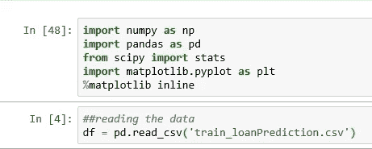

**2。快速数据探索**

所以总行数=614(在 Loan_ID，Education，ApplicantIncome，CoapplicantIncome，Property_Area，Loan_Status 中)。我们在(性别、已婚、家属、自雇、贷款金额、贷款金额期限、信用历史)中缺少值

```
df.head(5)
df.decsribe()
df.count(axis=0)
```

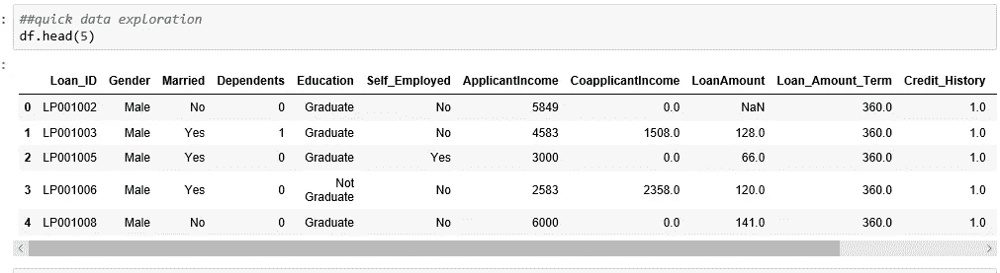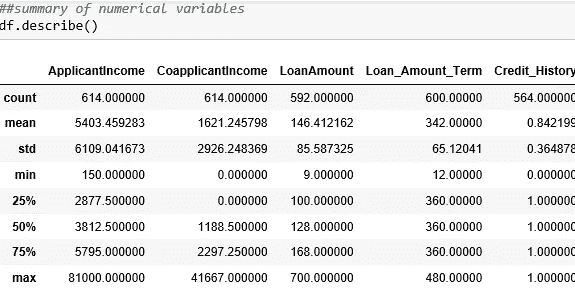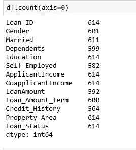

**3。分布分析**

箱线图，直方图

“ [bin](https://en.wikipedia.org/wiki/Data_binning) ”(或“ [bucket](https://en.wikipedia.org/wiki/Data_binning) ”)值的范围，即将整个范围的值分成一系列区间，然后计算每个区间内有多少个值

```
df['ApplicantIncome'].hist(bins=50)
df.boxplot(column='ApplicantIncome', by = 'Gender')
df.plot.box(grid='True')t1 = pd.crosstab(df['Education'],df['Loan_Status'])
t1.plot(kind='bar', stacked='True', color=['red','blue'], grid=False)
```

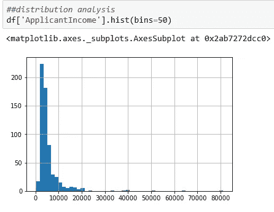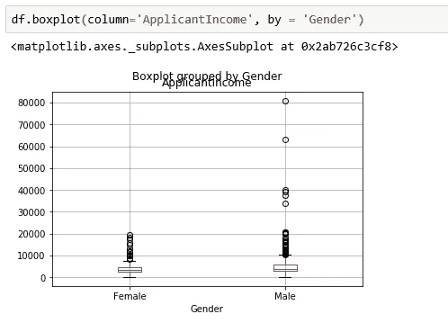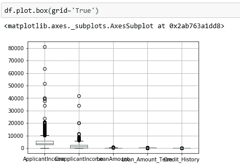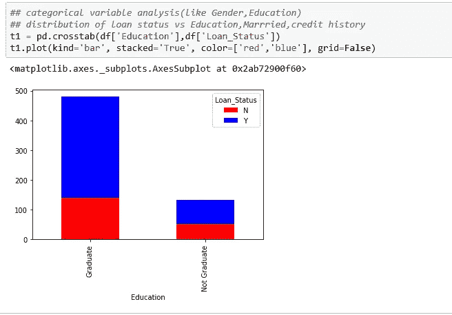

**4。数据准备-处理缺失数据**

计算每列中缺失的数据

```
df.apply(lambda x: sum(x.isnull()),axis=0)
OR
df.isnull().sum(axis=0)
```

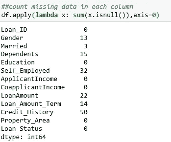

填写缺失的数据

```
df['LoanAmount'].fillna(df['LoanAmount'].mean(),inplace= True)
```

#检查缺失的数据是否已被填充

```
print(df[‘LoanAmount’].count())
```

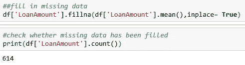

**5。数据争论-合并、分组、连接**

```
df.groupby('ApplicantIncome').mean()[:5]
df.groupby('Married').get_group('Yes')
```

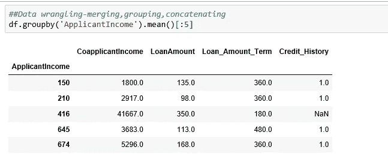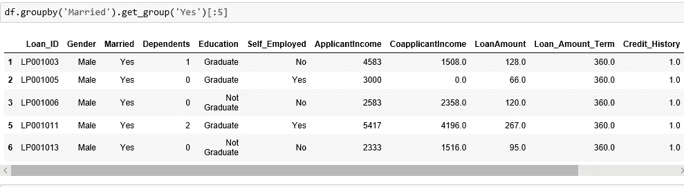

## **统计分析**

1.  **计算申请人收入的平均值、中值和众数**

```
print("mean is: ",df['ApplicantIncome'].mean())
print("median is: ",df['ApplicantIncome'].median())
print("mode is: ",df['ApplicantIncome'].mode())
```

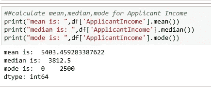

**2。计算申请人收入的标准差、偏斜度和方差**

```
print("standard deviation is: ",df['ApplicantIncome'].std())
print("variance is: ",df['ApplicantIncome'].var())
print("skewness is: ",df['ApplicantIncome'].skew())
```

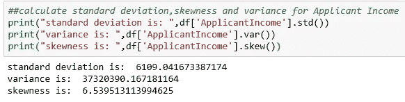

**3。p 值**

对于 p 值<0.05 we reject the null hypothesis that there’s no difference between the means and conclude that a significant difference does exist.

```
##using scipy
stats.ttest_ind(df['ApplicantIncome'],df['CoapplicantIncome'])
```

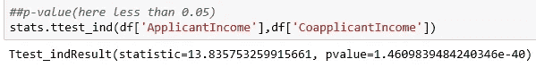

**4。相关性**

相关系数衡量两个变量之间线性关系的强度和方向。正的协方差/相关性意味着手头的两个变量正相关，并且它们向同一方向移动。负的协方差/相关性意味着变量是反向相关的，或者它们以相反的方向运动。范围(-1 到 1)

*   -1 表示完美的下坡负线性关系，0.30 表示弱的下坡(负)线性关系
*   0 表示没有线性关系
*   +1 表示完美的上坡正线性关系等等

```
df.corr()
```

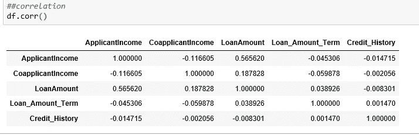

**5。卡方检验**

卡方统计检验用于确定预期分布和实际分布之间是否存在显著差异。它通常用于教育程度、肤色或性别等分类数据。

它返回卡方统计值、p 值和自由度以及列联表。

```
print(stats.chisquare(df['Education'].value_counts()))
print(stats.chisquare(df['Loan_Status'].value_counts()))cont = pd.crosstab(df['Education'],df['Loan_Status'])
stats.chi2_contingency(cont)
```

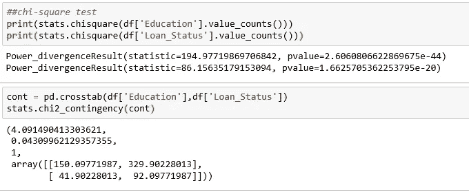

**6。线性回归**

```
from sklearn.linear_model import LinearRegressionX = np.array(df['ApplicantIncome']).reshape(-1,1)
Y = np.array(df['CoapplicantIncome']).reshape(-1,1)
linear_regressor=LinearRegression()
linear_regressor.fit(X,Y)
Y_pred = linear_regressor.predict(X)
print(Y_pred[:5])plt.scatter(X,Y)
plt.plot(X,Y_pred,color='red')
plt.show()
```

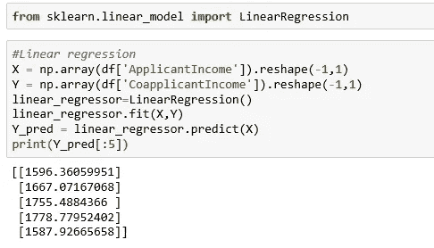

**Github 回购:**

> [https://github . com/ashukrishna 100/Python _ Data _ Analysis/blob/master/handson . py](https://github.com/ashukrishna100/Python_Data_Analysis/blob/master/Handson.py)

**第二部分**

> [https://medium . com/@ ashumountain/data-analysis-with-python-part-2-a 8879 c 8 F3 b4f](https://medium.com/@ashumountain/data-analysis-with-python-part-2-a8879c8f3b4f)

**第一部分**

> [https://medium . com/@ ashumountain/data-analysis-with-python-part-1-a 794 e 08 e 96 BF](https://medium.com/@ashumountain/data-analysis-with-python-part-1-a794e08e96bf)