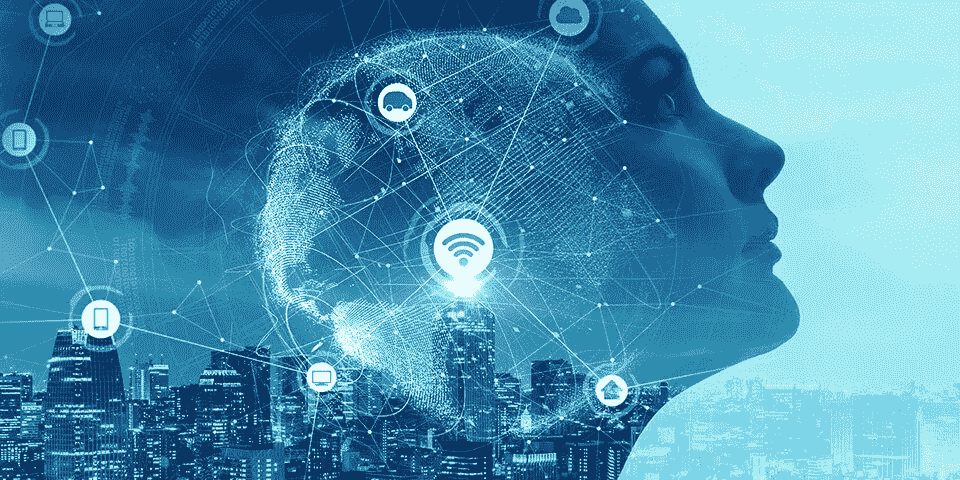
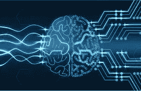
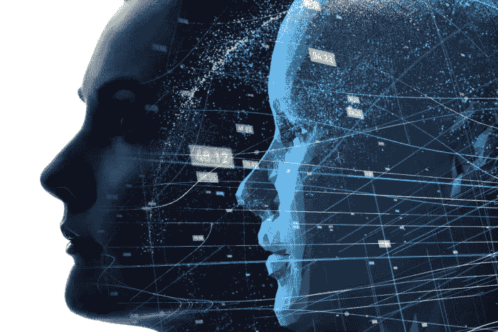
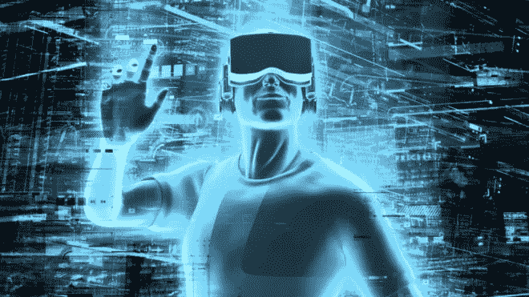
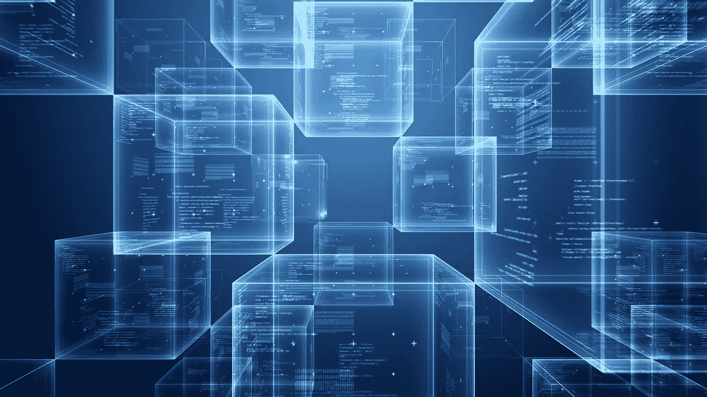

# 2019 年数据分析和人工智能趋势

> 原文：<https://medium.datadriveninvestor.com/data-analytics-artificial-intelligence-trends-in-2019-1032c44d9ce8?source=collection_archive---------1----------------------->

Artificial Intelligence Will Drive Nearly $2 Trillion Worth of Business Value Worldwide in 2019 Alone

数据分析和人工智能使用数据科学和先进的计算算法来自动化、优化和发现人眼永远看不到的价值。据估计，仅在 2019 年，人工智能就将在全球范围内推动价值近 2 万亿美元的商业价值。

根据国际数据公司的[研究，组织正在寻求利用数据分析和人工智能带来的巨大商业价值，在 2022 年每年投资超过 2600 亿美元用于大数据和商业分析解决方案。](https://www.idc.com/getdoc.jsp?containerId=prUS44215218)

 [## 今年值得关注的人工智能趋势——数据驱动的投资者

### 预计 2019 年人工智能将取得广泛的重大进展。从谷歌搜索到处理复杂的工作，如…

www.datadriveninvestor.com](https://www.datadriveninvestor.com/2019/02/19/artificial-intelligence-trends-to-watch-this-year/) 

那些不采用人工智能的人将无法有效竞争，因为人工智能将严重扰乱全球每个行业——到 2030 年，每个行业都将在某种程度上被人工智能技术扰乱。进步思维组织不能忽视人工智能和分析的新兴趋势。这篇文章简要介绍了将在 2019 年推动发展的几个重要趋势。

**人工智能和数据分析**

AI & Data Analytics Will Revolutionise Our World as We Know It

数据分析和商业智能已经需要对信息技术、数学和统计学的高度掌握。人工智能和机器学习算法有能力自动化和优化分析流程，这反过来又创造了变革性的商业洞察力。

融合人工智能和分析的复杂性需要一套计划来指导过渡，大多数公司尚未制定这些路线图，但公司正在竞争成为第一个创建这些路线图的公司，并采用人工智能技术来确保他们在行业中的竞争优势。

大多数采用人工智能和数据分析的人都将其用于客户互动。将人工智能算法应用于来自聊天机器人、电子商务平台和其他来源的分析见解，可以提升客户体验。这些客户分析计划可以为在整个业务中使用人工智能和分析奠定基础。

**智能应用和决策自动化推动成本节约**

The Future Is Smart Applications and Decision Automation

相当多的企业将高级应用程序用于企业资源规划(ERP)、客户关系管理(CRM)和其他关键任务功能。这些平台的未来更新将导致 2019 年人工智能和机器学习能力的增加，围绕决策自动化的原则构建。专家预测，通过机器人流程操作或 RPA，决策自动化将快速增长。借助 RPA，无需人工干预即可根据需要对业务流程实施更改。

根据行业专家的说法，机器人加工操作现在可以节省大约 2%的成本，但在一到两年内将会节省大约 20%。此外，系统集成商可以将人工智能与 API 和其他连接技术结合起来，以帮助这些平台进行协作。因此，人工智能、分析、ERP 和 CRM 可以协同工作，预测市场需求，解开物流僵局，推动可衡量的商业价值，实现卓越运营。

**数字双胞胎和 IOT 优化复杂环境**

Digital Twins Will Help Simplify and Optimise Complex IoT Environments

人工智能和数据分析对数字双胞胎的发展具有战略意义——数字双胞胎是产品、流程或服务的精确数字复制品。这作为真实世界的一面镜子，提供了一种模拟、预测、预报、服务和自愈的手段。因此，它为企业和改善人们的生活带来了巨大的机遇。

数字双胞胎并不是真正的新技术。几年来，天气预报已经获得了通过传感器和设备测量的实时条件，以数字形式模拟和可视化地表示这些条件，以进行长期气候预测和短期预测。

数字孪生概念将传感器的互联世界融合在一起。这些传感器记录硬件和软件的活动，并通过物联网(IoT)技术将其联网。

因此，汽车制造商可以部署一个物联网传感器结构，向人工智能增强的分析平台提供生产数据流。该平台生成一个数字双胞胎，对来自所有物联网传感器的数据流进行建模。使用这种方法，数字双胞胎允许人类与物联网传感器进行交互，以自动化资产管理。

2019 年数字双胞胎的采用增加意味着更多的公司将产生预测性的见解，使他们能够预测问题并在故障导致成本螺旋上升之前解决问题。通过数字双胞胎和物联网实现的预测性维护将提高安全性和可靠性，并降低运营成本。

**边缘计算和实时智能**

The Future Is No Longer Cloud Only — Edge Computing Will Connect the World and Revolutionize Intelligence on a Global Scale

随着数字双胞胎在 2019 年实现生产环境的实时建模，偏远地区的组织将需要高性能的处理器。

物联网(IoT)完全由数据驱动。大量数据的收集、发送和处理使公司能够更明智、更迅速地采取行动，并做出更明智的决策。但是，当如此大量的数据被发送到传统的云网络时，往往会遇到延迟(数据传输之前的延迟)。

边缘计算正在围绕将更多数据处理移至更靠近物联网传感器本身的需求发展，以减少延迟并提高效率。

例如，一个矿井操作员可以使用一个数字双胞胎来检测地球地层的运动，并避免矿工洞穴壁的灾难性坍塌。但是，如果煤矿的 IT 操作依赖于数百英里以外的远程服务器，一个小的数据延迟就可能导致重大灾难。这个问题可以通过部署边缘计算来轻松解决，即在更接近最终用户的地方部署强大的数据中心技术。

通过边缘计算，矿主可以在他们的位置附近实时收集数据。应用高级分析和人工智能算法意味着他们可以创建有助于防止故障的预测，从而节省资金并提高安全性。

**增强、虚拟和混合现实**

Our Lives Will Be Enriched and Aided by AI Technology Innovation Which We Will Consume Through Incredibly Immersive Digital Experiences Using AR and VR Technology

虚拟现实指的是在模拟环境中发生的交互式计算机生成的三维体验。它主要利用音频和视频反馈，但也可以结合其他类型的反馈。

相比之下，增强现实将关键数据和多媒体导入移动应用程序，以丰富用户体验，无论是在城市中游览还是购买节日礼物。

混合现实结合了虚拟现实和增强现实技术的元素。例如，它允许建筑师向他/她的客户展示新家的设计——不需要物理建模。

所有这些技术都为分析和人工智能提供了海量数据。增强现实、虚拟现实和混合现实的兴起正在导致使用自然语言处理和机器学习的增强分析。

**区块链将提高安全性并创建关注隐私的数据市场**

Blockchain Will Enable Secure and Privacy-Aware Data Ecosystems, Taking Back Control of Data from Data Brokers and Empowering Everyone with Ownership and Control of Their Personal Data

区块链是一个非常安全和透明的平台，其数据不能被修改或破坏。因此，可以肯定地说，区块链将是 2019 年最受关注的技术之一。

区块链的工作原理是共享的数字账本，黑客在功能上不可能侵入，这使其对保护敏感数据的组织具有吸引力。最重要的挑战是，区块链的账本需要复杂的交互和流程，既耗时又费力。

这些因素为部署人工智能和分析来改善区块链运营创造了一个强有力的案例。除了金融业的早期采用者之外，区块链的采用在许多行业都有所增加。医疗保健组织和政府机构也希望结合人工智能和分析，以利用区块链的安全和透明优势。

在一个个人数据由第三方数据经纪人控制和出售的时代，区块链将使数据所有权民主化——从控制你的第三方数据经纪人手中解放你的个人数据。区块链将有助于创建由区块链提供支持的隐私感知安全数据市场，将你个人数据的控制权交还给人们，并让你能够控制谁有权访问你的数据以及他们可以对数据做什么。

任何希望采用人工智能和分析的组织都应该从一个经过深思熟虑的计划开始，并在部署数据分析和人工智能计划之前首先解决基础问题。没有必要用大爆炸方法使数据分析和人工智能计划过于复杂，通常通过基于迭代实验的方法创建的最简单的解决方案是最好的。

[Cangler Analytics](https://www.cangleranalytics.com/) 正在开发一个端到端平台，通过人工智能生成的代码、自我修复技术和内置的应用商店生态系统来帮助简化、自动化、管理和民主化企业数据分析，使企业数据分析的交付速度比以往更快，成本更低，而无需构建或管理任何复杂的分析产品或技术。