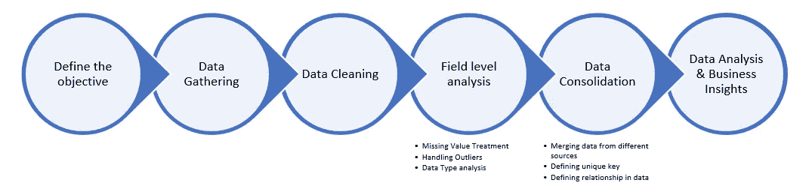

# 数据分析:逐步方法

> 原文：<https://medium.datadriveninvestor.com/data-analytics-step-by-step-approach-757c6a0bd8a2?source=collection_archive---------0----------------------->

数据是大多数公司的燃料，无论他们在哪个领域运营，例如银行、保险、IT、制造业等。理解数据并利用数据已经成为比以往任何时候都更能影响业务的流程的重要组成部分。因此，理解数据是当今的一项关键业务需求。但是在理解和分析数据之前，我们必须确保数据是正确的和结构良好的，否则我们将无法实现目标。

## 数据分析的先决条件:

定义您要寻找的透明物体。

列出实现目标所需的数据源和数据字段。

对需要进行分析的时间框架有一个清晰的理解，并确保你有足够的时间框架数据来进行分析。

数据准备是任何分析中最重要的部分，60–70%的时间都花在数据准备上。因此，我们遵循正确的方法来准备数据是非常重要的，这可以使我们避免最后一分钟的意外和整个分析过程的返工。以下是数据准备中涉及的一些步骤:

从多个来源收集数据，并确保收集数据的来源是远离数据偏差的正确来源。

从多个来源收集的数据可以是结构化的，也可以是非结构化的。这取决于你想如何处理它的要求。然而，大多数时候，我们最终只对结构化数据进行分析。因此，进行数据清理练习，并根据要求以结构化格式转换所有数据。

在实地一级分析数据。例如，如果字段中的数据需要日期值，则该字段中的所有记录都应该只有日期值。

以下现场级验证可能有所帮助:

> o 分析应该存储在唯一值字段中的数据的重复和空值。
> 
> o 检查每个字段的数据类型和其中包含的值。
> 
> o 计算 p 值以确定在分析过程中是否需要某个字段。如果不需要，在最初的过程中排除该字段，而不是在分析该字段时浪费时间和精力。
> 
> o 检查每个字段中的异常值，并定义处理或排除异常值的机制。
> 
> o 检查每个字段的空值。如果一个字段有空值，那么您需要分析它是否应该包含在分析中，因为它可能会对整体分析产生错误的影响。您可以拥有处理缺失值的机制，或者可以设置一些规则来最小化缺失值。
> 
> o 检查数据字段中的关系，并检查相关字段中的记录计数，以将这些字段连接到您的分析数据集中。

数据分析流程的流程图:

