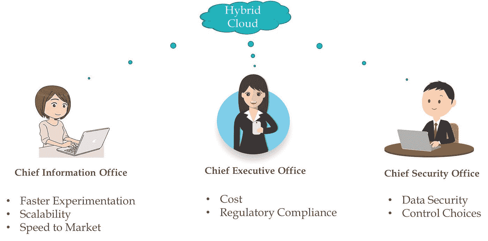

# 2020 年及以后的数据、人工智能和云趋势

> 原文：<https://medium.datadriveninvestor.com/data-artificial-intelligence-and-cloud-trends-for-2020-and-beyond-5d97ae45efcb?source=collection_archive---------0----------------------->

Image Source: Google Images

随着我们迅速接近 2020 年，让我们看到一些关键数据，人工智能和云趋势，以期待

> 今天的数据平台针对云原生时代进行了重新架构，云已经成为数据战略的核心，以加速从想法到实验的转变，人工智能已经开始为一些早期采用者提供合理的价值

以下是我对 2020 年的五大预测

 [## 为什么数据将改变投资管理|数据驱动的投资者

### 有人称之为“新石油”虽然它与黑金没有什么相似之处，但它的不断商品化…

www.datadriveninvestor.com](https://www.datadriveninvestor.com/2019/01/25/why-data-will-transform-investment-management/) 

**免责声明**:如果你正在寻找像量子、人工智能可解释性、人工智能偏见、区块链等这样的时髦关键词，你会失望的:)

# 云原生数据应用

云原生技术正迅速从无状态应用转向支持复杂的数据驱动型应用。像 Apache Spark、Kafka、SQL Engine 和一些数据库这样的框架已经移植到或即将移植到像 docker 和 kubernetes 这样的云原生技术

我们将会看到越来越多的数据应用无缝移植到云原生框架。这些技术的架构必须重新设想，而不是做一个电梯来转移，为它有效地工作与 Docker 和 Kubernetes

## 为什么重要？

*   混合和多云就绪
*   企业应用程序的所有部分都融合到单一基础架构(数据和应用程序)
*   更好的包依赖管理和从开发到生产的无缝迁移

在下面的参考资料部分，你可以看到我关于依赖性管理以及云原生技术如何帮助解决这个问题的简短视频

# 边缘分析/边缘人工智能

由于全球有数十亿台 IOT 设备，并且许多设备在核心业务流程中发挥着重要作用，该企业捕获了大量信息。到 2020 年，我们可以看到这些数以吨计的黑暗数据尚未被开发，正在被分析并用于推动新的数据产品

来自大量 IOT 数据的算法/模型将被移到更靠近设备边缘的地方，以减少决策过程的延迟

如果您正在寻找有关 edge analytics 的详细信息，下面是一个简短的视频

您还可以查看我的另一个相关视频(减少 Edge 的模型大小)和本文末尾参考部分的一个保险 IOT 用例

# 混合云

尽管主要云供应商和产品组织进行了快速投资，但混合云的发展速度在 2019 年低于预期。2020 年，我们将看到混合云和产品的采用加速，这些产品支持无缝连接、集中监控、安全性、负载平衡器等

许多企业将投资混合云，以充分利用私有云和公共云的优势，帮助组织控制基础架构成本，同时帮助他们加速和扩展创新

# 规定性分析(从什么到为什么)

虽然预测性分析将继续成为 2020 年许多数据驱动型决策的核心，但我们可以看到成熟的企业正在将规范分析原型化和部署到他们的决策中

规定性分析不仅仅是预测未来。它提供了可以增强决策结果的各种选项中的最佳行动方案

说明性分析规定了“为什么会发生某种结果”,现实世界的结果被反馈给模型以进行学习和重新规定，从而随着时间的推移提高预测准确性并规定更好的决策

# 用于数据和模型管理的增强分析

我们将看到越来越多的数据和模型管理采用统计和机器学习技术。增强分析将发挥重要作用的一些领域包括数据质量、数据安全性、智能缺失值插补、主数据管理、元数据管理、模型监控等

增强分析还将在数据操作中发挥关键作用，允许应用程序在可能的峰值之前爆发，或者自动发现故障并实时做出反应。

如今，在企业内部的这一领域已经出现了一些实施补丁。我们可以在市场上看到新产品，这些产品可以自动执行许多数据管理、数据准备和模型监控任务，并帮助企业加速他们的分析之旅

# 参考

**面向数据科学的 Docker 和 Kubernetes(云原生技术)**

**在低功耗/计算边缘设备上部署时，模型量化可减少模型内存和 CPU 需求**

**基于使用的保险— IOT 商业案例**