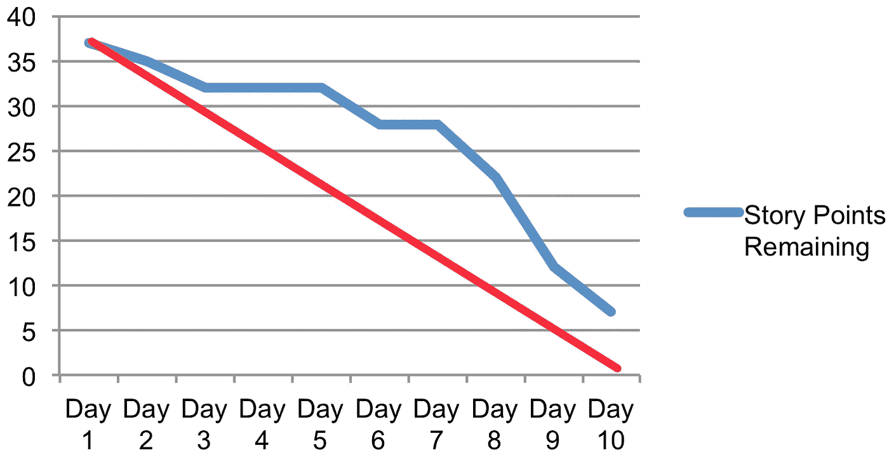
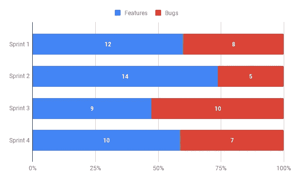
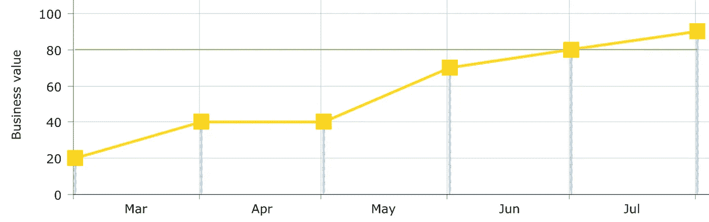
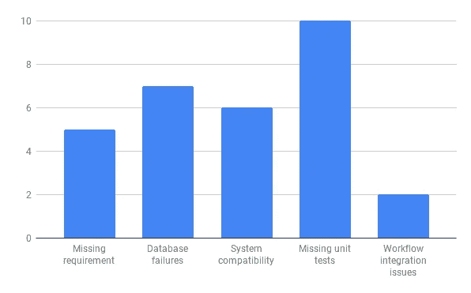

# 基于数据的 KPI，用于监控项目的健康状况和团队效率

> 原文：<https://medium.datadriveninvestor.com/data-based-kpis-to-monitor-your-projects-health-and-team-efficiency-e14d2732d8e5?source=collection_archive---------8----------------------->

Photo by [Adeolu Eletu](https://unsplash.com/photos/unRkg2jH1j0?utm_source=unsplash&utm_medium=referral&utm_content=creditCopyText) on [Unsplash](https://unsplash.com/?utm_source=unsplash&utm_medium=referral&utm_content=creditCopyText)

由于准确的可测量状态和共享的可见性，具有持续改进思想的数据驱动项目更有可能实现其目标。

随着工具和技术的成熟发展，数据比以往任何时候都更成为项目经理做出更好更快决策、提高团队绩效和关注效率的关键资产。

By Bryan Sheffield/© Corbis Outline./© Vanityfair

> **《数据战胜情绪》**
> Sean Rad，Tinder 联合创始人

每个利益相关者在使用任何数据或指标之前必须考虑的几个重要前提是:

*   **度量标准是由团队制定并为团队服务的:**任何度量标准的目标都是持续改进绩效，并实时检测任何可能导致项目失败的问题或缺陷。团队必须意识到，任何数据都不会被用于反对任何成员，以确保一致和正确的信息流。
*   **这完全取决于您如何使用数据:**将实施数十个图表和多个仪表板作为实现完美分析和监控系统的途径的谬论，通常是任何数据驱动分析失败的主要原因。一个迭代的方法来识别什么在项目的上下文中和对于团队是有效的，更有可能帮助你有效地实现你的目标。
*   **您的衡量标准是故事的一半:**衡量标准不知道上下文，也不能涵盖所有变量，通过与合作者和利益相关者的对话来支持您的数据将会让您更好地理解您的数据。

JIRA velocity chart example © Atlassian

速度
简单来说就是你在一次迭代中完成的工作的评估总和。这是一个很好的指标，可以监控团队的表现，并增强其更好地评估任务的能力。

Burn down chart by © JRothman

**冲刺耗尽**
团队计划任务进度的实时指标。通过监控基于“理想进度”的剩余工作，团队可以决定实现冲刺目标的行动。

Bugs vs Features by Sprint © Amine Rouh

**每次冲刺的任务类型**
跟踪技术债务产生的工作量对于确保项目在期限和预算内成功至关重要。

Business value(MVP) chart © Amine Rouh

**商业价值图**
帮助团队专注于 MVP，将客户和商业价值放在前面，不受任何干扰。

Number of defect by Root cause © Amine Rouh

**按根本原因划分的缺陷** 按根本原因对缺陷进行分组允许团队识别并修复对项目有更大影响的缺陷根本原因。

请记住，度量标准不会误导您，但是感知、实现、假设和分析可能会误导您。