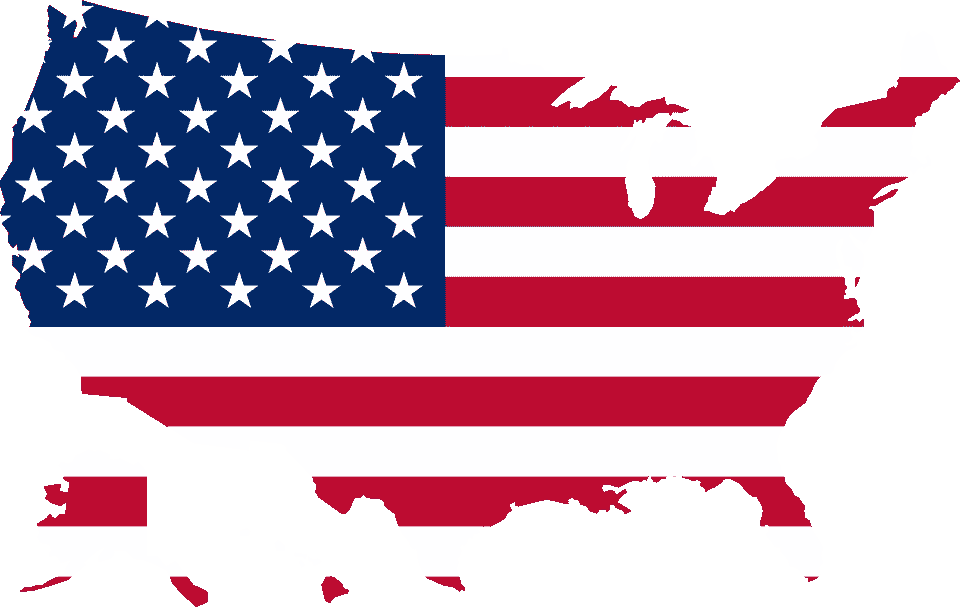

# 数据，数据，无处不在；你有多危险啊！

> 原文：<https://medium.datadriveninvestor.com/data-data-everywhere-what-danger-lies-in-thee-6371146d9941?source=collection_archive---------23----------------------->

为什么“智能”设备与现代人类体验的融合蕴含着令人兴奋和恐惧的可能性，以及美国如何未能解决这些问题。

*“The government of our Führer and Reichschancellor Adolf Hitler is statistics-friendly.”*
**— Friedrich Zahn, President, Bavarian Statistics Office, Nazi Germany**.

# 介绍

你和我以信息的形式存在——每一个都是我们在时间和空间中持续存在时产生的图上的点的集合。其中一些点是宏观和客观的，例如，一个人的位置和生命统计数据。其他的可能是静态的(种族，出生地)，微观的，看似琐碎的，或者本质上完全是主观的(你今天感觉如何？).

我们以这种方式存在并不新鲜，但数字革命不仅提供了存储和分类数量惊人的这些个人数据点的机制，还提供了在我们明确允许的情况下从我们每个人那里全天候收集这些数据的手段，因为“智能”设备与现代人类体验的各个方面交织在一起。

随着最近围绕脸书和剑桥分析(Cambridge Analytica)等社交媒体和数据服务的头条新闻，人们对个人数据隐私权进行了大量讨论，这是正确的。然而，我们将扩展对话，以了解我们的集体数据集所拥有的真正力量(以及真正的危险)。

# 收集的方法和动机

在前数字时代，数据收集缓慢且不准确。以纸质形式分发的调查由自我报告的数据填充，并返回进行人工计数。后来，在 19 世纪的最后几年，穿孔卡片和制表机改进了这一过程的许多方面，但是能够收集到的信息的数量、性质和质量受到当时技术的高度限制。

尽管如此，它仍然掌握着权力，沃尔特·迪尔·斯科特(Walter Dill Scott)于 1903 年和 1908 年出版的前两部广告理论著作将消费者心理学和行为统计学领域推入了商业世界，以许多新的方式刺激了经济增长(戴维斯，2015)。

但数据是客观的，可能会像用于大利益一样容易地用于大伤害，正如阿道夫·希特勒 1938 年的“报告犹太人拥有财产的法令”所表明的那样，该法令将犹太人社区的财务统计数据带到了第三帝国的指尖。在这种情况下，数据使系统性的财产盗窃成为可能，这有助于为德国军队的早期发展提供大量资金(Seltzer，Anderson，2001)。

快进到今天，数据可能以惊人的效率被收集、处理和存储，尽管它通常是在提供更好的服务或用户体验的良好幌子下完成的。例如，当我们带着爆米花和 3D 眼镜看电影时，地理、生物特征和销售点数据的实时流向任何可能知情的人讲述了一个全面的故事。这个故事的元素可能包括

通过电子购买方式(如 Visa 和 Apple Pay)与我们联系在一起的准确的剧院、电影和小吃选择。

在每一个场景播放时(或者可能在我们睡觉时)，心率和其他重要统计数据通过健身追踪器和智能手表传输到云端。

从我们智能手机中的加速度计和方位传感器推断出的上厕所的频率。

这些信息是在我们的许可下记录的，因为我们本能地*同意*并愉快地拒绝了我们面前滚动的每一个服务协议提示，假设获得的任何数据都将用于我们的利益。大部分都会是。在很大程度上，营销主管手中的你的观影历史可能会被用来打造一种更令人满意的(阅读:有利可图的)娱乐体验。那有什么问题？此外，那部电影糟透了——谁在乎他们有没有 T2 的数据？

不可否认，仅仅收集少量的数据点可能并不十分有趣，但是随着时间的积累，我们的行为模式出现了，并且这个集合开始在将我们定义为个体并将我们分成人口、社区和群体的能力方面拥有真正的力量。

# 大数据意味着强大的力量

后来，当德国在 1940 年入侵荷兰时，他们再次利用数据的力量，重新利用荷兰政府现有的人口登记作为工具来推进他们的议程——不仅要找出并消灭他们认为不受欢迎的一类人，还要找到有技能的科学家和身体健康的人进行招募(Seltzer，Anderson，2001)。

今天，我们的数据将是纳粹统计学家的天堂——医疗问题、日常体育活动、信用可信度、教育、社会地位和宗教信仰(仅举几例)都可以从我们的数据中推断出来，并用来给我们贴上“受欢迎”或“不受欢迎”的标签。

目前，中国正计划在 2020 年前推出“社会信用体系”。一个强制性的(它目前以非强制性的身份运行)数据收集和分析工具，其中每个中国公民(以及中国的每个其他法律实体，包括企业)将被排名和评级，以量化每个人的社会特征和可信度。

从表面上看，这似乎是一项高尚的努力。毕竟，如果没有诚信，我们在社会上算什么？事实上，从理论上讲，人类语言已经进化，部分原因是因为它在沟通个体群体成员的可信度方面的效用(Harari，2015)。

然而，要完成这一壮举需要(或至少合理化)一个包罗万象的数据收集工作；一个人读的书，他们使用的产品，沉迷于视频游戏或流媒体视频的时间，甚至社交媒体帖子——一切都受到监控，并作为系统分析每个人所谓的“社会信用”的一个因素(Botsman，2017 年)

问题就变成了，谁来定义标准？谁能说特质 A 给了一个人社会价值，而特质 B 没有，被发现有缺陷的人会怎么样？我们知道纳粹最终是如何回答这些问题的。

# 但是……‘梅里卡！？

值得庆幸的是，我们不再生活在纳粹统治的时代，今天，对我们数据的任何疏忽都可能导致比轻度尴尬或恶意信用卡收费更多的风险，这两者都是有争议的。

然而，虽然我们可以声称生活在自由的土地上，但美国没有全面的(甚至半全面的)个人数据权利法律。在这里，我们的大部分信息存在于一个众所周知的蛮荒的西部，那里什么都可以去。这与我们的同行国家形成对比，如英国，世卫组织的一般数据保护条例为个人所有类别的数据提供了全面的保护和权利。尽管有这些现有的模式，美国继续拖延制定任何超过特定行业法律(主要是健康和金融)的法律。事实上，如果最近的数据泄露有任何迹象(Equifax、雅虎、优步、易贝、塔吉特、成人交友网站等…)，我们在美国的数据的神圣性和安全性现在似乎比以往任何时候都更被忽视。

更糟糕的是，看一看当前的头条新闻就知道，美国，至少在现政府的领导下，并不认为个人权利，以任何形式，是一个高度优先的事项

*   美国宣布退出人权理事会(npr.org)
*   [美国总统]:媒体是“美国人民的敌人”(wbur.org)
*   美国(independent.co.uk)正式废除网络中立规则
*   [美国总统]的穆斯林数据库计划被比作纳粹德国(msnbc.com)

因此，有必要确保那些实际持有我们数据的人倡导数据的安全性和负责任的使用。

# 钥匙持有者

在我们的电影院例子中，信息向量通常是不相交的。也就是说，电影工作室可能很容易获得销售数据，但他们不会仅仅因为你的出现就获得那些宝贵的心率统计数据。相反，他们可能会寻求与你的健身跟踪提供商达成协议，以获得它。这是一种常见的做法，也是为什么，比方说，你手机上一个没有权限访问你的位置的应用程序似乎知道它——其他一些有必要权限的应用程序把它卖给了他们。

这表明，当我们的数据由服务提供商保存时，它们的价值会降低，因此功能也会减弱，从而说明了在这一级别承担责任的必要性。坏消息是数据共享给这些提供商带来了利润。然而，好消息是这些组织，这些我们数据的最终保管者，如果他们选择这样做，可以影响变化——他们可能会通过游说努力决定在什么情况下可以使用和共享数据，甚至向当局投降(苹果诉联邦调查局，2016)。

在这个数字时代，这些服务提供商中最主要的是互联网服务提供商(ISP)。如果谷歌、脸书和苹果是目的地，那么美国电话电报公司、威瑞森和康卡斯特等互联网服务提供商就是门户。大部分，如果不是全部的话，你的数据会在某个时候通过它们被记录下来(连同你的网络浏览记录等等)。)，也没有全面的法律来规定他们如何收集或分享这些信息。也许这并不奇怪，互联网服务提供商是世界上最强大的公司之一，他们知道这一点；2016 年，美国电话电报公司和威瑞森占了国家游说支出总额前四名中的两个(Welsh，Young，2017)。由于他们有能力用自己的巨额资金影响政府，因此，就要靠那些有权指导政府的人，即各个董事会，来倡导负责任的政策。

**参考文献**

博茨曼河(2017)。你可以相信谁:技术如何让我们走到一起，为什么它可能会让我们分开(第一版。).纽约:公共事务。

戴维斯，W. (2015)。幸福产业:政府和大企业如何向我们兜售幸福。伦敦:Verso。

纽约州哈拉里(2015 年)。智人:人类简史(美国第一版。).纽约:哈珀。

萨尔茨，w .，安德森，M. (2001 年)。数字的阴暗面:人口数据系统在侵犯人权中的作用。*，*， *68* (2)，第 481–513 页。

Young，r .，Welsh，H. (2017)领先的美国公司如何管理和花费在州游说上。可持续投资研究所为投资者责任研究中心研究所。