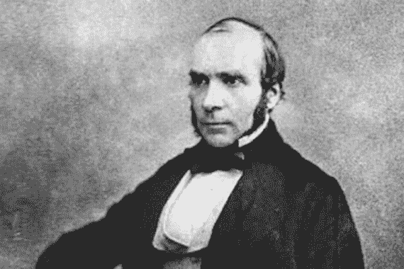
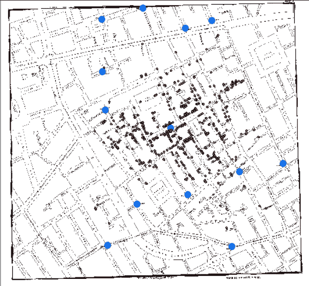
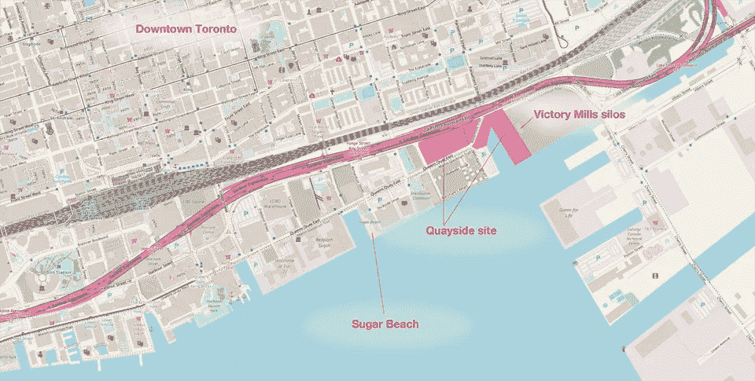
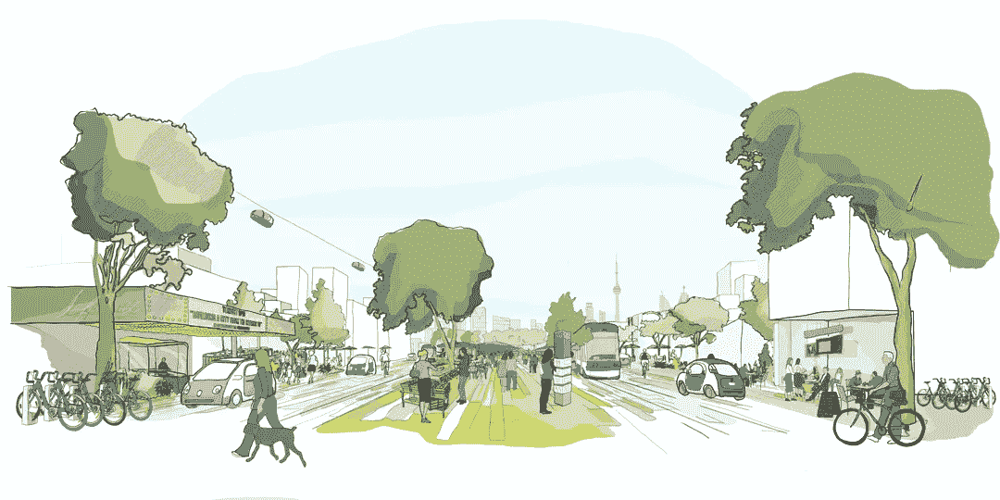

# 数据驱动的城市:从绘制霍乱地图到智能城市

> 原文：<https://medium.datadriveninvestor.com/data-driven-cities-from-mapping-cholera-to-smart-cities-9ea86fbb81e7?source=collection_archive---------13----------------------->

我对城市的迷恋不是秘密。我经常翻阅《大西洋月刊》的城市实验室，热衷于城市政策、设计和问题。在大学里，我最喜欢的一门课是交通规划，这门课专门研究成功的城市交通系统。毕竟，正如经济学家爱德华·格拉瑟(Edward Glaeaser)在《城市的胜利》(the Triumph of the City)中所写的，“自柏拉图和苏格拉底在雅典市场上争吵以来，遍布全球的密集集聚地城市一直是创新的引擎。佛罗伦萨的街道给了我们文艺复兴，伯明翰的街道给了我们工业革命。”

随着我对数据科学的不断了解，我也对城市研究和数据科学的交叉领域产生了兴趣。起初，我开始研究用数据来建造城市的方法。然而，在这项研究中，我意识到有必要后退一步，认识到数据在城市中发挥不可或缺的作用的时间比数据科学被认为是一个研究领域的时间要长得多。快速浏览 LinkedIn 的 2017 年美国新兴工作报告表明，数据科学是最热门的新兴工作之一，自 2012 年以来，数据科学职位的数量增加了 650%。虽然数据科学作为一个正式的职业相对较新，并在不断增长，但仅仅是嵌入该领域的价值是新的吗？

在该领域的核心，数据科学家收集、清理和分析数据以推动决策。这种分析的高潮通常是一个充满可视化效果的仪表板，这些可视化效果与幕后的编码和统计分析隔离开来。但是这种分析真的是新的吗？早在计算机发明之前，John Snow 博士通过使用当今数据科学不可或缺的许多工具，彻底改变了流行病学的研究。

Dr. John Snow — Google Images

几次间歇性的霍乱爆发重创了十九世纪的伦敦，斯诺认为污染的污水是罪魁祸首。然而，在 1849 年发表这一理论后，医学界拒绝放弃他们的信念，即有毒气体是真正的罪魁祸首。1854 年，又一次霍乱爆发困扰着伦敦，斯诺急于确定这场可怕的爆发的原因，这场爆发在两周内夺走了 500 多人的生命。他走遍伦敦收集了数百份死亡证明，这样他就可以在水泵旁绘制霍乱病例。

Snow’s Cholera Map with red dots representing cholera cases and blue dots representing water pumps [https://www.arcgis.com/apps/MapSeries/index.html?appid=3b7b69c040e64afe88ea8e577e71829a](https://www.arcgis.com/apps/MapSeries/index.html?appid=3b7b69c040e64afe88ea8e577e71829a)

通过空间密度分析，斯诺确定了最大的死亡集群源于宽街水泵。通过收集和分析数据，斯诺展示了水污染和霍乱爆发之间的联系。他为流行病学奠定了基础，他的分析在遏制城市疾病传播方面发挥了关键作用。

当然，自斯诺 19 世纪对伦敦霍乱爆发的调查以来，城市周围的数据量增加了，可供分析的工具也增加了。数据不仅在疾病控制中发挥了重要作用，而且已经成为城市生活所有要素的核心。近年来，数据科学促进社会公益组织(DSSG)与芝加哥公共卫生部合作，建立预测统计模型，以确定那些因含铅涂料危害而面临最大风险的家庭。作为雅加达智能城市倡议的一部分，DSSG 旨在通过从原始交通镜头中提取结构化信息，使城市街道更加安全。目前，城市使用数据的方式还有很多其他有趣的方式，但就连这种方式也在发生变化。城市现在是围绕数据来建设的。谷歌的母公司 Alphabet Inc 在 2015 年引入了 Sidewalk Labs，作为以技术为中心的解决方案的城市创新催化剂。与政府机构多伦多滨水区一起，Sidewalk Labs 承担了重新开发码头区的任务，这是多伦多东南部滨水区的一个 12 英亩的部分。

根据 Sidewalk Toronto 的网站，“Sidewalk Toronto 将结合前瞻性的城市设计和新的数字技术，创造以人为本的社区，实现可持续性、可负担性、流动性和经济机会的空前水平。”码头区将提供几乎无缝的数据瀑布，无处不在的传感器提供城市生活各个方面的信息，包括交通，空气质量和噪音。

[https://www.sidewalklabs.com](https://www.sidewalklabs.com)

尽管 Sidewalk Toronto 在推动城市政策的数据使用方面具有革命性的潜力，但随着我们进一步细化城市生活和数据收集之间的界限，这些创新计划也引入了政策需求。Sidewalk Toronto 当然不是没有批评者，其中许多人质疑维护数据隐私的能力，并分享老大哥式的恐惧。

Sidewalk Toronto 最近推出了独立的公民数据信托，旨在确保任何人都无权拥有从码头区收集的数据，以此回应这种言论。在一篇中期文章中，Sidewalk Labs 的数据治理负责人 Alyssa Harvey Dawson 概述了该组织对批评者的主要回应。Dawson 解释说，城市数据，即从城市的物理环境中收集的数据，是不同的，并且正在引入新的挑战。她写道，“城市数据不同于个人同意通过网站、手机或纸质文件提供信息时创建的数据。它带来了独特的挑战，包括它可能被合理地视为公共资产，以及它引发了对监控和隐私的潜在担忧。”

Dawson 还概述了公民数据信托将负责收集并向公众提供任何想要使用码头区数据的实体所需的负责任的数据影响评估。批评者肯定没有屈服，Sidewalk Labs 肯定也没有完成对一个“从互联网开始”建立的城市的数据保护的探索。Sidewalk Labs 计划继续为 2019 年初计划的 Sidewalk Toronto 主创新和发展计划建立数据使用模型。然而，可以肯定的是，尽管有可能获得更多数据，但对这些数据的分析肯定有助于提高城市的效率、可持续性和改善民生，我们也必须将数据隐私作为核心，并不断思考如何管理这些数据。

**来源:**

 [## 故事地图系列

### 此故事地图是使用 ArcGIS Online 中的故事地图系列应用程序创建的。

www.arcgis.com](https://www.arcgis.com/apps/MapSeries/index.html?appid=3b7b69c040e64afe88ea8e577e71829a)  [## 约翰·斯诺和宽街水泵:流行病的踪迹

### 约翰·斯诺和宽街水泵:流行病的踪迹

约翰·斯诺和宽街水泵:追寻 Epidemicwww.ph.ucla.edu 的足迹](https://www.ph.ucla.edu/epi/snow/snowcricketarticle.html)  [## LinkedIn 如今增长最快的工作是在数据科学和机器学习领域

### 这些和许多其他见解来自最近发布的 LinkedIn 2017 年美国新兴就业报告。LinkedIn 有…

www.forbes.com](https://www.forbes.com/sites/louiscolumbus/2017/12/11/linkedins-fastest-growing-jobs-today-are-in-data-science-machine-learning/#2287761e51bd)  [## 人行道实验室智能城市引发强烈反对的背后

### 八月的一个星期二晚上，人行道实验室公共领域和文化主任杰西·沙平斯翻阅了…

www.citylab.com](https://www.citylab.com/design/2018/09/how-smart-should-a-city-be-toronto-is-finding-out/569116/)  [## 一场围绕谷歌价值 10 亿美元的高科技社区的战争正在酝酿，它可能会产生重大的…

### 谷歌母公司 Alphabet 的城市创新部门 Sidewalk Labs 将很快建立一个高科技社区…

www.businessinsider.com](https://www.businessinsider.com/google-sidewalk-labs-toronto-privacy-data-2018-10)  [## 谷歌为什么要将其智能城市数据交给第三方“公民数据信托公司”

### 图片:Flickr/amber dawn pullin Sidewalk Labs 表示，它不想拥有或控制在计划中收集的数据…

motherboard.vice.com](https://motherboard.vice.com/en_us/article/vbknkj/google-wants-a-civic-data-trust-for-toronto-smart-city-sidewalk-labs)  [## 观点|对抗谷歌的智慧城市

### 8 月 8 日多伦多——在多沙的多伦多街区，一片灌木遮掩下，坐落着一栋砖砌的复式住宅，比安卡的家…

www.washingtonpost.com](https://www.washingtonpost.com/news/theworldpost/wp/2018/08/08/sidewalk-labs/?utm_term=.4802662a9c16)  [## 多伦多人行道数据治理更新

### 我们相信 Quayside 可以为城市中负责任的数据使用建立一个新的模式——以独立的公民数据为基础……

medium.com](https://medium.com/sidewalk-talk/an-update-on-data-governance-for-sidewalk-toronto-d810245f10f7)