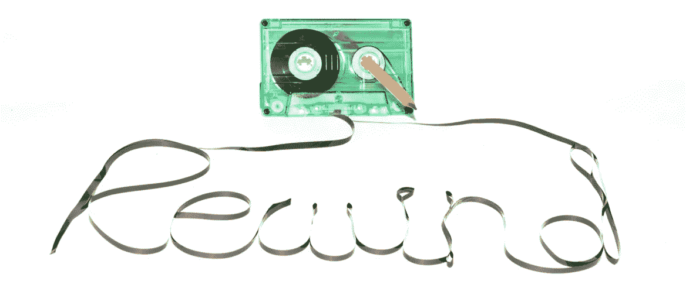

# 数据驱动的投资者—倒带#15

> 原文：<https://medium.datadriveninvestor.com/data-driven-investor-rewind-15-766bd0b5a850?source=collection_archive---------28----------------------->

 [## 有下层朋友吗？把它们留在那里。

### “最重要的是，要密切关注这一点——你永远不会与你以前的熟人和朋友如此紧密地联系在一起，以至于…

medium.com](https://medium.com/datadriveninvestor/got-friends-in-low-places-leave-them-there-ff96149b5b72)  [## 如果我能编码，你也能

### 高中毕业时，我对自己的未来有两个想法。一个想法是加入…

medium.com](https://medium.com/datadriveninvestor/if-i-can-code-you-can-too-1bcae7a5c4e4)  [## 技术与人性:即将到来的人机冲突

### 技术的社会影响

medium.com](https://medium.com/datadriveninvestor/technology-vs-humanity-the-coming-clash-between-man-and-machine-da074eee067f)  [## 区块链的四大巨头

### 如果你想谈论区块链，你需要知道的四大概念

medium.com](https://medium.com/datadriveninvestor/the-big-4-of-blockchain-17292aa819b7)