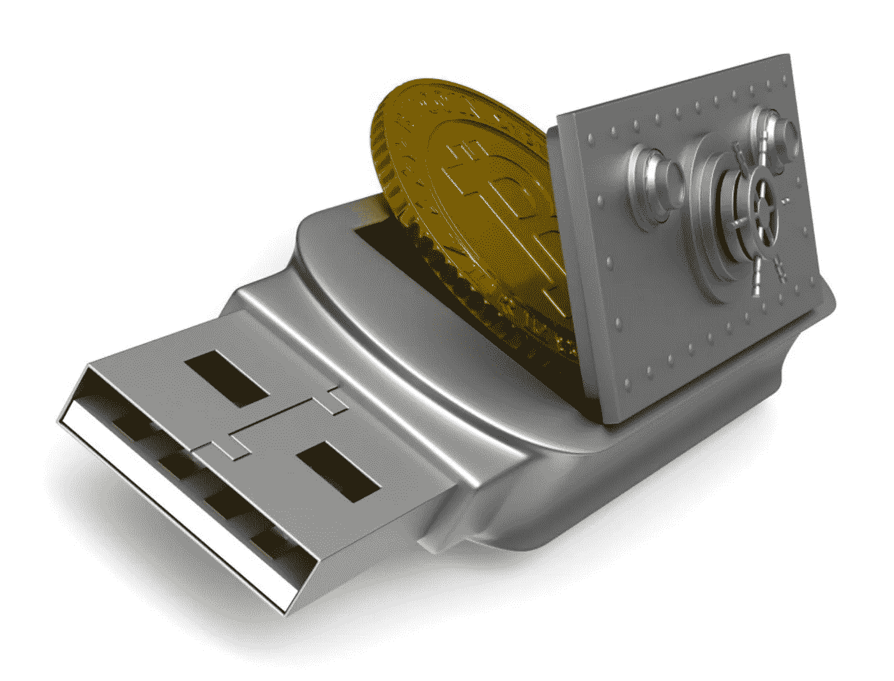

# 数据驱动的投资者—倒带#2

> 原文：<https://medium.datadriveninvestor.com/data-driven-investor-rewind-2-6866a6ac9c73?source=collection_archive---------8----------------------->

# [探索区块链的 5 大公司](https://medium.com/datadriveninvestor/the-5-largest-companies-exploring-blockchain-e1e62068eeae)

由[帕鲁尔·古杰拉尔](https://medium.com/@pgujral) — 5 分钟阅读

区块链再也不能被简单地认为是一种可能适合加密货币公司的边缘技术，仅此而已。事实上，世界上最大和最有影响力的公司都启动了区块链项目。这并不一定意味着分布式账本技术(DLT)即将被主流企业广泛接受，但这仍然是一个有趣的发展。

# [数字资产托管解决方案](https://medium.com/datadriveninvestor/escrow-solutions-for-digital-assets-b68f247008e3)

由[陈良](https://medium.com/datadriveninvestor/escrow-solutions-for-digital-assets-b68f247008e3) — 6 分钟读完

*“计算上不切实际的撤销交易可以保护卖家免受欺诈，而常规的托管机制可以很容易地实现以保护买家。”中本聪在他开创性的白皮书[中描述了比特币的一些可取的安全要求。](https://bitcoin.org/bitcoin.pdf)*

加密货币的最大缺点之一是，它使世界上任何地方的双方都能在几分钟内安全地以电子方式发送和接收价值，而不需要昂贵、容易出错的中介。

