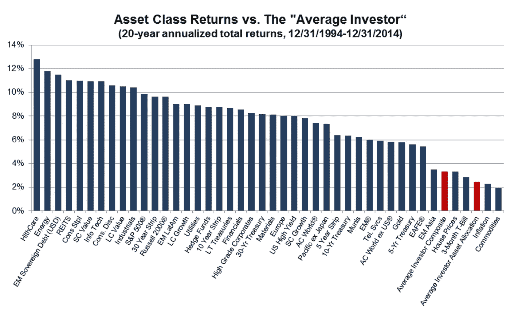

# 数据驱动的投资者—倒带#6

> 原文：<https://medium.datadriveninvestor.com/data-driven-investor-rewind-6-b9d2dee842f8?source=collection_archive---------22----------------------->

# [为什么投资者不能跑赢简单基准](https://medium.com/datadriveninvestor/why-investors-cannot-outperform-simple-benchmarks-d6a587a54967)

由[迈克尔·梅利西诺斯](https://medium.com/@mmelissinos) — 3 分钟阅读

许多投资者认为，通往财富的门票是一种优越的投资策略。如果他们能得到“专业人士”的秘密配方，他们就能以最小的损失每年每个月都赚钱。

许多不同的策略都有效，但没有多少投资者获得这些策略产生的回报。买入并持有的作品；逆势作品；价值作品；技术、趋势跟踪等等也是如此。然而，许多投资者的表现仍然不如该策略本身。

原因？缺乏纪律。许多不同的饮食让我们变得苗条和健康，但没有多少人坚持足够长的时间来工作。我们从一个地方跳到另一个地方，却没有任何进展。

# [机器人的冲突](https://medium.com/datadriveninvestor/the-clash-of-automatons-8d5f409e4080)

by [每日智慧](https://medium.com/@dailywisdom) — 6 分钟阅读

随着人工智能(AI)的不断进步，全球各地的企业都从其能力中受益，重要的是要确保这项技术被善加利用，以创造一个更好、更公平的社会。AI 系统在某些任务上已经优于人类，例如图像识别、数据分析和解决问题的任务。这些进步提出了大量的伦理问题，这些问题围绕着可能出现在数据中的偏见、安全问题以及如果系统被黑客攻击或不负责任地使用可能带来的后果。人工智能的道德实践有几个“指南”，如数据处理的方式和开发人员在创造产品时应该经历的过程，但仍有灰色区域令人担忧。

