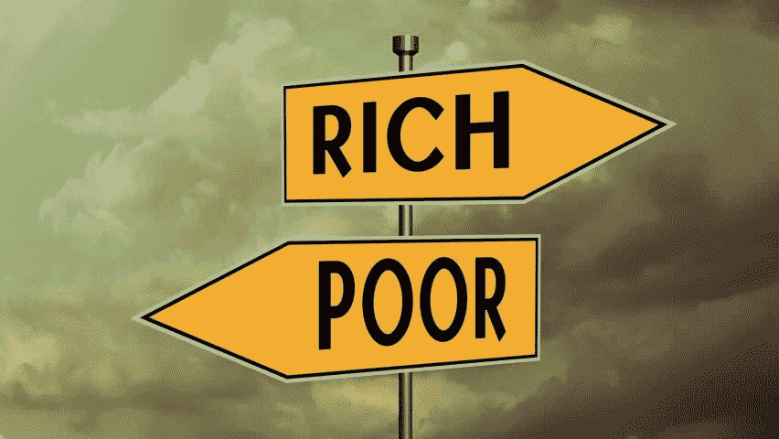
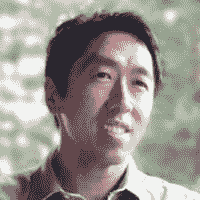

# 数据驱动的投资者——今日故事

> 原文：<https://medium.datadriveninvestor.com/data-driven-investor-story-of-the-day-7291eaac924e?source=collection_archive---------17----------------------->

## ​

## 今日特色故事

## [财富的倾斜分布](https://www.datadriveninvestor.com/2019/05/18/the-skewed-distribution-of-wealth/)

​

全球金融领域的家庭财富差异很大，这取决于你的居住地、获得金融服务的机会以及对市场的了解程度。生活在金融体系成熟且容易获得的发达国家的人往往比发展中国家的人拥有更高的净资产。

对于生活在不发达国家的人来说，差距甚至更大。给你一个视角——美国的人均收入是 60200 美元，中国是 16760 美元，而非洲国家尼日尔只有区区 990 美元。与不同地区的人均收入差异类似，一个人拥有的财富构成也各不相同。

即使在一个人均收入很高的国家，如美国，其构成也可能有很大的不同。财富的分配取决于构成一个国家经济的收入阶层，就像我们在美国看到的那样。 [**【阅读更多】**](https://www.datadriveninvestor.com/2019/05/18/the-skewed-distribution-of-wealth/)

## 今天的特色菜

## [AI For Everyone](http://bit.ly/2X7aoZm)

人工智能不仅仅是工程师的专利。如果你希望你的组织在使用人工智能方面变得更好，这是告诉每个人——尤其是你的非技术同事——要参加的课程。
在本课程中，您将学习:

*   常见人工智能术语背后的含义，包括神经网络、机器学习、深度学习和数据科学
*   人工智能实际上能做什么，不能做什么
*   如何在你自己的组织中发现应用人工智能解决问题的机会
*   建立机器学习和数据科学项目的感觉是什么——如何与人工智能团队合作，并在你的公司中建立人工智能战略
*   如何驾驭围绕人工智能的伦理和社会讨论

[**指导教师:吴恩达**](http://bit.ly/2X7aoZm)

CEO/创始人落地 AI；联合创始人，Coursera 斯坦福大学兼职教授；前百度首席科学家和谷歌大脑创始人