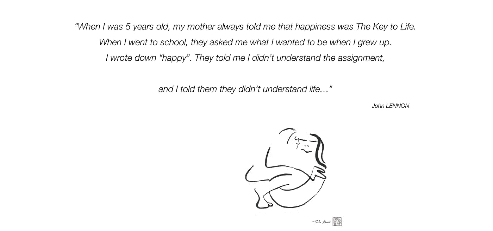

# 数据带来好处——医疗保健的未来

> 原文：<https://medium.datadriveninvestor.com/data-for-good-the-future-of-healthcare-290e2275eb8c?source=collection_archive---------23----------------------->

www.uwediegel.com

一场深刻的转变即将到来。创建一个新的基于数据的医疗保健系统是人类在不久的将来最重要的一项事业。它将对全球服务的提供产生深远的影响，但更重要的是，它将对我们看待自己的方式产生深远的影响。

我们真正的价值是什么？

事实上，我们今天仍然认为自己是个体，是单一的个体。我们不认为自己是世界方程式中的重要齿轮，而是独立思考者，数据孤岛。我们对个人健康数据的价值有一种极度扭曲的想法。这很容易验证…要做到这一点，走在街上，问人们“*你认为你的数据值多少钱？*”。你通常会得到从几百美元到高得离谱的 20000 或 50000 美元的价格。

但事实上，你的个人医疗数据一文不值。我在哈佛的一项研究中读到过，一个人的完整数据集价值约 1，67 美元。**是的，一美元六十七美分……**事实是**你的数据只有被使用才有价值……**今天，我们并没有真正使用数据；我们正在收集它，将它放入筒仓，并通过所谓的“健康管理”应用程序进行回流。但我们还没有真正开始使用这些数据，比如在预测性医疗系统或人工智能中。这两件事是更好的未来医疗系统的关键。

但是很难让人们分享他们的医疗数据，因为我们仍然在动摇数据安全的幽灵，并对他们的数据的未来使用进行恐吓。欧洲有一个关于数据的语义问题。我们倾向于问人们一些问题，比如*“你担心我们会拿走你的数据，卖给保险公司，让你付更多的钱吗？”在这里，就好像我们问了一个问题“你愿意与心脏基金会分享你的匿名数据来做医学研究吗？”答案永远是肯定的。事实上，病人自己，数据的产生者，通常总是乐于分享他的数据，只要他明白他为什么要分享它。*

那么，我们如何才能说服世界以一种高效、智能的方式分享数据呢？我们如何才能转向一个数据为善的系统，在这个系统中，捐献你的医疗数据就相当于捐献器官？

永久数据是在全球范围内建立更好的医疗保健系统的关键。事实上，好的数据是建立一个通用医疗保健系统的关键，在这个系统中，你的数据被用来造福人类，你可以在世界各地旅行，你的医疗数据随时随地可用。

那么我们如何说服人们分享他们的数据呢？如果建立一个系统，人们提供他们的数据，然后匿名，放在一个安全的地下室，用于医学研究。如果当你提供数据时，你会成为你提供数据的平台的股东呢？一个真正的合作系统，推动数据的使用，而不是限制它。

这可能是一个乌托邦，一个想象的世界，一个不可能完成的任务，但这确实是我们应该追求的目标。但是我很想引用约翰·列侬的话:*“当我 5 岁的时候，我妈妈总是告诉我快乐是生活的关键。我上学的时候，他们问我长大后想做什么。我写下了“快乐”。他们告诉我我不理解这个任务，我告诉他们他们不理解生活…”*

乌韦·迪格尔

【www.uwediegel.com 号

