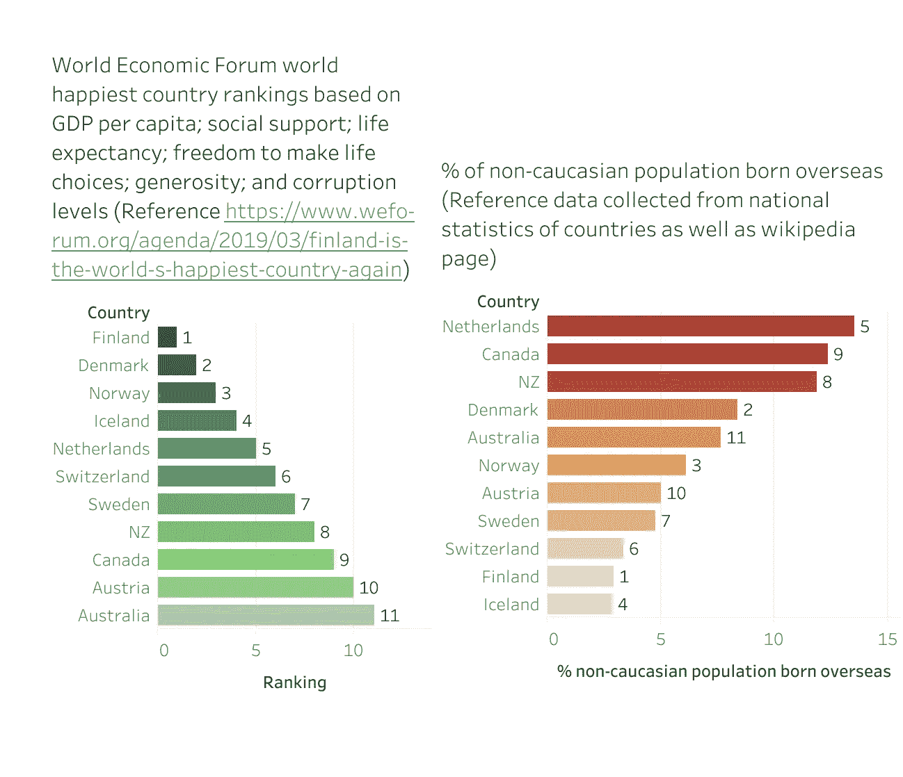

# 数据-仅来自您的眼睛！

> 原文：<https://medium.datadriveninvestor.com/data-from-your-eyes-only-497631dc32f1?source=collection_archive---------8----------------------->

Top 20 happiest countries in 2019, World Economic Forum Ref: [https://www.weforum.org/agenda/2019/03/finland-is-the-world-s-happiest-country-again](https://www.weforum.org/agenda/2019/03/finland-is-the-world-s-happiest-country-again)

澳大利亚堪培拉的澳大利亚国立大学在著名人类学家吉纳维芙·贝尔教授的指导下，开始了新应用科学的大胆发展。这个开创性的、世界上第一个倡议是围绕人工智能(AI)的自治、代理和保证以及人工智能扩展到大型网络物理系统的世界。简而言之，我们正在创建一个领域，以评估人工智能在未来对人类的社会、经济和文化影响。作为这个新领域的第一批学生/开发者的一部分，我们正在获得大量的信息，而人工智能的关键成分之一就是数据。数据有上下文，人们可能没有意识到，但它总是存在。数据也是有延展性的，因为它可以被塑造来呈现一系列的结论。结论当然取决于谁在分析数据，以及结论中是否存在先入为主的观念。

世界经济论坛最近发表了一篇关于世界上最幸福国家的文章。数据显示，基于六个因素人均 GDP，北欧国家比世界其他地区更幸福；社会支持；预期寿命；做出生活选择的自由；慷慨；和腐败程度。这种形象化并没有让我感到惊讶，因为北欧国家一直都在幸福指数的前十名。然而；这当然让我好奇，看看是否有可能从不同的角度分析这些数据。世界经济论坛用幸福指数没有考虑的因素之一是最幸福国家的人口多样性。所以我开始分析人口多样性，特别是前 11 个最幸福国家的海外出生的非高加索人口。现在之所以是前 11 名而不是前 10 名是因为我是澳大利亚人的偏见。关于数据的另一个教训是，你自己的偏见在数据的收集和分析中起着很大的作用。

我的假设是，相比之下，在前 11 名中，北欧国家在海外出生的非白种人比其他国家要少。这需要我从各国国家统计组织收集数据，并不时参考维基百科上关于各国人口统计的文章(我只使用了维基百科上可信的参考资料)。

Comparison of happiest countries and the non-caucasian population born overseas (Analysis tool-Tableau Public)

分析在一定程度上证明了我的假设，因为可以看出，除了丹麦，所有其他北欧国家来自海外出生的非白种人的人口比例相对较低。事实上，幸福指数排名第一的芬兰有 3%的人口是非白种人，并且出生在海外。现在，我并不是说幸福国家的非白种人人口较少，因为这不是正确的数据分析。然而；我想建议的是，在全球公民时代，也许是时候考虑将多样性(非白人)纳入世界经济论坛和类似的世界机构的分析中了。

所以，下次你遇到数据、分析和信息图表时，问问自己，我们是从谁的角度来看这些数据的？

关于作者

Hrishikesh Desai 是一名进步领袖，目前是澳大利亚国立大学 3A 学院的学生。赫里什克什在联邦政府的监管、知识产权方面有经验，你可以通过 LinkedIn 和 T2 的 Twitter 与他联系。