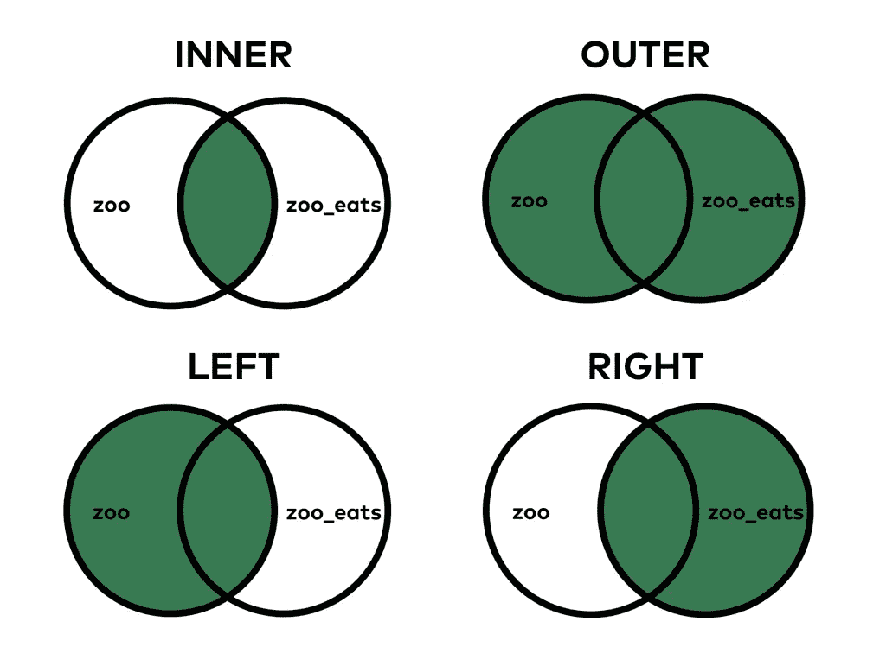
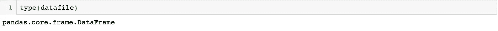
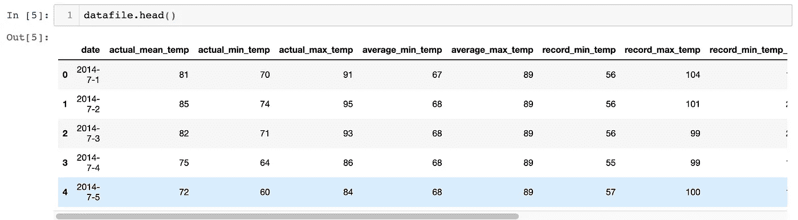
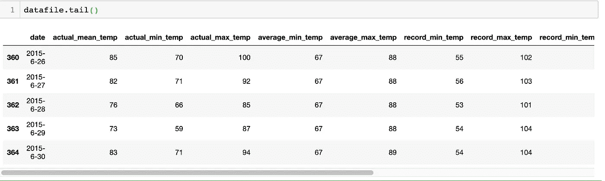
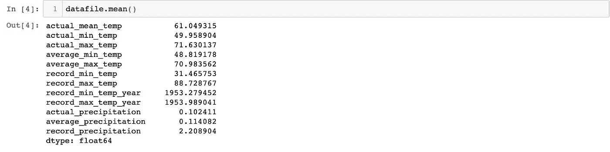
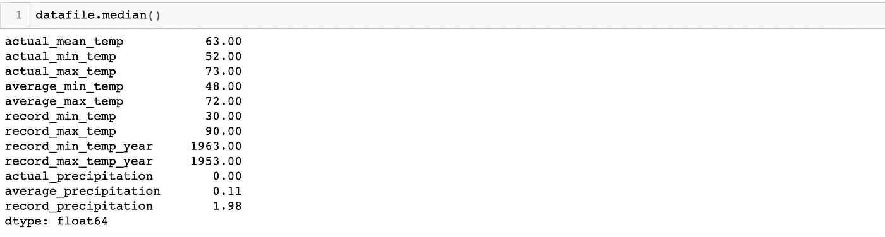
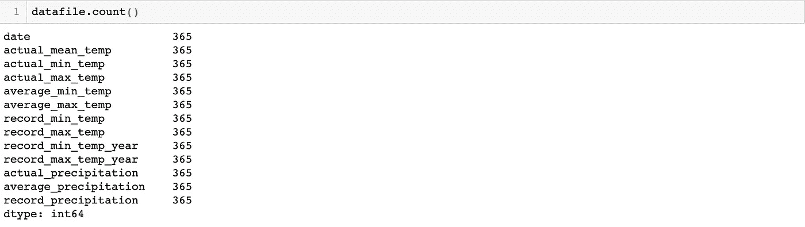
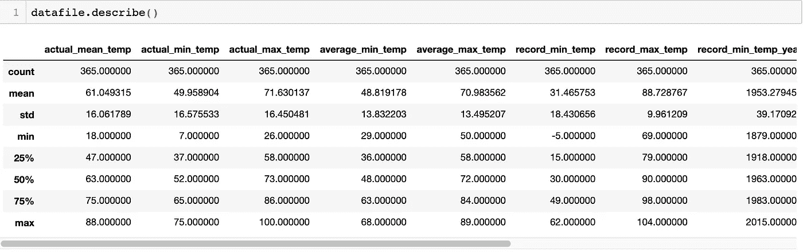

# 用 Pandas 导入和分析数据，📶这里有你需要知道的一切！—机器学习入门—第 4 部分

> 原文：<https://medium.datadriveninvestor.com/data-importing-and-analysing-with-pandas-heres-everything-you-need-to-know-ed31ab7904cc?source=collection_archive---------6----------------------->


欢迎回到机器学习文章系列的第 4 部分。在上一篇文章中，我们制作了第一个机器学习程序，在这里我们将讨论 pandas 中的系列对象、数据帧合并操作以及导入和分析数据集功能。

那么，熊猫是什么？它是 python 中主要的数据操作/清理库。虽然听起来这个名字和熊猫这种动物有关，但事实并非如此。Pandas 只是 Wes McKinney 在 2015 年制作的名称 Panel Data(简单来说就是一个 csv 文件)的缩写。它的一些主要功能是处理缺失数据、数据对齐、按功能分组、数据切片、索引、子集化、合并、连接、整形等。在学习 pandas 时，您想知道的主要事情是，它最适用于具有 500K (500000)行或更多行的数据集。对于少于 500K 行的数据集，你最好使用 Numpy。我们会看到什么是面板数据，

1.  一维数据序列对象
2.  二维数据框架
3.  三维面板数据

[](https://www.datadriveninvestor.com/2019/01/23/which-is-more-promising-data-science-or-software-engineering/) [## 数据科学和软件工程哪个更有前途？数据驱动的投资者

### 大约一个月前，当我坐在咖啡馆里为一个客户开发网站时，我发现了这个女人…

www.datadriveninvestor.com](https://www.datadriveninvestor.com/2019/01/23/which-is-more-promising-data-science-or-software-engineering/) 

让我们一个一个来举例，

1.  **系列对象**

```
Data = [1,2,3,4]
Series1 = pd.series(data)
```

否则，您可以通过以下方式检查数据集的类型

```
Print (type(series1))
```

2.**数据框** —在列中有不同的数据类型，可变大小和标记轴。

```
import pandas as pd
data = [1,2,3,4,5]
Dataframe = pd.DataFrame(data)
```

因此，假设您已经给定了一些数据文件，您需要合并这些文件以便获得给定的输出。

```
import pandas as pd
pd.read_csv('Datafile_name.csv')
```

在 path 中，您需要给出您正在使用的数据文件的相对路径。现在，您已经导入了 csv 文件，您需要连接两个 csv 文件，以便获得一个数据文件。我们可以使用合并功能来做到这一点。基本上，数据文件合并有 4 种类型。

1.  内部合并/内部联接
2.  外部合并/外部联接
3.  左合并/左连接
4.  右合并/右连接



让我们先来看看**内部连接**！

第一个数据帧(df1)

```
import pandas as pd
Player = ['player1','player2','player3']
Point = [8,9,6]
City = ['Colombo','Kandy','Panadura']
df1 = pd.DataFrame({'Player:player','Point:point','City:City'})
print(df1)
```

第二数据帧(df2)

```
Player = ['player4','player5','player6']
Power = ['Punch','Kick','Elbow']
City = ['Colombo','Kandy','Panadura']
df1 = pd.DataFrame({'Player:player','Power:power','City:City'})
print(df2)
```

合并，

```
df1 = pd.DataFrame(df2,on='Title',how='inner')
```

这里发生的是我们首先创建的表与 df2(我们随后创建的表)连接的 df1。它通过两个表中的公共列连接起来，你可以通过查看上面的图像来理解这个理论。

**左合并/左连接**

```
df1 = pd.DataFrame(df2,on='Player',how='left')
```

左连接或左合并保留左数据框中的每一行，左数据框中没有右数据框中相应连接值的行保留 NAN(非数字)值。在上面的例子中，df1 是左表，df2 是右表。

**外部合并/外部连接**

外部合并很简单，它基本上将两个表相加，没有任何条件，就像集合*中的 *A U B (A union B)* 。*

**连接两个数据帧，包含相同列但不同行的数据，**

```
df_all_rows = pd.concat([df1,df2])
```

在这种情况下，我们希望将一个数据帧的所有行连接到另一个数据帧。 *Concat()* 函数追加 2 个数据帧中的行，以创建 df_all_rows 数据帧。当您列出它时，您可以看到所有的数据行都在那里，但是索引有问题。我们没有为我们使用的任何数据帧显式设置索引。熊猫使用自己生成的指数。当我们连接数据帧时，pandas 也连接了索引。如果您需要通过索引来访问一行，这确实是一个问题。但是您仍然可以用下面的代码来解决这个问题。

```
df_all_rows = df_all_rows.reset_index(drop = True)
```

# 导入和分析数据集。

导入数据集

```
cars = pd.read_csv('datasetname.csv')
```

系统将返回数据集的类型，

```
print(type(cars))
```



您将能够看到数据集的前 10 行，

```
print(cars.head())
```



这是一个重要的函数，因为每次执行合并函数或任何操作或改变数据表的函数时，你不能每次都查看所有的行。有 10-50 行的表是可以的。但是想象一下，如果您的表有 10K 或以上的行，会发生什么！每次你运行这段代码，你的电脑都会卡住。从上面的函数中，你可以很容易地粗略地看一下表格。

```
print(cars.tail())
```



这与*头的功能相反()。这将返回表格的最后 10 行。这两个函数将有利于你，例如你正在排序表和删除空值。你只需要调用 *head()* 和调用 *tail()* 就可以看到最上面和最下面。*

```
print(cars.shape())
```

上述函数将返回表格的形状，即列数和矩阵形式的列数，如(23，10)。

```
print(cars.info(null_count= True))
```

上述函数将给出数据集的非空值。

```
print(cars.mean())
```



将返回数据集每一列的平均值。

```
print(cars.median())
```



将返回数据集每列的中位数。

```
print(cars.std())
```

将返回数据集每列的标准偏差。

```
print(cars.max())
print(cars.min())
```

*max()* 函数将返回每列的最大值，而 *min()* 将返回每列的最小值。

```
print(cars.count())
```



这将返回每一列的计数。如果你正在做一个统计方面的项目，你也可以考虑累积和。

```
print(cars.describe())
```

上述函数将返回数据集的完整描述性统计摘要，如下所示。



我想这对于数据导入和分析部分已经足够了！。我们将在下一篇文章中讨论数据清理和操作部分。不要犹豫，在评论区评论你的问题，我会尽快联系你！手指交叉！编码快乐！🙌🏻 👨🏻‍💻 ♥️