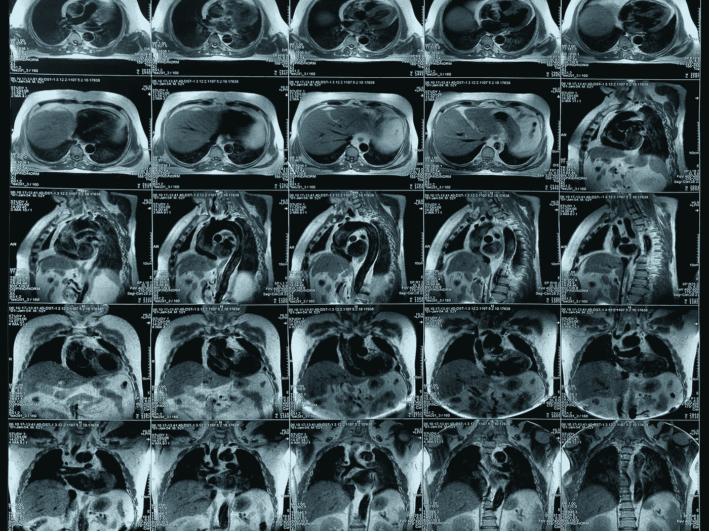

# 数据不是黄金。数据不是石油。

> 原文：<https://medium.datadriveninvestor.com/data-is-not-gold-data-is-not-oil-9878ad28d12b?source=collection_archive---------14----------------------->

## 数据科学

## 我正在读一篇题为“数据是金”的帖子。只是让我想起了前几天的另一个帖子，题为《数据是新的石油》。

就我个人而言，我认为数据具有很高的价值，与许多其他人不同，我不相信数据价值“只是另一种炒作”。但是，作为一名数据科学家，我认为缺少了一幅大图。

让我说得更清楚些。数据本身没有价值。数据实际上不像黄金。如果你把数据存储在硬盘或数据中心，它就没有任何价值。也许，它有更多的成本和产生任何价值。使用时，数据会增值。从这个角度来说，对我来说，数据更像是石油。石油本身是一种黑色的臭味物质，但当它被用于工厂和汽车的运转时，它就具有非常高的价值。

但实际上，数据也不是石油。与石油不同，数据有截止日期。有些数据的到期日期较长，有些数据的到期日期较短。想想医学成像数据。大约 100 年前，X 射线图像具有很高的价值。他们是少数非侵入性信息来源之一。今天，随着先进的成像技术，如 MRI 和 CT 扫描，X 射线图像在大多数应用中没有其原始值。此外，如果你认为，与更高质量的新 X 射线，没有人训练他的模型从 20 世纪 20 年代的 X 射线图像。如果有人在 20 世纪 20 年代，为了 2018 年的更高价值而存储他的实验室 X 射线图像，他就失去了他的投资。相反，如果他有技术使用他丰富的 X 射线数据集来建立一个机器学习模型(我知道，让成像计算机存在于 20 世纪 20 年代)，他的数据集获得了太多的值。

我在石油和天然气行业工作，同样的数据过期理论也适用于石油和天然气行业的数据。今天，一些地区的一些人查看非常古老的测井记录来建立他们的模型。新采集的数据比使用旧数据更好地揭示和表现了地质特征，旧数据仅显示了钻孔的一个地质方面(噪音太大)。如果有人能回到洛克菲勒时代，他不会建议他存储自己的油井数据，永远不要发布或使用这些数据。相反，一个聪明的顾问可能会鼓励他获取更多的数据并立即使用。

综上所述，数据没有内在价值，价值随时间递减。最好在过期前使用它。