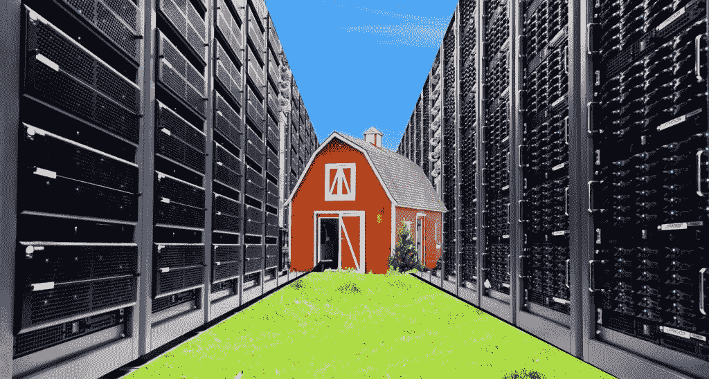

# 数据是油，小麦，五花肉

> 原文：<https://medium.datadriveninvestor.com/data-is-the-new-cash-crop-47ab51470cf9?source=collection_archive---------7----------------------->

cc photo by Tom Raftery

在这个世界上，有一种新的商品可能很快就会比原油更有价值。是数据。

数据将成为推动人工智能驱动的下一场经济革命的燃料。正如原油为导致工业革命的蒸汽机提供动力一样，数据将为推动人工智能革命的机器学习算法提供燃料。

在我们这个时代，数据将继续增长，就像“死亡和税收”一样确定无疑。有些已经存在，就像石油已经在我们脚下躺了几个世纪。其他的等待种植和收获，就像田地里的小麦或农场里的五花肉。

互联网给了每个人创造数字内容的能力。随着越来越多的人能够使用智能手机和宽带网络，我们正在创建需要更大存储空间的内容。

我们不仅有更多的网民创造更大的内容，我们也有更少的内容被删除。看看你周围。有多少人会从社交媒体上删除他们的电子邮件账户和帖子，即使他们，嗯…去世了？

我有朋友让他们配偶的脸书账户保持活跃，作为一种虚拟的纪念。家人和朋友会在他们的死亡周年纪念日贴上笔记和纪念照片。

有机死亡物质产生了原油。从数字垃圾中，我们将获得…原始数据！

# 数字农场

只要文明继续，人类就会有意识和无意识地种植、耕种和开采这种数字商品。除非世界毁灭，否则我看不出数据会减少而不是增加。

服务器农场将成为一种数字农业——种植*下一个最有价值的商品:数据*

数据已经存在很长时间了，但为什么它现在才成为一种新的重要商品和潜在的财富来源？嗯，就像石油在整个文明中一直存在于我们脚下一样，它们的真正用途直到我们发明了蒸汽机才显现出来。

AI 是由大数据驱动的。过去，分析数据只是为了帮助现有企业优化产品或运营。如果你不拥有这家企业，它所创造的数据对你来说就没有特别的货币价值。对于出售报告或调查的第三方咨询或研究公司来说，它至多是有价值的。

但随着人工智能时代的到来，新的应用程序、产品和解决方案正在人工智能的基础上构建。简单来说，过去的数据是商业或学术活动的副产品。现在，数据是人工智能驱动的初创公司和企业的*基础*！

即使当新的人工智能方法[减少对大数据](https://medium.com/nanonets/nanonets-how-to-use-deep-learning-when-you-have-limited-data-f68c0b512cab)的依赖以构建初始模型变得可行时，仍然需要收集数据作为输入以及验证输出。

# 定价

那么，如果数据现在是一种数字商品，我们如何给它定价呢？

Photo by [Sharon McCutcheon](https://unsplash.com/photos/-8a5eJ1-mmQ?utm_source=unsplash&utm_medium=referral&utm_content=creditCopyText) on [Unsplash](https://unsplash.com/search/photos/payment?utm_source=unsplash&utm_medium=referral&utm_content=creditCopyText)

任何商品的价格都是基于需求和供给的。稳定的价格点将由购买者的感知价值满足生产者要求的激励决定。

但这正是科学让位于艺术的地方。价值往往是一个感知的问题。作为一种刚刚开始成为新行业“原材料”的新商品，人工智能公司从“输入数据”中可以产生的利润仍然不确定。

这种情况类似于 dot.com 时代和最近的社交媒体热潮，新技术创造了新的业务，但还没有明确的商业模式。

在 dot.com 繁荣的早期，风险投资者甚至股票市场都是根据网站的“眼球”或独立访客数量来给初创公司定价的。最终，社交媒体和移动应用稳定下来，成为更现实的[月活跃用户(MAU)或平均每用户收入(ARPU)](http://www.moorestephens.com.hk/news/april-2018/how-venture-capitals-and-private-equities-value-st) 模型。这是因为在线广告和电子商务已经建立，并且有先例的公司和统计数据可以预测每个活跃用户可能为企业带来的收入。

随着人工智能驱动的初创公司为商业和消费者用例创造新产品和服务，很难说每个数据集在所有不同的商业模式中能有多少价值。但用于评估的基本单位可以是“每个可用数据点”，就像独立访问者或活跃用户一样。

在未来的一段时间里，这一切都将回归经典方法，即根据公司收入或利润数字的倍数对公司进行定价，但就目前而言，对于一家需要一组数据来建立业务的公司来说，你和我一样都不知道这些数据值多少钱。

# 所有权和控制权

所有权和控制权是另一个方面，数据可能类似于实物商品，如已经存在的石油或必须种植的小麦等作物。

假设一个数据库已经存在，比如地下石油或地球金属。它拥有土地/海洋的合法所有权，以及开采和出售商品本身的权利。已经存在的有用数据的例子是交易所的股票价格或翻译公司的翻译文本(称为翻译语料库)。这些数字资产拥有所有权，可以出售或分配开发权进行‘采销’。

Photo by [rawpixel](https://unsplash.com/photos/nZPnSyeLUcg?utm_source=unsplash&utm_medium=referral&utm_content=creditCopyText) on [Unsplash](https://unsplash.com/search/photos/contract?utm_source=unsplash&utm_medium=referral&utm_content=creditCopyText)

对于像小麦或五花肉(两种交易量很大的实物商品)这样需要“种植”的数据，种植数据的土地和最终商品的受益者之间的所有权可能会分离。例如，一家超市或零售商场最终可能会收集大量有用的消费者数据，作为其业务运营和 IT 系统的一部分。但它可能不需要将此作为一项独立的业务来盈利。然而，人工智能驱动的广告公司希望将这些数据作为输入来预测消费者购买什么以及何时购买。然后，他们可以达成一项协议，在数据变得可用时帮助“增长和收集”这些数据，并使用它们。作为回报，他们将向财产所有者支付“租金”或“版税”，以使用他们的领土和由此产生的数字资源。

与实物商品一样，数字商品必须通过网络安全和加密措施(如防火墙、防病毒和区块链)来防止未经授权的访问、病毒和盗窃。

# 利益

那么数据驱动的 AI 会给人类带来什么好处呢？最明显的一个是:工业过程和消费者生活中的便利和生产力。

更深入地说，数据的创建和不断增长的数据量已经产生了自己的问题和解决方案。为什么

信息时代造成了信息过载，对互联网和社交媒体上瘾。人工智能可以帮助我们过滤信息，筛选出与我们最相关或最感兴趣的信息。

Photo by [Aiony Haust](https://unsplash.com/photos/f2ar0ltTvaI?utm_source=unsplash&utm_medium=referral&utm_content=creditCopyText) on [Unsplash](https://unsplash.com/search/photos/headache?utm_source=unsplash&utm_medium=referral&utm_content=creditCopyText)

人工智能还可以帮助我们减少工作和个人生活中的信息处理和决策。当然，这是一把双刃剑。任何从事常规或重复性工作的人，如果没有被机器取代，很可能很快就会失业。

但更多的是对人类的负面影响。先继续说好的。

# 投资机会

在科技行业内，有一些明显的巨头将从数据创建、存储和分析的这一上升趋势中受益:

*   IBM、惠普和英特尔等销售服务器的公司
*   提供云计算的[公司](https://www.forbes.com/sites/bobevans1/2017/11/07/the-top-5-cloud-computing-vendors-1-microsoft-2-amazon-3-ibm-4-salesforce-5-sap/#2959373d6f2e)比如微软和亚马逊
*   销售企业数据存储的[公司](http://www.enterprisestorageforum.com/products/20-top-enterprise-data-storage-vendors.html)如戴尔和 HPE
*   还有出售网络设备的公司，如思科和华为，它们提供连接来传输数据。

在这些大型上市公司之下，还有一些较小的供应商，生产制造服务器、电缆和路由器等所需的零部件。我会把这些清单留给外面的专业投资分析师。

一个潜在的私募股权或风险投资机会是那些多年来积累了大量有用的专有数据，但以前没有任何实际用途的公司。这些人坐在“油田”上没有意识到。

我刚才提到了翻译语料库。这是一个很好的例子。在经济全球化的背景下，[翻译行业](https://www.gala-global.org/industry/industry-facts-and-data)是最稳定且稳步增长的行业之一。对大多数人来说很无聊而且被忽视。但近年来，私人股本在其中越来越活跃。空间的碎片化性质以及机器翻译和人工智能大幅提高生产力的潜力对他们非常有吸引力。

一家价值数百万美元的中国初创公司，[【UTH 国际】](http://en.utranshub.com/about.html)，通过收购翻译语料库来建立数据业务，与老牌大公司展开较量。他们声称拥有 150 亿+翻译句子对。但几个月前，当他们的业务发展副总裁来镇上和我喝咖啡时，我惊讶地得知，即使是他们也没有想到从较小的东南亚翻译公司购买数据，这些公司多年来积累了科技巨头不包括的少数民族语言的翻译语料库。

# 问题

硬币总是有两面的。随着大数据和人工智能的出现，隐私将成为我们这个时代最大的法律问题。

Photo by ev on Unsplash

不同的国家对这个问题有不同的做法。过去，人们普遍认为，如果说中国在科技领域有什么优势的话，那就是这个国家的公民普遍更愿意放弃一些个人信息，以换取便利和免费服务，比如移动应用。甚至这一点现在也在改变。一项里程碑式的调查显示，76.3%的中国公民现在“将某些形式的人工智能视为对其隐私的威胁”。

数据收集和货币化间接造成的另一个问题更加微妙和长期，就像化石燃料和工业农业对土地、空气和海洋的污染——空气波的污染。随着大部分数字通信无线化，电磁辐射无处不在。从长远来看，它们对人类健康的影响有多大，这本身就是一个巨大的技术课题。根据美国国家健康研究中心的这篇文章，到目前为止所做的研究是正反两方面的，并且没有结论。可能还需要 10-20 年才能确定长期影响。

我自己不科学的直觉指向负面。你们当中像我一样，对着手机在耳边讲了一会儿话就单侧头痛的人，大概就明白了。

无论如何，随着工业和消费物联网(IoT)通过 Wifi、蓝牙、蜂窝网络和[低功耗广域网](https://internetofthingsagenda.techtarget.com/definition/LPWAN-low-power-wide-area-network) (LPWAN)创造越来越多的设备连接，我们可以有把握地说，现代文明浸泡在无形的浪潮中。随着我们增长、积累和利用越来越多的数据，连接性和带宽也会随之增长。我希望声称它们是安全的科学家是对的…当工业化农业和农业开始的时候，他们对杀虫剂和类固醇说过同样的话吗？

但是现在，原油越来越难提炼，旧金山也不再有淘金热了。在我们的一生中，数据是珍贵的商品，可能就在你的脚下(或者说，在你的硬盘里……)

> "[论人工智能的潜在极限——炒作背后的事实](https://medium.com/@lancengym/3-simple-reasons-why-ai-will-not-rule-man-yet-22d8069d8321)"

写作是我一生的激情，也是我组织思想的方式。我也希望根据可靠的信息在社会上创造有意义的话语。所以请随时给我回复，贡献你的知识和观点。我会尽力回复的。但是，如果是您寻求的业务联系，请在[*LinkedIn*](https://www.linkedin.com/in/lancengym/)*上这样做。*

