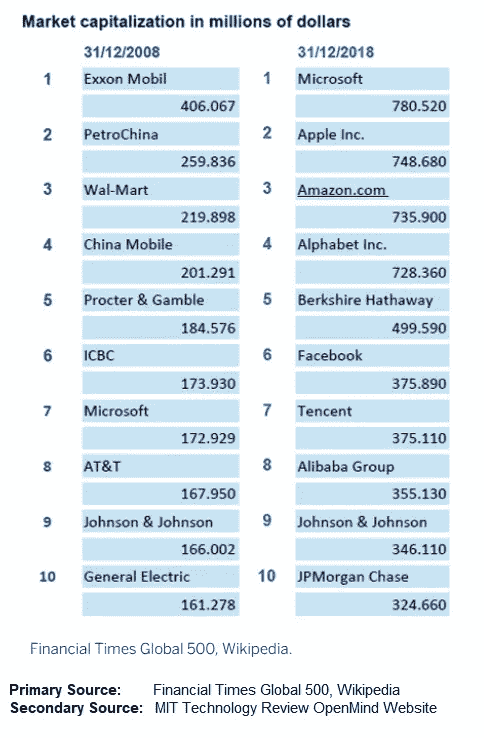
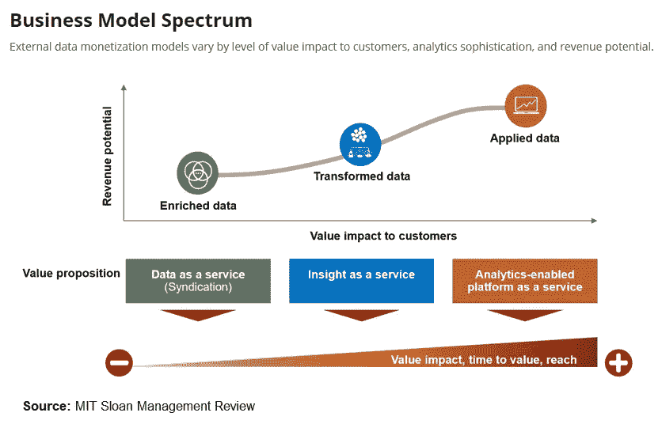

# 数据是新的石油

> 原文：<https://medium.datadriveninvestor.com/data-is-the-new-oil-421305e66ec4?source=collection_archive---------2----------------------->

数据是机器学习时代的一个热门词汇。

前微软高管陆弃描述道，数据是当前技术浪潮中新的资本形式。在 2017 年与 Y Combinator 风险投资公司合伙人丹尼尔·格罗斯的[采访](https://blog.ycombinator.com/baidus-coo-qi-lu-discusses-ai-with-daniel-gross/)中，陆弃从人类生产力历史的角度总结了数据的重要性如下:

> 在这一波技术发展中，有一个方面与上一代大技术浪潮有着根本的不同，那就是数据发挥着至关重要的作用。我给你举个简单的例子。你可以有一万名工程师，伟大的工程师，或者一百万名伟大的工程师。你将无法建立一个理解人类对话的系统。你将无法建立一个能够识别物体或图像场景的系统，因为你需要有数据。一个简单的类比很像人类。当你我长大后，并不是我们的父母或上帝在给我们的大脑写代码。我们内置的神经引擎具有学习能力，所以我们的感觉系统，本质上是我们的感知系统，无论是视觉系统还是听觉系统，我们都能够观察这个世界。我们的观察，那些传感器，这些是数据。这些数据承载着知识，我们能够从与世界的互动中学习。随着我们的成长，我们获得了知识。同样的事情也发生在人工智能技术上。这次不是写代码的问题。这是关于编写代码，用软件和硬件实现算法，能够学习，从数据中学习知识。
> 
> 如果你从这个角度来看，我认为数据是人工智能时代的数据。它将成为主要的生产资料。顾名思义，生产资料是资本的一种形式。我们看看，在历史上，在我们人类的历史上，比如说，在农业时代，土地是主要的生产资料。你可以看到土地周围的一切都井然有序。所有的战争都在争夺土地。在工业时代，生产资料是主要的劳动设备，不同类型的设备。当然，还有金融资本，人才。但是在 AI 时代，我的观点是数据会成为一种初级的生产资料。利用数据成为关键。

还有人打了个比方，数据是新的石油。公司能够[“加工和提炼原油”](https://www.linkedin.com/pulse/digital-its-analytics-stupid-bharath-thota)并从大数据中提取商业见解(如规范性分析解决方案)以进行及时的战略路线修正，这种能力已日益成为商业组织保持信息灵通、敏捷、适应性强和竞争力的决定性因素，以便在当前充满假阳性破坏性创新症状的动荡市场环境中捍卫和占领市场份额。

 [## 为什么数据将改变投资管理——数据驱动的投资者

### 有人称之为“新石油”虽然它与黑金没有什么相似之处，但它的不断商品化…

www.datadriveninvestor.com](https://www.datadriveninvestor.com/2019/01/25/why-data-will-transform-investment-management/) 

石油和天然气公司在 2008 年和 2018 年之间的市值排名的鲜明矛盾可以描述数据支持分析能力对财富 500 强公司的价值。

[报道](https://www.bbvaopenmind.com/en/technology/digital-world/data-the-lever-to-promote-innovation-in-the-eu)截至 2018 年底，引领交易大厅排名数十年的石油和天然气公司市值排名前列已被具有先进数据分析能力的所谓数字本土公司取代。欧盟委员会大数据专家胡安·穆里略·阿里亚斯[将](https://www.bbvaopenmind.com/en/technology/digital-world/data-the-lever-to-promote-innovation-in-the-eu)这些数字本土公司的成功归功于他们将数据作为原材料进行处理并将其转化为有用和可操作信息的能力。

虽然很难量化数据在成功的数字原生企业向技术和数据支持型企业转变的商业模式中的作用，但组织可以后退一步，了解组织数据支持能力的不同成熟阶段，并决定其在数据分析商业模式范围内不同细分市场的投资权重。

AT Kearney 数据科学专家撰写的一篇麻省理工学院斯隆科技评论文章简要介绍了典型数据支持业务模式中的三个不同成熟阶段，即“数据即服务”、“洞察即服务”和“支持分析的平台即服务”，如下图所示:

在我看来，“数据是新的石油”这一类比植根于其逐渐将人类生产力与化石燃料脱钩的潜力。事实上，数据是新的石油，生动地描述了数据取代化石燃料成为人类主要生产手段的潜力。化石燃料是 20 世纪人类工业生产力飞跃的主要驱动力。化石燃料为内燃机提供动力，加速了机械工程的发展。然而，在机器学习的时代，虽然数据通过流程和资源优化提高原油产量和以内燃机为中心的工业生产率，继续成为化石燃料的推动者，但数据不可避免地将逐渐改变方向，取代化石燃料，成为工业生产率的主要驱动力，因为它能够培训自动电动汽车、机器人自动化流程、智能设备和各种涉及高水平重复工作例程的专业服务。此外，经过大数据训练的规范性分析解决方案还将实现替代能源的有效获取和高效部署，以替代非化石燃料驱动的车辆和机器，从而进一步减少人类对化石燃料的依赖。

考虑到围绕数据在改变不同行业、业务以及人类日常生活方面的能力而建立的所有兴奋和预期，值得注意的是，并非所有数据在任何情况下都有用。包括机器学习应用在内的所有信息技术系统都需要遵守通用的“垃圾进垃圾出”原则。如果没有有意义的数据，与使用“手工制作”的基于规则的编程算法开发的传统 IT 应用程序相比，人工智能应用程序没有任何优势。这概述了组织获取符合数据工程师和数据科学家需求的质量和相关数据的必要性，而不是简单地将任何形式的数据扔出围栏，并期望人工智能团队从非结构化数据中产生有用的见解。

另一方面，随着组织加大努力并加倍投资大数据战略，一些公司选择与行业垂直领域的不同参与者建立战略数据合作伙伴关系，而其他公司则决定投资开发全面的超级应用/超级平台生态系统，最终使他们能够访问消费者数据的各个方面。在我看来，这是一个大数据来源和整合战略。由于数据是当前深度学习时代的新石油，那些拥有最大战略大数据池的人将成为未来几乎任何行业的国王。

**参考:**

Combinator，Y. (2017)。百度的首席运营官，陆弃与丹尼尔格罗斯讨论人工智能。[在线] Y Combinator。可在:[https://blog . y combinator . com/baidus-COO-qi-Lu-discuss-ai-with-Daniel-gross/](https://blog.ycombinator.com/baidus-coo-qi-lu-discusses-ai-with-daniel-gross/)【2019 年 4 月 28 日访问】。

阿里亚斯，J. M. (2019)。数据:推动欧盟创新的杠杆。[在线] BBVA 开放思维。可在:[https://www . bbvaopenmind . com/en/technology/digital-world/data-the-lever-to-promote-in-the-innovation-in-the-eu/](https://www.bbvaopenmind.com/en/technology/digital-world/data-the-lever-to-promote-innovation-in-the-eu/)【2019 年 4 月 28 日获取】。

m .法贝尔、s .克莱因、b .托塔和 r .尼迈耶(2019 年)。数字？是数据分析，笨蛋！。[在线]Linkedin.com。可在:[https://www . LinkedIn . com/pulse/digital-its-analytics-stupid-bharath-thota](https://www.linkedin.com/pulse/digital-its-analytics-stupid-bharath-thota)【2019 年 4 月 28 日获取】。

甘地，s .，托塔，b .，库欣巴克，r .和斯沃茨，J. (2018)。揭秘数据货币化。[在线]麻省理工学院斯隆管理评论。可在:[https://Sloan review . MIT . edu/article/demystifying-data-monetization/](https://sloanreview.mit.edu/article/demystifying-data-monetization/)【2019 年 4 月 28 日访问】。

诶，H. C. (2019)。数据是新的石油。[在线]可在:[https://erhc79.blogspot.com/2019/04/data-is-new-oil.html](https://erhc79.blogspot.com/2019/04/data-is-new-oil.html)【2019 年 4 月 28 日获取】。

诶，H. C. (2018)。深度学习(机器学习)炒作的危险。[在线]见:[https://erhc 79 . blogspot . com/2018/05/the-danger-of-hype-over-deep-learning . html](https://erhc79.blogspot.com/2018/05/the-danger-of-hype-over-deep-learning.html)【2019 年 4 月 28 日访问】。