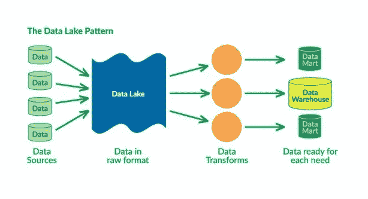

# 2018–2027 年数据湖市场|微软、Informatica、Teradata、凯捷、EMC、Oracle 等主要竞争对手

> 原文：<https://medium.datadriveninvestor.com/data-lakes-market-2018-2025-top-key-players-like-microsoft-informatica-teradata-capgemini-b6f6a86e2fc8?source=collection_archive---------5----------------------->

数据湖已经成为许多公司的一种经济选择，而不是数据仓库的一种选择。与数据湖不同，数据仓库在数据进入仓库之前需要进行额外的计算。维护一个数据湖的成本低于维护一个数据湖的成本，因为为仓库建立数据库涉及的操作数量很多。

 [## 成为数据科学家所需的 8 项技能——数据驱动型投资者

### 数字吓不倒你？没有什么比一张漂亮的 excel 表更令人满意的了？你会说几种语言…

www.datadriveninvestor.com](https://www.datadriveninvestor.com/2019/02/07/8-skills-you-need-to-become-a-data-scientist/) 

***2017 年，全球数据湖市场价值为 32.4 亿美元，预计在 2018 年至 2026 年的预测期内，以+27.4%的 CAGR 计算，到 2026 年将达到+140.1 亿美元的价值。***

**顶级关键球员:**

微软公司

Amazon.com 公司。

凯捷 SE

甲骨文公司

Teradata 公司

SAP SE

IBM 公司

索利斯技术公司。

信息公司

戴尔 EMC

企业数据湖

日立数据系统公司

卡泽纳公司等。

北美地区拥有全球最大的市场份额，其次是欧洲和亚太地区。美国和加拿大正在主导北美市场，这是因为该地区的技术进步和智能互联设备的激增。此外，该地区拥有完善的基础设施，可以更快地实施先进技术。此外，越来越多的人采用物联网以及对业务灵活性需求的增加是推动该地区数据湖市场增长的主要因素。

**报告亮点:**

对母市场的全面深入分析

市场动态的重要变化

市场的细分细节

根据数量和价值对以前、现在和将来的市场进行分析

利基产业发展评估

市场份额分析

主要参与者的关键策略

新兴市场和区域市场

**按类型细分市场，数据湖可分为**

数据发现

数据集成和管理

数据湖分析

数据可视化

**按应用细分市场，数据湖可分为**

BFSI

电信和信息技术

零售和电子商务

医疗保健和生命科学

制造业

政府

能源和公用事业

媒体和娱乐

其他人

《数据湖市场研究报告》汇集了第一手信息、行业分析师的定性和定量评估、行业专家和整个价值链的行业参与者的意见。该报告对母市场趋势、宏观经济指标和主导因素以及细分市场的市场吸引力进行了深入分析。该报告还描绘了各种市场因素对细分市场和地理区域的定性影响。

通过举例说明他们采取的一些重要战略，提供了行业展望。全球数据湖市场已经通过行业分析技术进行了分析，如 SWOT 和波特的五种技术。这份研究报告的显著特点是，它通过解释企业面临的驱动因素、制约因素和机遇，为企业提供了正确的见解。