# 使用 Azure 数据工厂加载数据

> 原文：<https://medium.datadriveninvestor.com/data-load-using-azure-data-factory-2528747752fc?source=collection_archive---------2----------------------->

*Azure Data Factory 是一种基于云的数据集成服务，允许您在云中创建数据驱动的工作流，以协调和自动化数据移动和数据转换*

简而言之，您可以提取文件(源)中的数据，将其加载到数据库中的 SQL 表(目标)中，您可以用一种适合您的 OLAP/OLTP 要求的方式转换该数据。
转换包括聚合、汇总和清理数据，这些可以由
完成——Azure Data Lake Analytics
中的 U-SQL 脚本——在您的 SQL 数据库中开发 T-SQL 的存储过程/函数。
-开源技术，如 Apache Hive、Spark、pig 等

通过在 Azure Data Factory 中创建合适的工作流，可以根据需要编排(预定/自动)这个过程

上述过程只是 Azure Data Factory 支持的众多用例中的一个，可以有各种各样的源和目的地，以及可以根据需要使用的转换方法。整个列表可以在这里找到[。](https://docs.microsoft.com/en-us/azure/data-factory/copy-activity-overview)

我们将在本文中讨论使用 Azure 数据工厂将数据从 Azure Blob 传输到 Azure SQL 数据库

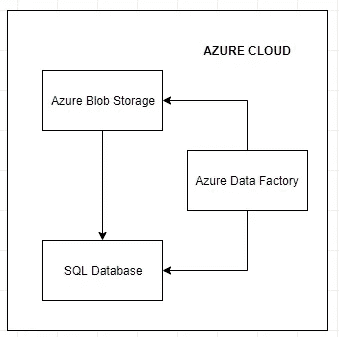

如上图所示，这是一个典型的用例，其中 Azure Data factory 促进了从 Azure Blob 存储中的文件到 SQL 关系数据库的数据传输。

**先决条件:** - Azure 订阅
- Azure 存储账户
- Azure SQL 数据库

完成上述设置后，您可以按照以下步骤创建一个简单的 Azure 数据工厂工作流，将数据从 CSV 文件加载到 Azure 云环境的 SQL 表中。

对于此示例，我们将在 AdventureWorks 数据库中创建一个 productreview 表

将数据上传到 Azure Blob 存储

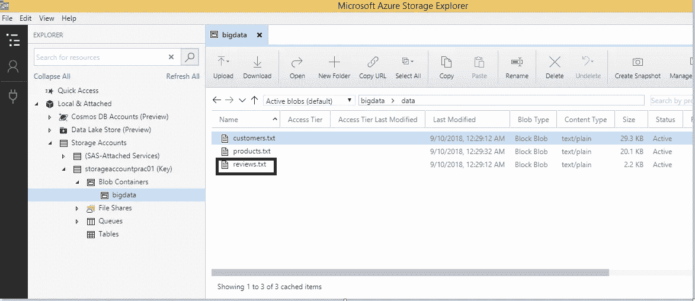

源文件可以从[这里下载](https://github.com/cdamak/AzureSQL/blob/master/Data%20Load%20using%20Azure%20Data%20Factory/reviews.txt)

现在，我们将使用 Azure 数据工厂服务中的复制数据向导，将产品评论数据从 Azure 存储中的文本文件加载到我们在 Azure SQL 数据库中创建的表中。

1.  在 Microsoft Azure 门户的菜单中，单击“新建”。然后在分析菜单中，单击数据工厂。

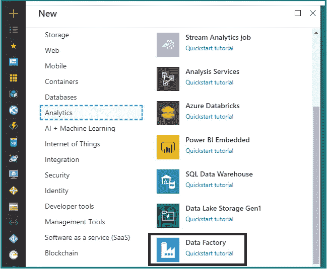

2.在新的数据工厂刀片中，输入以下设置，然后单击创建:

名称:输入一个唯一的名称(并记下来！)
订阅:选择您的 Azure 订阅
版本:1
资源组:选择适当的资源组或创建新的
位置:选择任何可用的区域

3.查看通知以验证部署已经开始。然后等待部署数据工厂(这可能需要几分钟。)
4。单击所有资源，然后单击您的数据工厂，并单击复制数据单幅图块。这将在您的浏览器中打开一个新标签。

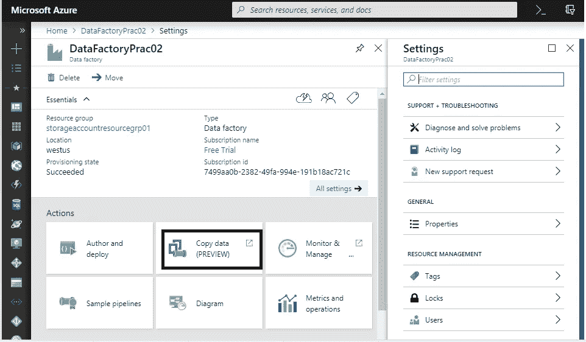

5.在复制数据向导的属性页面上，输入以下详细信息，然后单击下一步:
任务名称:加载审查
任务描述:将审查数据加载到 Azure SQL 数据库
任务节奏(或)任务计划:立即运行一次
到期时间:3:00:00:00

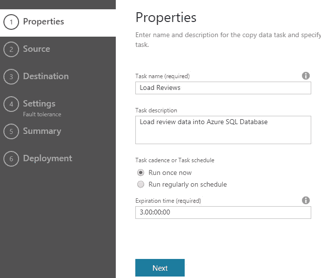

6.在“源数据存储”页面的“连接到数据存储”选项卡上，选择“Azure Blob 存储”。然后单击下一步。(观察各种可用选项)

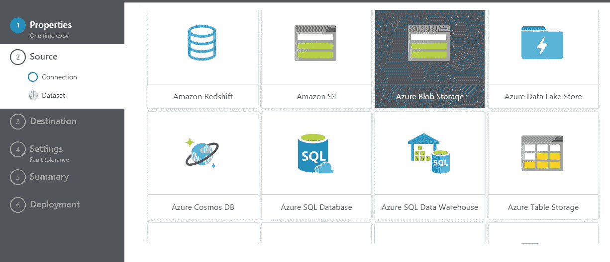

7.在指定 Azure Blob 存储帐户页面上，输入以下详细信息，然后单击下一步:
连接名称:blob-store
帐户选择方法:从 Azure 订阅中
Azure 订阅:选择您的订阅
存储帐户名称:选择您的存储帐户

8.在“选择输入文件或文件夹”页面上，从 blob 中选择您的文件，在本例中，它将是 reviews.txt 文件。然后单击选择，并单击下一步。

9.在“文件格式设置”页面上，等待几秒钟以读取数据，然后验证以下详细信息，确保预览部分中的数据行与下表匹配，并单击“下一步”:

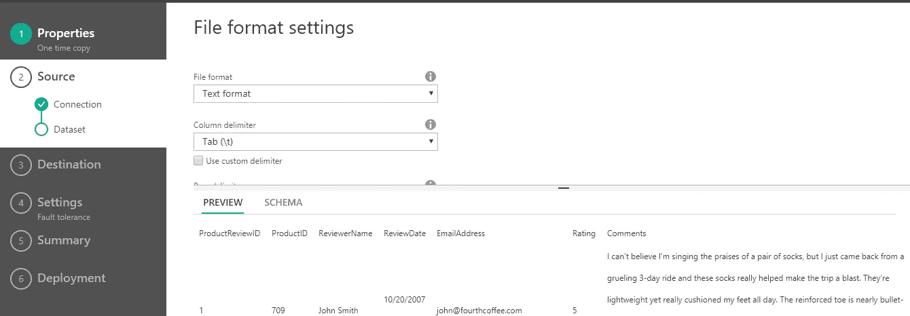

10.在“目标数据存储”页面的“连接到数据存储”选项卡上，选择“Azure SQL Database”。然后单击下一步。(观察各种可用选项)
11。在指定 Azure SQL 数据库页面上，输入相关细节以连接到您的数据库
12。在“表映射”页面的“目标”列表中，选择[SalesLT]。[ProductReview](在本例中)并单击下一步。

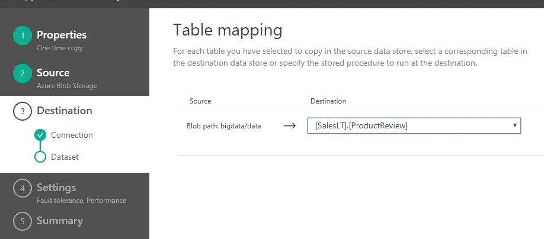

13.在“架构映射”页面上，确保文件中的数据映射到适当的列

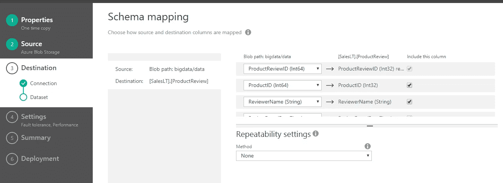

14.在“性能设置”页面上，展开“高级设置”以查看默认值。然后单击下一步。
15。在摘要页面上，单击完成。

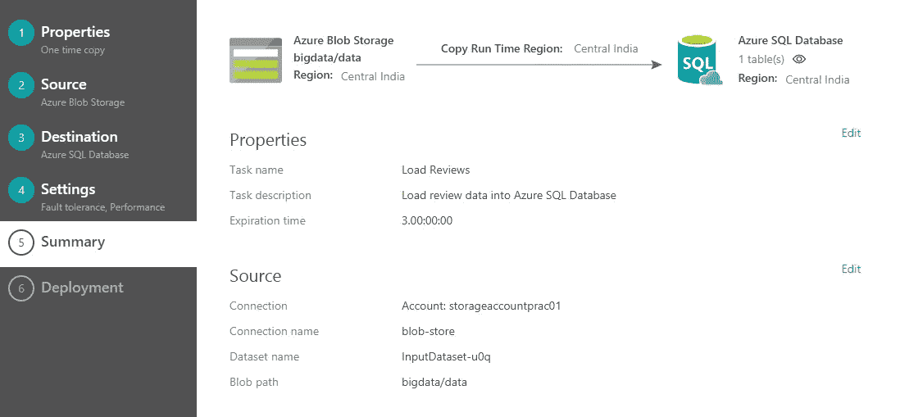

16.在“正在部署”页面上，等待部署完成。

验证数据已经复制到 SQL 表中

复制数据向导应该已经创建了一个管道，并运行它将事务数据从 blob 存储复制到 Azure SQL 数据库。Azure Data Factory 可能需要几分钟来安排管道运行，因此请等待大约 5 分钟。

你可以通过 Azure Data factory dashboard 在下面的屏幕中查看管道的详细信息

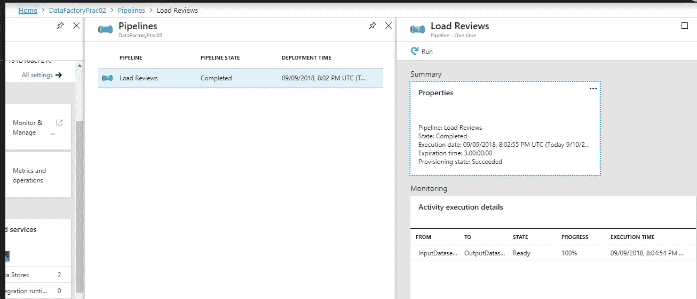

**优势:**
您可以调度/监控批处理或处理实时流数据的工作流，这些流数据可能具有不同的源和目标组合，可以是微软或开源解决方案的组合，以处理大数据

**领英**:[https://www.linkedin.com/in/karan-dama](https://www.linkedin.com/in/karan-dama-46234957/)