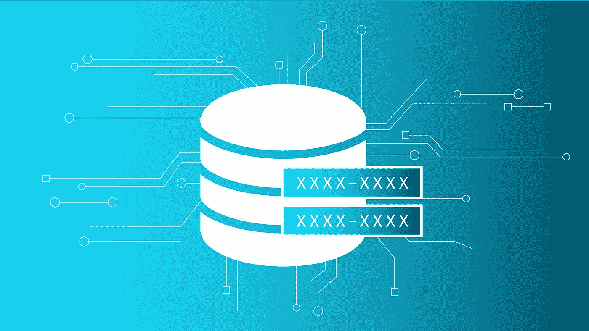

# 大数据中的数据屏蔽[Spark]

> 原文：<https://medium.datadriveninvestor.com/data-masking-in-big-data-spark-cf3d111a7ea9?source=collection_archive---------3----------------------->



我们经常面临在大数据管道中屏蔽数据的挑战，以便对未授权用户屏蔽所有敏感数据。这些用户可以是开发人员、业务分析师、数据工程师或任何想玩游戏的人。

因为我们知道我们不能通过屏蔽数据使其成为 XXXX 来使其变得无用，所以我想出了一个有用的方法，以一种通用的方式对所有类型的数据进行数据屏蔽，以便相同的数据可以用于有用的目的。

[](https://www.datadriveninvestor.com/2019/01/25/why-data-will-transform-investment-management/) [## 为什么数据将改变投资管理|数据驱动的投资者

### 有人称之为“新石油”虽然它与黑金没有什么相似之处，但它的不断商品化…

www.datadriveninvestor.com](https://www.datadriveninvestor.com/2019/01/25/why-data-will-transform-investment-management/) 

数据格式可以是任何类型，例如电子邮件、信用卡、数字、字符串、日期等。我们需要保留这些类型，这样用户至少知道什么是期望的数据格式。

以下面定义为 **DealsDF** 的交易数据集为例-

```
 — — -+ — — — — — — — -+ — — — — — + — — — — — -+
|deal_id|discount_amount|product_id|active_flag|
+ — — — -+ — — — — — — — -+ — — — — — + — — — — — -+
|deal1 |1.0 |product1 |Y |
|deal2 |1.2 |product2 |Y |
|deal1 |1.5 |product3 |N |
|deal1 |1.2 |product4 |Y |
|deal1 |1.2 |product2 |Y |
+ — — — -+ — — — — — — — -+ — — — — — + — — — — — -+
```

任务是屏蔽每个交易标识的交易标识、折扣金额和产品标识。我们可以使用下面的代码片段来做这件事。

```
def mask(inputDF: Dataset[Row], colmask: Map[String, List[String]], customMaskSring: String = “”): Dataset[Row] = {
 var initialDF = inputDF
 colmask.foreach {
 case (“email”, value) => value.foreach { v => { initialDF = initialDF.withColumn(v, lit(“[aXXX@XXXX.com](mailto:aXXX@XXXX.com)”)) } }
 case (“custom”, value) => value.foreach { v => { initialDF = initialDF.withColumn(v, lit(customMaskSring)) } }
 case (“creditcard”, value) => value.foreach { v => { initialDF = initialDF.withColumn(v, lit(“xxxx-xxxx-xxxx-1234”)) } }
 case (“randomnumber”, value) => value.foreach { v => { initialDF = initialDF.withColumn(v, lit(scala.util.Random.nextInt(10000))) } }
 case (“number”, value) => value.foreach { v => { initialDF = initialDF.withColumn(v, lit(0)) } }
 case (“string”, value) => value.foreach { v => { initialDF = initialDF.withColumn(v, lit(“xxxx”)) } }
 case (“date”, value) => value.foreach { v => { initialDF = initialDF.withColumn(v, lit(“01–01–1900”)) } }
 case _ => { initialDF }
 }
 initialDF
 }
```

如果我们运行下面的代码示例，我们会得到屏蔽的数据。

```
val maskeddf= mask(DealsDF, Map(“string” -> List(“deal_id”, “product_id”),”number” -> List(“discount_amount”)))maskeddf.show(false)+ — — — -+ — — — — — — — -+ — — — — — + — — — — — -+|deal_id|discount_amount|product_id|active_flag|+ — — — -+ — — — — — — — -+ — — — — — + — — — — — -+|xxxx |0 |xxxx |Y ||xxxx |0 |xxxx |Y ||xxxx |0 |xxxx |N ||xxxx |0 |xxxx |Y ||xxxx |0 |xxxx |Y |+ — — — -+ — — — — — — — -+ — — — — — + — — — — — -+
```

我们还可以创建一个配置表，并从表中获取映射值，例如*映射("字符串"- >列表("交易标识"、"产品标识")、"编号"- >列表("折扣金额"))*，而不是编码。

就这么简单，在下一篇文章中，我将介绍不同类型的加密算法，通过混合和匹配屏蔽来保护您的大数据管道。

编码快乐！